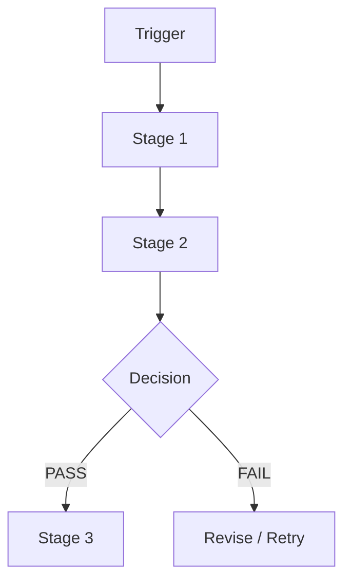
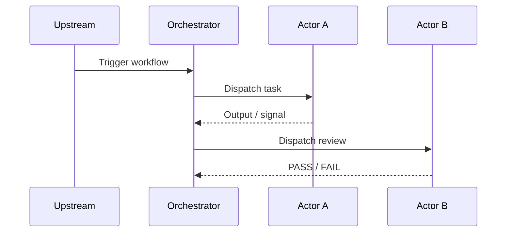
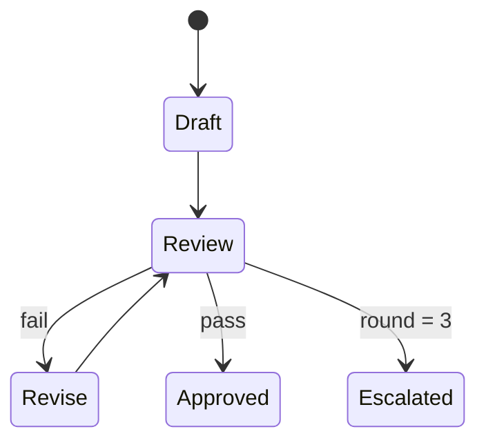
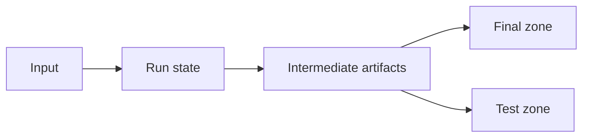

# Diagram Patterns

Prefer Mermaid for workflow documentation.

## 1. Overview Flowchart

Use this to show the primary business path.

## 2. Sequence Diagram

Use this to show actor handoffs and event emission.

## 3. State Diagram

Use this for loops, retries, and escalation logic.

## 4. Data Flow

Use this for artifacts, zones, and outputs.

