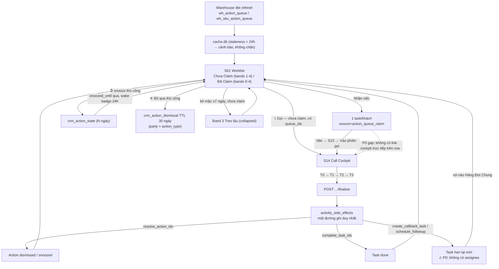
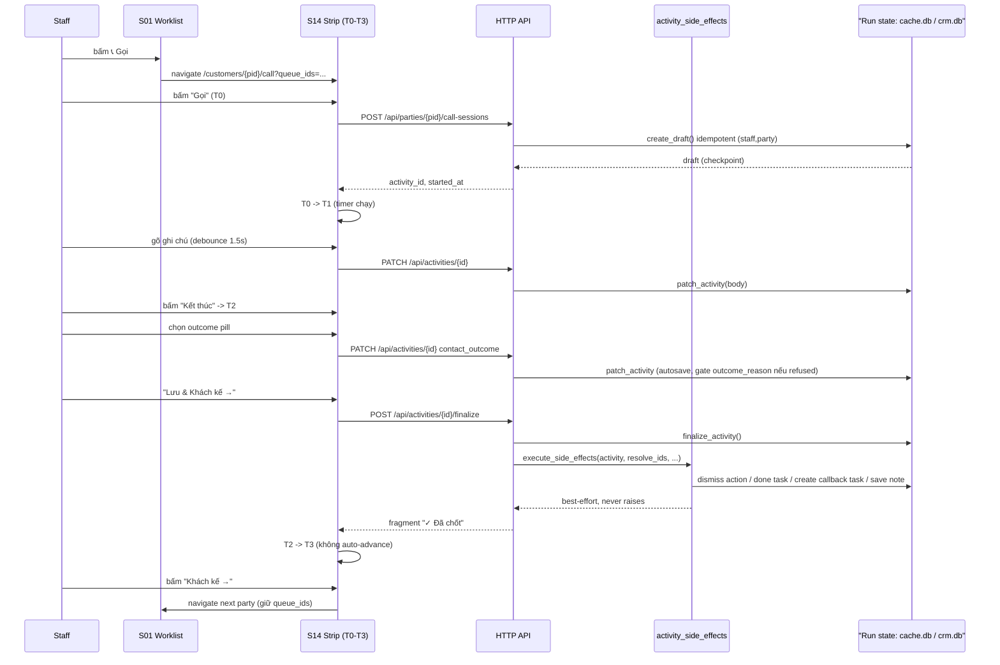
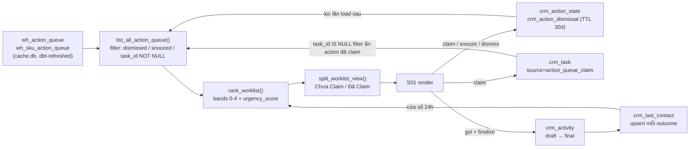
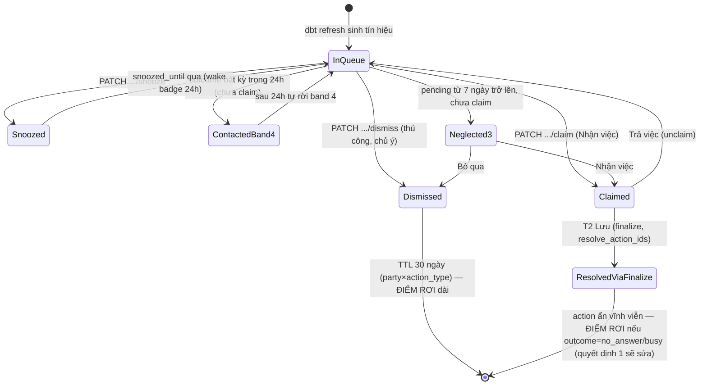

# Workflow: Vòng lặp Chăm sóc Khách Chủ động (Outreach Worklist → Call → Log → Callback Loop)

> Tín hiệu warehouse đi vào worklist, staff nhận việc, gọi, ghi log, thu thập thông tin, hẹn lại — rồi quay về đâu?

## Mục tiêu tài liệu

**Đây KHÔNG phải user guide.** Đây là tài liệu audit, viết để trả lời 2 câu hỏi:

1. **Flow đã KHÉP KÍN chưa** — mọi tín hiệu/hành động đi vào đều có đường ra rõ ràng và quay về nơi
   quan sát được (worklist, task list, activity timeline)? Có "điểm rơi" nào không — tín hiệu biến mất
   khỏi tầm nhìn mà không ai chủ động quyết định?
2. **UX tốt chưa** — mỗi hành động của staff có feedback tức thời, không mất ngữ cảnh làm việc đang dở,
   không có nút thừa/thiếu làm gãy flow?

Vì vậy đơn vị tường thuật cốt lõi của tài liệu là cặp **sự kiện/hành động của user → hành vi hệ thống**,
không phải mô tả tính năng theo hướng liệt kê. Ưu tiên bảng tương tác + state machine hơn văn xuôi.

Tài liệu này trả lời được:
- Cái gì kích hoạt vòng lặp, và ai/cái gì sở hữu từng giai đoạn.
- Với MỖI nút trên UI: bấm xong route nào chạy, hệ thống ghi gì, màn hình đổi ra sao, tôi đang ở đâu,
  quay lại bằng cách nào.
- Route nào là *spec* (ui-spec `crm/docs/ui-spec/`) và route nào là *quan sát thực tế từ code* — khi
  hai bên lệch nhau, tài liệu nêu rõ thay vì chọn một bên làm câu trả lời duy nhất.
- Route nào **đã được quyết định sửa** (2026-07-11) nhưng **chưa implement** — phân biệt với bug và với
  hành vi hiện tại đang chạy đúng ý.
- 1 tín hiệu CALL_NOW có thể đi hết bao nhiêu nhánh trước khi biến mất, và nhánh nào là điểm rơi thật.

## TL;DR

`Tín hiệu warehouse -> S01 Worklist -> Nhận việc / Gọi -> S14 Cockpit (T0->T1->T2->T3) -> finalize + side-effects -> Task hẹn lại -> quay lại Worklist`

- Nguồn tín hiệu là batch refresh (dbt), không real-time; UI coi cache >24h là "cũ" nhưng không chặn thao tác.
- Claim ("Nhận việc") có ở **cả** S01 Worklist lẫn P01 Insight Panel (S03) — cùng semantics, không thừa.
- Cả cuộc gọi đi qua **1 disposition strip** 4 pha (T0→T3), và mọi side-effect (resolve action, done task,
  tạo task hẹn lại, ghi note, đúc kết insight, auto-claim) chạy qua **đúng 1 executor**
  (`activity_side_effects.execute_side_effects()` — "một đường ghi duy nhất").
- 3 quyết định UX chốt 2026-07-11 **đã được code hóa** (260711-0933 plan + 260711-0838 phase 5-7):
  ① auto-snooze khi no_answer/busy, ② bắt buộc log khi "Hoàn tất ✓", ③ auto-claim khi bấm Gọi.
  Tài liệu cập nhật trạng thái tại từng chỗ liên quan.
- Điểm gãy lớn nhất hiện tại: `HX-Redirect` sau khi Lưu (M05/M08) luôn đá về Customer 360 toàn trang,
  bất kể caller là worklist hay cockpit đang gọi dở — trái với spec gốc (`close_overlay, target:
  return_to_invoker`).

## Identity Card (Tổng quan)

| Field | Value |
|---|---|
| Loại | Business/UX workflow (CRM nghiệp vụ) — **không phải** orchestration engine chạy nền |
| Domain | CSKH outbound — action-queue → worklist → call → log → callback |
| Trigger | Batch dbt refresh sinh tín hiệu vào `cache.db` (không real-time) + staff tạo task thủ công bất kỳ lúc nào |
| Actors chính | Sales Rep (staff), Warehouse/dbt (nguồn tín hiệu), System side-effects executor, Manager (giám sát dismissal) |
| Nhịp lặp | Vô hạn — mỗi tín hiệu tự khép qua 1 trong 8 nhánh thoát (xem [§ Đánh giá khép kín](#đánh-giá-khép-kín)) |
| Checkpoint tương đương | Draft `crm_activity` — 1 draft mở/(staff, party), `create_draft()` idempotent |
| Gate tương đương | `outcome_reason` bắt buộc khi `contact_outcome='refused'`; `body` bắt buộc khi `outcome_reason='irritation'`; R14 stop-banner khóa nội dung khi `recommended=false`; `title`+`due_at` bắt buộc ở M05 |
| Rollback tương đương | "Trả việc" (unclaim), "Hủy" task, "Mở lại" task done/cancelled, "🚫 Đừng gọi nữa" (escalation reason) |
| dry_run | N/A — không áp dụng. Không có chế độ mô phỏng; mọi PATCH/POST ghi thẳng `cache.db`/`crm.db` |
| rigor | N/A — không áp dụng. Không có review-depth; 1 executor duy nhất chạy mọi side effect như nhau bất kể "mức độ nghiêm túc" |

## Workflow Map — Sơ đồ tổng quan

## Trigger và Input

**Trigger 1 — batch dbt refresh (chính):** warehouse tính lại `wh_action_queue` (grain khách hàng) +
`wh_sku_action_queue` (grain khách × SKU) vào `cache.db`. Không có endpoint kích hoạt từ UI; nhịp refresh
do orchestration warehouse quyết định (ngoài phạm vi tài liệu này). UI chỉ đọc `refreshed_at` và tự đánh
dấu "cũ" khi quá 24 giờ (`_is_cache_stale()`, `screen_worklist.py:654`) — **cảnh báo, không chặn thao tác**.

**Trigger 2 — task thủ công:** staff bấm "+ Tạo task" (S01/S03/S15) bất kỳ lúc nào, không phụ thuộc tín hiệu warehouse.

**Input mỗi action item:** `action_id`, `action_type` (CALL_NOW / REORDER_NUDGE / WIN_BACK / SECOND_ORDER /
HIGH_CANCEL_RISK / …), `party_id` (có thể rỗng nếu khách chưa link CRM — badge hiển thị SĐT thay tên),
`rationale_vi`, `value_at_stake_vnd`, `priority` (rank warehouse, 1=khẩn nhất), `pending_since`,
`snoozed_until`, `value_group` (VIP/GOLD/…).

**Modifier tùy chọn (filter bar S01):** priority, action_type, product, strategic_tier, value_group,
free-text `q`, `min_value`, `hide_contacted`, `contactable_only` (mặc định ON), `has_script`.

## Actors và Tools/Skills — Bản đồ vai trò

| Role | Owner | Route/Module chính | Trách nhiệm |
|---|---|---|---|
| Warehouse / dbt | batch job (ngoài CRM app) | `cache.db: wh_action_queue`, `wh_sku_action_queue` | Sinh tín hiệu, không tương tác UI trực tiếp |
| Sales Rep (Staff) | người dùng CRM | S01, P01 (S03), S14, S15, M05, M08 | Xem, nhận việc, gọi, log, thu thập thông tin, hẹn lại |
| System Side-Effects Executor | `application/activity_side_effects.py: execute_side_effects()` | gọi từ cả `POST /customers/{id}/log-activity` (legacy) lẫn `POST /api/activities/{id}/finalize` | "Một đường ghi duy nhất" — resolve action, done task, tạo task callback/follow-up, save note, promote insight, auto-claim; mỗi bước try/except-logged độc lập |
| ActionStateRepository | `adapters/outbound/sqlite/action_state_repository.py` | `crm_action_state`, `crm_action_dismissal` | dismiss/snooze theo episode + TTL 30 ngày theo (party, action_type) |
| TaskService | `application/task_service.py` | `crm_task` | `claim_customer_actions` / `auto_claim_from_contact` / `create_task` / `transition_status` |
| ActivityService | `application/activity_service.py` | `crm_activity` | `create_draft` (idempotent) / `patch_activity` / `finalize_activity` (gate outcome_reason/irritation) |
| Manager | người dùng CRM (role khác) | `list_active_dismissals()` (dismissed-actions transparency view) | Giám sát action bị bỏ qua — KHÔNG nằm trong vòng lặp tác nghiệp chính |

## Chi tiết từng stage (Stage-by-Stage)

### Bảng tóm tắt stage

| Stage | Owner | Input | Output | Gate | Checkpoint | Signal | Transition tiếp theo |
|---|---|---|---|---|---|---|---|
| 1. Sinh tín hiệu | Warehouse/dbt | Đơn hàng, hành vi khách | `wh_action_queue` row | — | — | `refreshed_at` timestamp | S01 đọc qua `list_all_action_queue()` |
| 2. Hiển thị worklist | S01 screen adapter | `wh_action_queue` + `crm_task` + `crm_last_contact` | Bands 0-4, Chưa Claim/Đã Claim | filter bar (không chặn) | — | — | Staff chọn 1 trong 3 lối: Nhận việc / Gọi / Xem 360 |
| 3. Nhận việc (claim) | TaskService | `party_id` + toàn bộ action của khách | 1 `crm_task` (source=action_queue_claim) | phải đăng nhập (401 nếu chưa) | — | — | Action ẩn khỏi "Chưa Claim" (filter `task_id IS NULL`) |
| 4. Vào cockpit | S14 route | `party_id` (+`task_id`/`queue_ids` tùy chọn) | Render rail + talk-track + strip T0 | — | — | — | Staff bấm "Gọi" |
| 5. T0→T1 (bắt đầu gọi) | ActivityService | `party_id`, `staff_id` | Draft `crm_activity` | — | **`create_draft()` idempotent per (staff,party)** | — | Timer chạy, JS chuyển T1 |
| 6. T1 (trong cuộc gọi) | ActivityService | ghi chú, Zalo checkbox | `patch_activity()` autosave | — | draft vẫn 1 dòng duy nhất | — | Staff bấm "Kết thúc" → T2 |
| 7. T2 (chốt outcome) | ActivityService | `contact_outcome`, `outcome_reason` | patch autosave | **`outcome_reason` bắt buộc khi `refused`; `body` bắt buộc khi `irritation`** | — | — | Nút "Lưu" enable khi outcome hợp lệ |
| 8. T2→T3 (finalize) | ActivityService + Executor | `resolve_action_ids/task_ids`, `create_callback_task`, `schedule_followup_at` | `crm_activity.status=final` + side effects | **draft phải có `contact_outcome` (409 nếu chưa)** | draft đóng, không finalize lại được 2 lần (`already_final`) | — | Action/task resolve, task hẹn lại mới sinh |
| 9. Task hẹn lại quay lại worklist | TaskService (`create_task`) | `due_at` | `crm_task` mới, KHÔNG assignee | — | — | — | Rơi vào "📥 Hàng Đợi Chung" (S01), ai cũng có thể Nhận |

### Ba lớp hành vi — cách đọc các bảng bên dưới

Mọi bảng tương tác dưới đây được đọc qua 3 lớp:

- **(a) Hiện tại** — verified trực tiếp từ code (`file:line` khi hữu ích). Mặc định mọi dòng thuộc lớp này trừ khi có chú thích khác.
- **(b) Đã implement** — 3 quyết định user chốt 2026-07-11 và code hóa:
  - **①** `no_answer`/`busy` → auto-snooze 1-3 ngày, không dismiss TTL 30 ngày (plan 260711-0933)
  - **②** session-checklist "Hoàn tất ✓" bắt buộc kèm log tiếp xúc (plan 260711-0838 phase 6)
  - **③** auto-claim khi bấm "Gọi" trong strip (mở cockpit chỉ xem vẫn không claim) (plan 260711-0838 phase 6)
- **(c) Known UX gap** — đánh dấu ⚠ ngay tại dòng xảy ra, kèm severity (**P0**/Medium/Minor). Nguồn: `plans/reports/ux-review-260711-0818-worklist-claim-call-log-flow-report.md`.

### S01 Worklist — Action row (`wh_action_queue`, chưa claim)

| User action | HTTP call | System behavior | UI feedback | Ngữ cảnh giữ/mất |
|---|---|---|---|---|
| Click vào row (ngoài nút) | `GET /customers/{party_id}` (client nav) | Điều hướng S03 | same-tab, full reload | MẤT scroll/band-overflow của worklist |
| `[Xem 360 →]` | `GET /customers/{party_id}` | Điều hướng S03 | same-tab | ⚠ Minor: TRÙNG hành vi với click row |
| `[📞 Gọi]` (action row, script hoặc thường) | `GET /customers/{pid}/call?queue_ids=<≤50>` | Mở S14 cockpit **KHÔNG claim trước** | same-tab | ⚠ **P0**: 2 staff có thể cùng bấm gọi 1 khách (race) — (b) quyết định ③ sẽ auto-claim tại bước "Gọi" trong strip, KHÔNG phải tại bước mở cockpit này |
| `[Nhận việc]` | `PATCH /worklist/actions/{action_id}/claim` | Claim TOÀN BỘ action của khách → 1 task; action ẩn qua filter `task_id IS NULL`, **KHÔNG đổi `crm_action_state`** | swap `#worklist-container` (outerHTML) | ⚠ Medium: row rơi vào "Đã Claim" mặc định **collapsed** → mất feedback tức thời |
| `⏰` snooze dropdown (1/3/7 ngày) | `PATCH /worklist/actions/{id}/snooze?days=N` | `action_state.snooze()` → `crm_action_state` | row xóa khỏi DOM (`hx-swap=delete`) | Action rời tầm nhìn N ngày, tự "thức dậy" (wake badge 24h đầu) |
| `[✕ Bỏ qua]` | `PATCH /worklist/actions/{id}/dismiss` | `action_state.dismiss()` → `crm_action_state` (episode) **+** `crm_action_dismissal` TTL 30 ngày theo (party, action_type) | row xóa khỏi DOM | Đây là **quyết định chủ ý** của staff, khác với resolve-tự-động ở T2 (xem [Common Misunderstandings #2](#dismiss-bỏ-qua-thủ-công--resolve-on-finalize-đóng-khi-lưu-outcome)) — quyết định ① KHÔNG áp dụng cho nút này, chỉ áp dụng cho resolve-on-finalize |
| `[+ Tạo task]` (topbar) | `GET /modals/m05` (không `party_id`) | Mở M05 trống | modal overlay | Sau Lưu → xem hành vi M05 bên dưới |
| `[Làm mới ↺]` | `GET /worklist/fragment` | Re-query `cache.db`, giữ filter hiện tại | swap `#worklist-container` | Giữ filter (`hx-include #wl-filter-form`) |
| Filter bar (priority/type/product/tier/value_group/q/min_value/hide_contacted/contactable_only/has_script) | `GET /worklist/fragment?...` | `apply_filters()` lọc actions + tasks | swap `#worklist-container` | Filter persist qua query-string |

### S01 Worklist — Task row & Hàng Đợi Chung

| User action | HTTP call | System behavior | UI feedback | Ngữ cảnh giữ/mất |
|---|---|---|---|---|
| Checkbox done | `PATCH /tasks/{id}/done` | `transition_status → done` | swap row → `task_done_row.html` | — |
| Overdue — `[📅 Dời hạn]` | `GET /modals/m05?task_id=...` | Mở M05 edit | modal overlay | |
| Overdue — `[Hủy]` | `PATCH /tasks/{id}/cancel` | `transition_status → cancelled` | row xóa (`hx-swap=delete`) | |
| Hàng Đợi Chung — `[Nhận]` | `PATCH /tasks/{id}/assign-me` | `assign_to(uid)` | row xóa khỏi Hàng Đợi Chung | ⚠ Minor: không tự chuyển vào "của tôi" tại chỗ — cần reload để thấy trong Đã Claim |
| Claimed task — `contact_btn` (📞/💬/📘) | `GET /modals/m08?...&task_id=...` | Mở M08 log form | modal overlay | |
| Claimed task — `[Trả việc]` | `PATCH /worklist/customers/{pid}/unclaim` | `unclaim_customer_actions()` | swap `#worklist-container` | Action quay lại "Chưa Claim" ngay |
| Claimed task — title | `GET /tasks/{task_id}` | Điều hướng S15 | same-tab | ⚠ **P0**: đây là đường DUY NHẤT vào cockpit sau khi claim (3 click: title → S15 → "Vào phiên gọi") — trước claim chỉ 1 click. Nghịch với mức độ commit |
| Claimed task — `⏰` snooze (A4) | `PATCH /tasks/{id}/snooze?days=N` | `due_at += N ngày`, status→open nếu đang doing | `hx-swap="none"` — **KHÔNG feedback UI** | ⚠ Minor |

### P01 Insight Panel (tab "Value & Behavior" trong S03)

| User action | HTTP call | System behavior | UI feedback | Ngữ cảnh giữ/mất |
|---|---|---|---|---|
| `[Nhận việc]` | `PATCH /customers/{pid}/claim` | `claim_customer_actions()` | swap `#tab-panel` | Badge "👤 X đang xử lý" hiện ngay — feedback TỐT hơn S01 |
| `[Trả việc]` | `PATCH /customers/{pid}/unclaim` | `unclaim_customer_actions()` | swap `#tab-panel` | |
| `[Gọi ngay]` (Mode B, 0-1 action chưa resolve) | JS `aqCallNow()`: click tab "Gọi" nếu có, fallback `GET /modals/m08?...&hinh_thuc=call` | Chuyển tab S14 embedded hoặc mở M08 | swap tab hoặc modal | ⚠ Minor: fallback JS string `'\modals\m08?...'` — backslash literal, URL hỏng, nhánh fallback không bao giờ chạy đúng trên trình duyệt |
| Session checklist `[Hoàn tất ✓]` (≥2 action chưa resolve) | `hx-get="/modals/m08?party_id={pid}&mode=log"` + `hx-vals='js:{"resolve_action_ids": aqCheckedActionIds()}'` | M08 opens pre-filled với `resolve_action_ids` (checked IDs động), route `POST /api/activities/{id}/finalize` → `execute_side_effects()` — giờ ghi `crm_activity` + side effects như mọi resolve path khác | modal overlay | ✓ **P0 fixed** — (b) quyết định ②: session-checklist "Hoàn tất ✓" giờ bắt buộc log trước finalize (M08 enforce `contact_outcome` bắt buộc) — shipped phase 6 |

### S14 Call Cockpit — Disposition strip (T0 → T3)

| User action | HTTP call | System behavior | UI feedback | Ngữ cảnh giữ/mất |
|---|---|---|---|---|
| T0 `[📞 Gọi <số> ▾][⋯ Ghi thủ công]` | `POST /api/parties/{pid}/call-sessions` (Gọi) hoặc `GET /modals/m08?mode=log` (Ghi thủ công) | `create_draft()` **idempotent** theo (staff, party) + **auto-claim từ 260711-0838 phase 6** → claim_customer_actions (nếu chưa claimed) | JS chuyển thẳng T1, timer chạy — KHÔNG mở modal | ✓ **P0 fixed** — (b) quyết định ③: auto-claim khi bấm Gọi — shipped phase 6 |
| T1 note textarea | `PATCH /api/activities/{id}` (debounce 1.5s + blur) | `patch_activity(body)` | không swap DOM; `window.alert()` nếu fail | Rủi ro mất nội dung nếu staff bỏ qua alert |
| T1 `☑ Zalo` | `PATCH /api/activities/{id}` `custom_fields_patch.zalo_connected` | Ghi ngay | — | |
| T1 `[⋯ Chi tiết]` | `GET /modals/m08?mode=edit_activity&activity_id=...` | Mở M08 pre-filled sửa draft | modal overlay | |
| T1 `[■ Kết thúc]` | (client-only, không gọi API) | Chuyển T1→T2 | — | |
| T2 pill outcome (1/7, phím `1`-`7`) | `PATCH /api/activities/{id}` `contact_outcome=<key>` | Autosave ngay khi click | Highlight pill; outcome cần thêm info (`answered`/`purchased`/`callback`/`refused`/`wrong_number`) → sheet mọc lên trên | |
| T2 sheet "Từ chối" — chọn lý do | `PATCH /api/activities/{id}` `outcome_reason=<key>` | Server validate `REASON_REQUIRED_OUTCOMES` | Nút Lưu chỉ enable sau khi có lý do | **Gate**: `outcome_reason` bắt buộc khi `refused` (`activity_service.py` — cả `finalize_activity` lẫn `patch_activity` validate) |
| T2 sheet — `[🚫 Đừng gọi nữa]` | (dùng chung PATCH `outcome_reason='do_not_contact'`) | Escalation pill (2 lần bấm) | — | Reference-only: chưa có suppression filter runtime thật (plan khác sở hữu) |
| T2 `[Lưu & Khách kế →]` | `POST /api/activities/{id}/finalize` | `finalize_activity()` → `execute_side_effects()`: resolve `resolve_action_ids`/`resolve_task_ids` với outcome-aware logic từ 260711-0933: nếu `no_answer`/`busy` → auto-snooze 1-3 ngày, khác → dismiss TTL 30 ngày; tạo callback/follow-up task, save-as-note, promote insight, auto-claim | swap strip → T3 | ✓ **P0 fixed** — (b) quyết định ①: `no_answer`/`busy` → auto-snooze (không dismiss) — shipped plan 260711-0933 |
| T3 `[＋Nhắn Zalo]` (chỉ hiện khi outcome=`no_answer`) | `POST /customers/{pid}/reason/resolve-async` | Tạo activity **thứ hai riêng biệt** (không gộp vào activity vừa finalize) | Button đổi "✓ Đã nhắn Zalo" | |
| T3 `[Khách kế →]` | `GET /customers/{next_pid}/call?queue_ids=...&queue_pos=+1` (client nav) | Điều hướng cockpit khách tiếp theo, giữ queue | same-tab | **KHÔNG auto-advance** — phải bấm chủ động (chốt UX rõ ràng, đúng thiết kế) |
| Rail "Đặt lịch" (A-S14-024) | `GET /modals/m05?party_id=...&source=action_queue&source_ref=...&prefill_title=...` | Mở M05 prefilled | modal overlay | ⚠ **P0**: sau `[Lưu task]` → `HX-Redirect /customers/{pid}` → **RỜI cockpit đang gọi dở**, mất mid-call context |
| Rail "Gửi Zalo" (secondary, A-S14-026) | `POST /customers/{pid}/reason/resolve-async` | Resolve item không cần gọi | swap rail item → outerHTML | |
| Reason checkbox "đã nói" (A-S14-025, secondary) | (client-only) | JS gộp `action_id`/`task_id` vào hidden input bulk-resolve | — | |
| Collect rows (zalo/email/birthday/skin_type/health_domain…) — `[+]` | `POST /customers/{pid}/contact|core|custom-field-inline|tags/inline` | Ghi field, trả fragment 1 dòng | swap row → "✓ đã lưu" | ⚠ **P0**: `s14CollectSave`/`s14ToggleReason`/`s14TagChipToggle` chỉ định nghĩa trong block `` — khách **KHÔNG có approach script** (ST-CALL-NO-SCRIPT) → nút `[+]` không phản hồi (hàm JS undefined). Mục tiêu chính "thu thập thông tin" hỏng với nhóm khách này |
| Idbar `[360]` | `GET /customers/{pid}` (client nav) | Điều hướng S03 | same-tab | Rời cockpit; draft resume nhờ checkpoint nếu quay lại (`find_open_draft`) |
| Idbar `[Zalo]` | `GET /modals/m08?mode=log&hinh_thuc=chat` | Mở M08 | modal overlay | ⚠ Medium: GET handler bỏ qua `hinh_thuc`, modal luôn mặc định "Cuộc gọi" |
| R14 stop-banner `[Tôi đã xác minh]` | `POST /customers/{pid}/r14-ack` | Ghi audit `r14_ack` | JS gỡ `s14-locked`, **KHÔNG re-render panel** (Invariant §9) | **Gate**: R14 khóa nội dung (`pointer-events:none`) tới khi ack |

### S15 Task Detail

| User action | HTTP call | System behavior | UI feedback | Ngữ cảnh giữ/mất |
|---|---|---|---|---|
| Lifecycle `[Bắt đầu]` | `POST /tasks/{id}/status` `new_status=doing` | `transition_status` | full reload (`hx-target=body`, JS `window.location.reload()`) | |
| Lifecycle `[Sửa]` | `GET /modals/m05?task_id=...` | Mở M05 edit | modal overlay | |
| Lifecycle `[Hoãn]` | `GET /modals/o03?task_id=...&due_at=...` | Mở O03 postpone overlay | modal overlay | |
| Lifecycle `[Huỷ]` | `POST /tasks/{id}/status` `new_status=cancelled` | `transition_status` | full reload | |
| `[Vào phiên gọi]` (task_kind=contact) | `GET /customers/{pid}/call?task_id={tid}` (client nav) | Mở cockpit VỚI reason ghim PRIMARY, `return_target=/tasks/{tid}` | same-tab | Chrome "Khách kế →" đổi thành "Quay lại task" |
| `[Xem 360]` | `GET /customers/{pid}` | Điều hướng S03 | same-tab | |
| Close bar — input "ghi chú nhanh…" | (KHÔNG wire — không `name`/`id`/JS) | — | Không làm gì | ⚠ Medium: control chết — text gõ vào bị vứt khi bấm nút bên cạnh |
| Close bar `[Ghi log & hoàn thành]` | `GET /modals/m08?...&mode=log&task_id=...` | Mở M08 (**không mang** nội dung closebar input) | modal overlay | |
| Banner "Mở lại" (done/cancelled) | `POST /tasks/{id}/status` `new_status=open` | `transition_status` | full reload | |

### M05 — Create/Edit Task Modal

| User action | HTTP call | System behavior | UI feedback | Ngữ cảnh giữ/mất |
|---|---|---|---|---|
| `[Lưu task]` (tạo mới) | `POST /customers/{pid}/tasks` | `task_svc.create_task()` — derive `task_kind` nếu absent | `HX-Redirect /customers/{pid}` | ⚠ **P0**: **spec** (`M05-create-edit-task-modal.md`, A-M05-003) định nghĩa `close_overlay, target: return_to_invoker` — **quan sát thực tế** luôn điều hướng toàn trang về S03, bất kể caller (worklist/cockpit/S15) — xem [Common Misunderstandings #4](#close_overlay--return_to_invoker-spec-m05m08--hx-redirect-observed) |
| `[Lưu task]` (sửa) | `PATCH /tasks/{id}/edit` | `task_svc.update_task()` | `HX-Redirect /customers/{pid}?tab=tasks` hoặc `/tasks` | Tương tự |
| `[Hủy]`/`[✕]` | (client) đóng modal | — | `modal-root.innerHTML=''` | Ngữ cảnh giữ nguyên — đây mới đúng hành vi `close_overlay` |
| *(không phải nút — side effect)* Task callback/follow-up | Sinh trong `execute_side_effects()` §4/§5 sau finalize | `create_task()` **KHÔNG có `assignee_user_id`** | Task xuất hiện ở "📥 Hàng Đợi Chung" | ⚠ **P0**: lời hứa "tạo task nhắc tự động" không nhắc đúng *người đã hẹn khách* — cần fix code (không phải quyết định UX, là gap trong `activity_side_effects.py:129-154`) |

### M08 — Log Activity Modal

| User action | HTTP call | System behavior | UI feedback | Ngữ cảnh giữ/mất |
|---|---|---|---|---|
| `[Lưu hoạt động]` (mode=log, fresh insert) | `POST /customers/{pid}/log-activity` | `activity_log.log_activity()` → `execute_side_effects()` | `HX-Redirect /customers/{pid}?tab=timeline` (**trừ** `source=call_cockpit` → trả fragment nhỏ, không redirect) | ⚠ **P0**: spec ghi `close_overlay/return_to_invoker`; quan sát: redirect toàn trang — worklist quick-log (📞/💬) bị đá sang 360 dù mở từ worklist |
| `[Lưu hoạt động]` (draft-adopt, `draft_activity_id` có) | `POST /customers/{pid}/log-activity` (cùng route) | `patch_activity()` + `finalize_activity()` trên draft có sẵn — **không** tạo row mới | Cùng hành vi redirect | |
| Outcome pills | (client) `m08OnOutcome` | JS rebuild reason section theo `hinh_thuc` | — | |
| Checkbox "Đánh dấu task hoàn thành" | (gộp vào submit) | `complete_task=1` → `transition_status → done` trong side effects | — | |
| `[★ Đúc kết thành insight]` | (gộp vào submit) | `promote_insight=1` → `party_insights.add_insight()` | — | |

## Runtime thực thi (Runtime Mechanics)

Tách bạch 2 tầng để tránh đọc nhầm:

- **Tầng nghiệp vụ (business flow)** — cái spec (`crm/docs/ui-spec/`) mô tả: chuỗi surface + interaction
  ID (A-S01-xxx, A-S14-xxx…), *ý định thiết kế*.
- **Tầng runtime (quan sát thực tế)** — code chạy thật trong `crm/src/adapters/inbound/web/` +
  `crm/src/application/`. Route handler, template Jinja2 + HTMX, và JS client-side (`c360_call_cockpit_panel.html`
  cuối file) là nơi *thực sự* quyết định điều hướng, swap vùng nào, gọi API nào.

Người đọc **không nên** hiểu spec (`crm-contract` YAML) là thứ tự thi hành trực tiếp — đó là hợp đồng thiết
kế. Runtime là FastAPI route + HTMX response headers (`HX-Redirect`, `HX-Trigger`) quyết định điều hướng
thật. Khi 2 tầng lệch nhau (ví dụ M05/M08 redirect vs `return_to_invoker`), tài liệu này giữ nguyên mâu
thuẫn — xem bảng tương tác ở trên và mục Common Misunderstandings.

**"Một đường ghi duy nhất"**: cả route legacy `POST /customers/{id}/log-activity` lẫn route mới
`POST /api/activities/{id}/finalize` đều gọi đúng 1 hàm `activity_side_effects.execute_side_effects()`
— nguyên tắc thiết kế minh bạch, tránh 2 đường ghi khác nhau âm thầm phân kỳ (bài học ghi lại trong chính
docstring file đó: "party_insights factory lesson"). Mỗi bước side-effect try/except-logged **độc lập**
— 1 bước lỗi không rollback activity đã ghi (never raises).

## Tín hiệu, Gate, Checkpoint (Signals, Gates, Checkpoints)

| Type | Name | Owner | Meaning |
|---|---|---|---|
| Signal | `wh_action_queue` row mới/refresh | Warehouse/dbt | Kích hoạt hiển thị lại toàn bộ worklist sau lần load kế tiếp — không push real-time |
| Signal | `refreshed_at` | `WorklistQueryService` | > 24h → banner "Cache cũ" ở footer, không chặn |
| Signal | `last_contacted_at` (24h rolling) | `crm_last_contact` (upsert mỗi lần `log_activity`) | Đưa action/claim-task vào band 4 "Đã liên hệ", tự hết hạn sau 24h |
| Signal | `wake_badge` | `snoozed_until` vừa qua trong 24h | Badge "⏰ vừa thức dậy" trên row |
| Gate | `outcome_reason` bắt buộc khi `refused` | `activity_service.py` (`_reason_required_violation`) | Chặn cả `patch_activity` lẫn `finalize_activity`, validate client **và** server độc lập |
| Gate | `body` bắt buộc khi `outcome_reason='irritation'` | `activity_service.py` (`_irritation_body_violation`) | Tín hiệu chất lượng (tác dụng phụ) phải có mô tả, không cho qua trống |
| Gate | `contact_outcome` bắt buộc trước finalize | `finalize_activity()` → `ActivityFinalizeConflictError` (HTTP 409) | Không bao giờ tự bịa outcome cho staff |
| Gate | Đăng nhập bắt buộc khi claim | `screen_worklist.py` claim/assign-me handlers | 401 nếu `current_user_id` rỗng |
| Gate (blocking, R14) | `recommended=false` (approach script) | S14 stop-banner | Nội dung khóa (`pointer-events:none`) tới khi bấm "Tôi đã xác minh" → `POST /r14-ack` |
| Checkpoint | Draft `crm_activity` mở | `ActivityService.create_draft()` | Save point = row draft trong `crm_activity`; resume point = `find_open_draft(staff, party)` — reload trang mid-call phục hồi đúng T1/T2, không tạo draft thứ 2 |
| Self-check (không phải gate chính thức) | Client-side JS validate (`m08ValidateSubmit`, alert trước submit) | Modal M08/strip | Chỉ cảnh báo trước submit — **không** thay thế server-side validate ở trên |

**Đường không có handler (unavailable path)**: khi `task_svc`/`action_state`/`party_insights` không được
wire (misconfiguration ở composition root), mỗi bước side-effect log warning và **bỏ qua riêng bước đó**
— activity chính vẫn được ghi. Không có cơ chế alert-lên-manager khi 1 side-effect bị bỏ qua liên tục.

## Luồng dữ liệu (Data Flow)

## Failure, Retry, Escalation (Thất bại — Thử lại — Leo thang)

| Tình huống | Hành vi |
|---|---|
| Claim `action_id` đã cũ (bị người khác claim hoặc dbt refresh xóa) | Re-render fragment thay vì lỗi — worklist container cập nhật đúng trạng thái hiện tại (`screen_worklist.py:492-498`) |
| `party_id` không resolve được khi claim | HTTP 422 "Chưa xác định được khách hàng trong hệ thống" |
| Draft "biến mất" (bị xóa/hết hạn) khi `patch_activity` | `ActivityNotFoundError` → fallback sang fresh-insert (log_activity mới) thay vì lỗi 500 |
| Double-submit finalize (double-click) | `already_final=True` → skip side effects lần 2, không duplicate note/task/dismiss |
| Finalize khi activity chưa có `contact_outcome` | `ActivityFinalizeConflictError` → HTTP 409, staff phải PATCH outcome trước |
| `refused` thiếu `outcome_reason` | Client chặn submit (alert) + server re-validate độc lập → HTTP 400/422 |
| `irritation` thiếu `body` | Server bắt buộc non-empty → HTTP 400/422 |
| Autosave PATCH thất bại (mạng lỗi) | `window.alert()` hiển thị lỗi — **không** retry tự động, staff phải gõ lại |
| `task_svc`/`action_state`/`party_insights` chưa wire | Mỗi side-effect step try/except-logged độc lập — 1 bước lỗi **không** rollback activity đã ghi |
| Cache `wh_action_queue` chưa refresh > 24h | Banner vàng "Cache cũ — đã quá 24h" ở footer worklist, **không chặn** thao tác |
| Khách không có approach script | ST-CALL-NO-SCRIPT — talk-track ẩn, rail + collect vẫn render nhưng ⚠ P0 gap #4 khiến JS collect chết |
| Claim `action_id` khi `task_claim` port chưa wire | `HTMLResponse("", status_code=204)` — no-op im lặng |

## Những điều dễ hiểu lầm (Common Misunderstandings)

### "Nhận việc" (claim) ≠ "Bắt đầu gọi" (call session start)

Claim gán toàn bộ action của khách thành 1 task cho staff — hành động sở hữu, không đòi hỏi đang gọi.
Bấm "Gọi" trong strip là hành động cam kết cụ thể hơn nhưng **hiện tại không claim** (dù đã tạo draft
`crm_activity` thật). Nhầm 2 khái niệm này khiến người đọc nghĩ race-condition (2 staff cùng gọi 1
khách) không thể xảy ra — nó **có thể** xảy ra vì claim và call-start là 2 sự kiện độc lập cho tới khi
quyết định ③ (auto-claim khi bấm Gọi) được implement.

### Dismiss (bỏ qua thủ công) ≠ Resolve-on-finalize (đóng khi lưu outcome)

`[✕ Bỏ qua]` tại worklist là quyết định **chủ ý** của staff — gọi thẳng `action_state.dismiss()`.
Resolve-on-finalize là hệ quả **tự động** của việc Lưu bất kỳ outcome nào trong strip (kể cả `no_answer`)
— hiện tại cũng gọi đúng `action_state.dismiss()`, cùng TTL 30 ngày, dù staff không hề "cố ý bỏ qua" — họ
chỉ đang ghi lại 1 lần gọi trượt. Gộp 2 khái niệm khiến việc đọc code/log nhầm rằng mọi `no_answer` đều
được xử lý đúng ý staff; thực ra đó chính là điểm rơi ĐANG được sửa (quyết định ①).

### Snooze thủ công (`crm_action_state`, per-episode) ≠ Band 4 "Đã liên hệ" (`last_contact`, 24h rolling)

Snooze là staff chủ động hoãn 1 action N ngày — state bền vững tới khi `snoozed_until` qua hoặc bị ghi đè.
Band 4 là hệ quả tự động của **bất kỳ** activity nào trong 24h qua (`last_contacted_at`), tự hết hạn sau
24h mà không ai bấm gì và **không đổi `crm_action_state`**. Cả hai đều "làm action tạm biến khỏi khu vực
chính" nhưng cơ chế lưu trữ, thời hạn, điều kiện kích hoạt hoàn toàn khác nhau.

### `close_overlay / return_to_invoker` (spec M05/M08) ≠ `HX-Redirect` (observed)

Spec ui-spec (`M05` A-M05-003, `M08` A-M08-003) định nghĩa hành vi Lưu là `close_overlay, target:
return_to_invoker` — đóng modal, quay lại đúng nơi đã mở nó. Code thực tế trả `HX-Redirect` cố định về
`/customers/{party_id}` (M05) hoặc `/customers/{party_id}?tab=timeline` (M08) — không có khái niệm
"invoker" nào được lưu. Với caller là S03, đích trùng nên vô hại; với caller là S14 cockpit hoặc S01
worklist, nó phá ngữ cảnh (P0 #1 trong bảng tương tác). Tài liệu này giữ nguyên mâu thuẫn thay vì chọn
1 bên làm câu trả lời — đây chính là hành vi cần sửa, không phải nhầm lẫn khi đọc.

## Checklist đọc nhanh (Quick Reading Checklist)

Dùng để chẩn đoán "tại sao action/task này hành xử lạ" hoặc "tại sao nút này không phản hồi":

1. Xác định đối tượng: `action_id` (`wh_action_queue`) hay `task_id` (`crm_task`)? Hai bảng khác nhau,
   kiểm tra đúng cột trạng thái tương ứng.
2. Action "biến mất" khỏi worklist? Kiểm tra `crm_action_state.status` (dismissed/snoozed) **và**
   `crm_task.task_id IS NULL` filter (đã bị claim?) **và** `crm_action_dismissal` (TTL 30 ngày theo
   party×action_type).
3. Action nằm sai band? Đọc `assign_band()` (`application/worklist_ranking.py:106`) — band 0 chỉ áp
   dụng cho **task** quá hạn, không áp dụng action.
4. Staff báo "bấm nút không phản hồi" trong S14? Kiểm tra `script`/`ap` có `None` không
   (ST-CALL-NO-SCRIPT) — nhiều hàm JS collect/rail chỉ định nghĩa trong block ``.
5. "Lưu xong bị đá khỏi màn hình đang làm"? Kiểm tra route trả về — `HX-Redirect` header luôn điều
   hướng toàn trang, bất kể caller là ai.
6. Draft cuộc gọi "biến mất" sau reload? Query `crm_activity WHERE status='draft' AND staff_user_id=?
   AND party_id=?` — `find_open_draft()` phải trả đúng 1 row.
7. Outcome không lưu được? Kiểm tra `REASON_REQUIRED_OUTCOMES` — `refused` bắt buộc `outcome_reason`,
   server trả 400/422 nếu thiếu.
8. Task hẹn lại (callback/follow-up) "không ai nhận"? Đọc `execute_side_effects()` §4/§5
   (`activity_side_effects.py:129-154`) — hiện KHÔNG set `assignee_user_id`.

## Cheat Sheet — Tra cứu nhanh

| Câu hỏi | Trả lời nhanh |
|---|---|
| Claim ở đâu? | S01 Worklist (`PATCH /worklist/actions/{id}/claim`) **và** P01 Insight Panel (`PATCH /customers/{id}/claim`) — cùng semantics |
| Route finalize 1 cuộc gọi? | `POST /api/activities/{id}/finalize` |
| Route tạo/adopt draft? | `POST /api/parties/{id}/call-sessions` (idempotent per staff+party) |
| TTL dismiss thủ công là bao lâu? | 30 ngày, key = (party_id, action_type) — `_DISMISSAL_TTL_DAYS = 30` (`action_state_repository.py:26`) |
| Band 4 tự hết hạn sau bao lâu? | 24 giờ kể từ `last_contacted_at` |
| "Một đường ghi duy nhất" là hàm nào? | `application/activity_side_effects.py: execute_side_effects()` |
| Executor này KHÔNG BAO GIỜ làm gì? | Không raise exception ra ngoài — mọi bước try/except-logged độc lập |
| Vào cockpit từ claimed task cần mấy click? | 3: title → S15 → "Vào phiên gọi" (so với 1 click từ action row chưa claim) |
| Modal Lưu xong đi đâu? | `HX-Redirect /customers/{party_id}` (M05) hoặc `/customers/{party_id}?tab=timeline` (M08) — **luôn** vậy, bất kể caller |
| 3 quyết định 2026-07-11 chưa implement ở đâu? | ① `activity_side_effects.py` (resolve → snooze khi no_answer/busy); ② `screen_customer_360_panels.py::handle_dismiss_session` (bắt buộc log); ③ `s14StripStartCall()` trong `c360_call_cockpit_panel.html` (auto-claim) |

## Đánh giá khép kín

Bảng liệt kê từng đường ra khả dĩ của 1 tín hiệu (lấy ví dụ CALL_NOW) và có quay về nơi quan sát được không:

| # | Đường ra | Quay về nơi quan sát được? | Verdict |
|---|---|---|---|
| 1 | Claim → gọi thành công (`answered`/`purchased`) → finalize resolve | Action dismiss vĩnh viễn, task done — biến mất khỏi worklist, tính vào "đã xử lý" | ✅ Khép kín đúng ý nghĩa |
| 2 | Claim → gọi trượt (`no_answer`/`busy`) → finalize resolve (**hiện tại**) | Action dismiss TTL 30 ngày — CÙNG cơ chế với đường #1 dù chưa thực sự "xử lý xong" | ❌ Không khép kín đúng ý — mất tín hiệu thật 30 ngày; quyết định ① sẽ sửa (auto-snooze 1-3 ngày) nhưng **chưa implement** |
| 3 | Không claim, không gọi → bỏ mặc ≥7 ngày | Chuyển Band 3 "Treo lâu" (collapsed mặc định, VIP/GOLD auto-expand) | ⚠ Khép kín kỹ thuật (vẫn trong queue) nhưng ẩn sâu, không có escalation chủ động lên manager |
| 4 | Snooze thủ công N ngày | Tự "thức dậy" khi `snoozed_until` qua, có wake badge 24h đầu | ✅ Khép kín, có tín hiệu trực quan |
| 5 | Dismiss thủ công (`[✕ Bỏ qua]`) | `crm_action_dismissal` TTL 30 ngày theo (party, action_type) — không hiện lại kể cả dbt tái sinh action cùng loại | ⚠ Khép kín đúng ý staff (chủ động bỏ qua) nhưng chỉ manager (`list_active_dismissals`) thấy được — staff gốc không có nhắc lại |
| 6 | Session checklist `[Hoàn tất ✓]` (P01, dismiss-session) | Resolve nhiều action cùng lúc, **không ghi `crm_activity`** | ❌ Không khép kín — mất traceability, không bằng chứng đã liên hệ; quyết định ② sẽ sửa (bắt buộc log) nhưng **chưa implement** |
| 7 | Callback/follow-up task tạo tự động sau finalize | Task mới **không có assignee** → rơi "📥 Hàng Đợi Chung", hiển thị lại ở worklist | ⚠ Khép kín kỹ thuật (task tồn tại, hiển thị) nhưng sai người — bất kỳ ai cũng nhận được thay vì đúng người đã hẹn khách |
| 8 | Claim → không gọi → `[Trả việc]` | `unclaim_customer_actions()` → action quay lại "Chưa Claim" ngay lập tức | ✅ Khép kín, tức thời |

**Tổng kết**: 3/8 đường ra khép kín đúng ý nghĩa (✅), 3/8 khép kín về kỹ thuật nhưng lệch mục đích hoặc
thiếu traceability (⚠), 2/8 **không** khép kín đúng (❌) — cả 2 đã có quyết định sửa (2026-07-11) nhưng
chưa được code hóa tại thời điểm viết tài liệu này.

## Câu hỏi mở (Open Questions)

1. **Quyết định ①** (auto-snooze khi `no_answer`/`busy`): số ngày mặc định cụ thể là bao nhiêu — 1 hay
   3? Report gốc đề xuất khoảng 1-3 ngày, chưa chốt số chính xác.
2. **Quyết định ②** (dismiss-session bắt buộc log): log qua modal M08 riêng (gián đoạn flow checklist)
   hay 1 textarea inline ngay trong session checklist (giữ 1-màn-hình)?
3. **Quyết định ③** (auto-claim khi bấm Gọi): nếu khách đã bị người khác claim NGAY TRƯỚC KHI staff bấm
   Gọi (race hẹp), hành vi mong đợi là gì — chặn cứng, chỉ cảnh báo, hay vẫn cho ghi đè?
4. Callback/follow-up task thiếu `assignee_user_id` (P0 #3): gán `actor_id` (người vừa hẹn) làm assignee
   mặc định có đủ, hay cần route theo role "trực callback" riêng?
5. `HX-Redirect` phá context (P0 #1): sửa toàn bộ M05/M08 sang trả fragment + `HX-Trigger`, hay chỉ sửa
   các caller cụ thể (cockpit, worklist quick-log)? M05/M08 được dùng chung bởi ~8 surface khác nhau
   (S01, S03, S06, S15, P02-P05) nên phạm vi sửa cần cân nhắc kỹ.

## Kết luận

> "Vòng lặp này tồn tại để mỗi tín hiệu chăm sóc khách đều có người nhận, có cuộc gọi, có ghi nhận, và có đường quay lại — không tín hiệu nào âm thầm biến mất."
