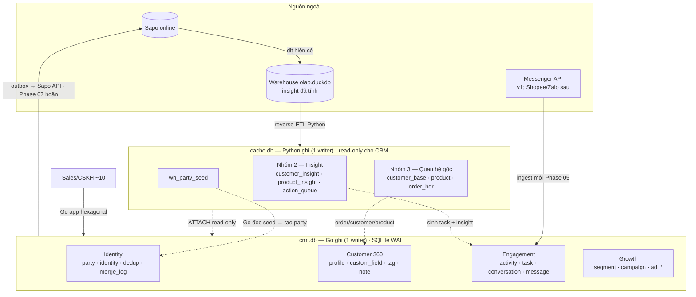
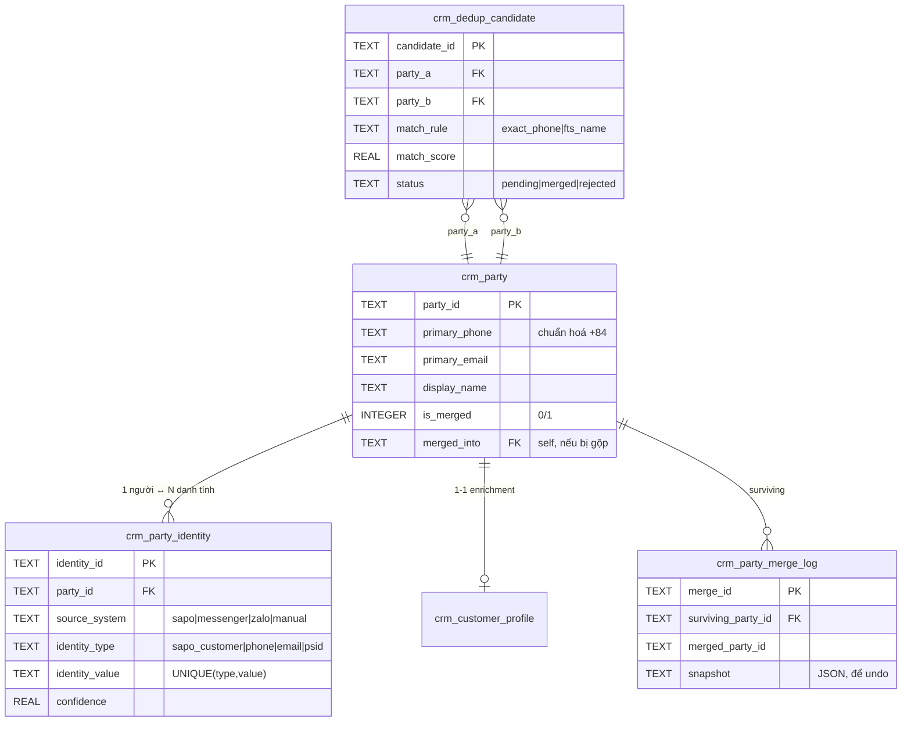
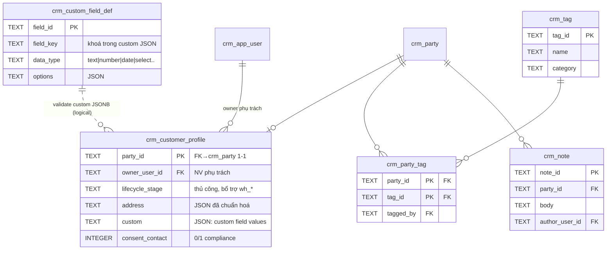
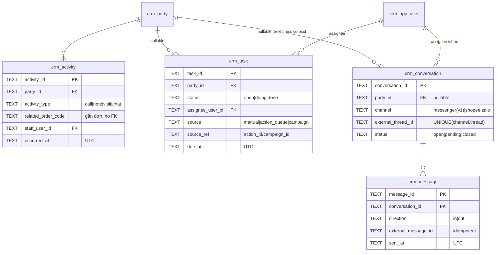
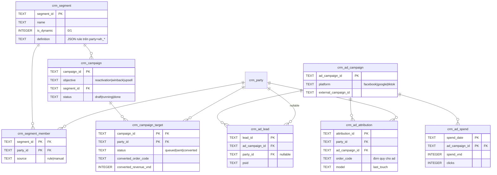
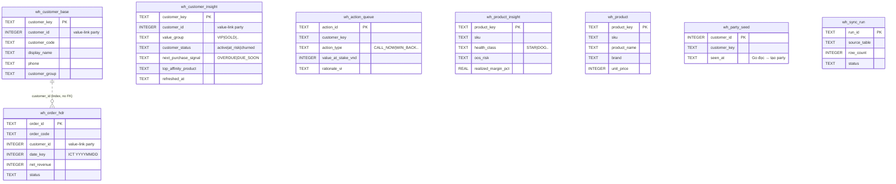
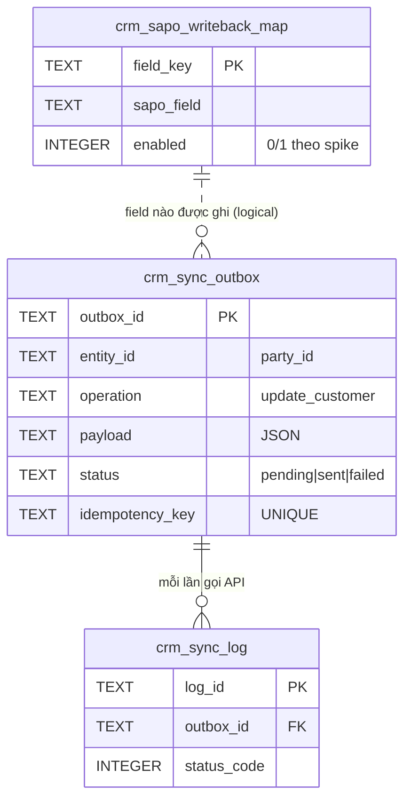

# ERD Tổng & Giải thích — Internal CRM (SQLite)

> Tài liệu review schema trước khi code. Xem kèm [plan.md](plan.md) + các phase. DDL kiểu Postgres trong phase → map SQLite theo "Quy ước SQLite" ở plan.md (`uuid`→TEXT, `timestamptz`→TEXT UTC, `jsonb`→TEXT+JSON1, prefix `crm_*`/`wh_*`).

## 0. Bản đồ domain & ranh giới 2 file

**3 nhóm dữ liệu — phân biệt rõ ai sở hữu:**

| Nhóm | Ví dụ | Nguồn sự thật | Ở đâu | CRM ghi? |
|---|---|---|---|---|
| 1. CRM tự tạo | party, enrichment, tag, note, task, conversation, segment, campaign | **CRM** | `crm.db` | ✅ |
| 2. Insight đã tính | RFM, affinity, next_purchase, action_queue, product_health | warehouse | `cache.db` `wh_*_insight` | ❌ |
| 3. Quan hệ gốc | order, customer base, product (catalog) | Sapo→warehouse | `cache.db` `wh_order_hdr`/`customer_base`/`product` | ❌ |

**Nguyên tắc:** mỗi file đúng **1 writer** (Go↔`crm.db`, Python↔`cache.db`) → không tranh chấp. FK **trong cùng file vẫn dùng bình thường** (bật `PRAGMA foreign_keys=ON`); chỉ liên kết **`crm.db`↔`cache.db`** là **value-link** (so giá trị `customer_id`), không FK — vì SQLite **không enforce FK qua file ATTACH**. `crm_party` là **trục trung tâm** — gần như mọi bảng tác nghiệp gắn `party_id`.

---

## 1. Identity & Golden Record (Phase 02) — lõi v1

**Vì sao:** Warehouse KHÔNG gộp khách trùng qua SĐT/email → CRM tự sở hữu. `crm_party` = bản ghi vàng (1 người thật). `crm_party_identity` = bảng cầu nối mọi danh tính về party; `UNIQUE(identity_type, identity_value)` đảm bảo 1 SĐT/psid chỉ thuộc 1 party. Dedup: exact SĐT (~90%) tự link; fuzzy tên (FTS5) → `crm_dedup_candidate` cho NV duyệt. Mọi merge ghi `crm_party_merge_log.snapshot` để **hoàn tác**.

---

## 2. Customer 360 — Enrichment (Phase 03)

**Vì sao:** Sapo ít custom field → đây là giá trị cốt lõi. `custom` (JSON1) lưu giá trị field tuỳ biến; `crm_custom_field_def` = registry để app render UI + validate (thêm field mới KHÔNG cần migration). Quy ước: **warehouse = sự thật tính toán, profile = ghi nhận con người** — không ghi đè nhau. `consent_contact=false` sẽ loại khỏi campaign (Phase 06).

---

## 3. Engagement — Activity, Task, Chat (Phase 05)

**Vì sao:** Warehouse chat là stub disabled, không link customer → CRM tự ingest (v1 Messenger) + tự dựng `psid→party` qua `crm_party_identity`. `crm_task.source='action_queue'` → việc sinh tự động từ `wh_action_queue` (CALL_NOW/WIN_BACK…), `source_ref` chống tạo trùng. `related_order_code` gắn đơn nhưng **không FK** (đơn nằm ở warehouse).

---

## 4. Growth — Segment, Campaign, Ads (Phase 06)

**Vì sao:** Segment dựng trên signal `wh_*` (value_group, customer_status, affinity) — KHÔNG re-derive. Campaign → `crm_campaign_target` theo dõi từng khách (queued→converted) + đo `converted_order_code` để tính ROI reactivation. Ads: warehouse không có ad→order → CRM tự ghi `crm_ad_lead` (click/messenger ad-referral) → resolve party → `crm_ad_attribution` (v1 last-touch đơn giản).

---

## 5. cache.db — Warehouse Read-Cache (Phase 04, Python ghi)

> `cache.db` = **mọi dữ liệu gốc-warehouse CRM cần ĐỌC**, 2 nhóm: **(2) insight đã tính** + **(3) quan hệ gốc** (order/customer/product). CRM không tính lại, không ghi. Quan hệ trong cache dùng cột index (`customer_id`/`sku`), **không bật FK** (bulk-load).

**Vì sao:**
- **Nhóm 2 (insight)** — bản sao read-only của thứ ĐÃ TÍNH ở warehouse, CRM không tính lại.
- **Nhóm 3 (quan hệ)** — `wh_customer_base`/`wh_product`/`wh_order_hdr` để CRM "xem đơn của khách / chọn SP gợi ý / segment theo lịch sử mua". `order_hdr` **slim 1 dòng/đơn** (KHÔNG dòng đơn); full giỏ hàng để **on-demand** từ `olap.duckdb` khi cần.
- `wh_party_seed` = kênh 1 chiều để Go tạo `crm_party` (giữ 1-writer). Mọi link sang CRM bằng **giá trị `customer_id`**, không FK qua file.

**Truy vấn điển hình** (Go ATTACH cache.db): "đơn của party này" = `crm_party_identity` → `customer_id` → `cache.wh_order_hdr`.

> ⚠️ Convention khi đọc: tiền = VND `INTEGER`; margin dùng `realized_margin_pct` (KHÔNG gross — bug H010); `net_revenue` (VAT-inclusive); `date_key` ICT; `customer_type` B2B & `fact_payments` warehouse KHÔNG tin cậy.

---

## 6. Phase 07 — Sapo Write-back (HOÃN sau v1)

**Vì sao:** Transactional outbox — thay đổi enrichment được duyệt → `crm_sync_outbox` → worker (hexagonal `SapoWriter` adapter) gọi Sapo API. API order+customer đã xác nhận tồn tại; field writable cần spike nhẹ. `enabled` bật từng field theo kết quả spike. **Hoãn sau khi v1 ổn.**

---

## 7. Quy ước chung mọi bảng `crm_*`

- `*_id` PK = **TEXT (UUID app sinh)**. Mọi `*_user_id` → `crm_app_user`.
- `created_at`/`updated_at` = **TEXT UTC ISO-8601 'Z'**, hiển thị ICT ở app (kỷ luật TIMESTAMPTZ).
- Tiền VND = **INTEGER**; tỉ lệ/pct = **REAL**; bool = **0/1**; JSON = **TEXT + JSON1**.
- `crm_app_user` còn được tham chiếu bởi `note.author`, `activity.staff`, `campaign.created_by`, `segment.owner`, `dedup_candidate.reviewed_by`… (lược khỏi sơ đồ cho gọn).
- **FK trong cùng file**: dùng đầy đủ, nhớ bật `PRAGMA foreign_keys=ON` mỗi connection (mặc định SQLite TẮT → quên thì không enforce).
- **Không enforce FK qua file ATTACH**: `crm.db` ⇄ `cache.db` chỉ value-link `customer_id` (app tự đảm bảo toàn vẹn).

## Legend
- `||--o{` 1 ↔ 0..N (FK cứng, cùng file) · `||--o|` 1 ↔ 0..1 · `}o--||` N ↔ 1
- `..` (đường đứt) = liên kết **logic/value-link**, KHÔNG FK (qua file, hoặc registry validate).

## Câu hỏi mở
- Không còn — chờ bạn duyệt ERD để bắt đầu Phase 01.
