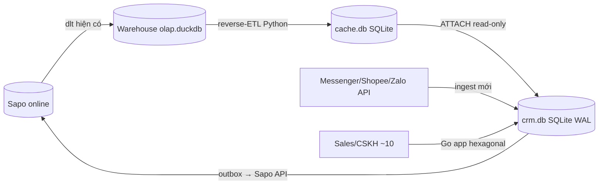

# Internal CRM — OLTP Schema Design (SQLite WAL)

> **Mục tiêu:** Thiết kế schema DB OLTP (**SQLite WAL** nhúng) + pipeline tích hợp + đề xuất stack cho một **CRM nội bộ bán lẻ**. App giúp sales/CSKH **làm giàu — chuẩn hóa — khai thác insight cá nhân hóa** để bán lại, trên nền warehouse phân tích đã có.
>
> 📐 **ERD tổng + giải thích (review trước):** [erd-overview.md](erd-overview.md)

## Bối cảnh & nguyên tắc kiến trúc

- **2 DB, 2 nhiệm vụ:** Warehouse (DuckDB/dbt) = OLAP, *tính* insight (giữ nguyên). CRM (**SQLite WAL** nhúng) = OLTP, *ghi* tác nghiệp + lưu enrichment.
- **CRM KHÔNG tính lại insight** — cache 1 chiều từ warehouse (`wh_cache.*`, refresh theo lịch). CRM **sở hữu**: golden record, enrichment, activity, conversation, task, segment, campaign, ads-attribution, write-back outbox.
- **3 luồng dữ liệu:**
  1. Warehouse → CRM: reverse-ETL (Python đọc `olap.duckdb` read-only) → `wh_cache`.
  2. CRM → Sapo: outbox → Sapo API (write-back 1 số field). **GATED** bởi API spike.
  3. FB Graph API → CRM: ingest chat + ads (warehouse không có) → `crm.conversation/message/ad_*`.
- **Tôn trọng convention warehouse:** TIMESTAMPTZ (UTC-store, ICT-display), `date_key` ICT, `net_revenue` (VAT-inclusive), consume cột semantic as-is, gate margin trên `has_cogs`.

## Stack đề xuất (đã chốt)

| Lớp | Lựa chọn | Lý do |
|---|---|---|
| DB | **SQLite (WAL)** nhúng, driver **`modernc.org/sqlite`** (pure-Go, no CGO) | 10 user/write ít → server Postgres là overkill; nhúng thẳng vào binary; tiền lệ project: "DuckDB no concurrent-write → dùng SQLite WAL" |
| Tách file | `crm.db` (Go ghi) + `cache.db` (Python reverse-ETL ghi; Go ATTACH read-only) | **mỗi file 1 writer → không tranh chấp** giữa Go app & Python sync |
| App | **Go** (chi + sqlc), **hexagonal** (domain ⟂ ports ⟂ adapters) | single static binary, deploy dễ; Sapo/DuckDB/SQLite đều là adapter; templ+HTMX cho UI nội bộ |
| Migration | **golang-migrate** (SQL-first, dialect sqlite3) | "schema thuần DDL", versioned |
| Pipeline | **Python** (duckdb read + stdlib `sqlite3` ghi cache.db) | đồng bộ stack ingestion; có thể thành Dagster asset |
| Local | chạy binary + python; **không cần container DB** | 10 user → cực nhẹ |
| Auth | **Hoãn (làm sau)** | v1 tin-cậy-LAN không auth như `detailView`; bảng `app_user` vẫn tạo để gán owner/assignee |

## Phân tầng schema (2 file SQLite)

- **`crm.db`** — bảng CRM sở hữu, prefix `crm_*` (ghi bởi Go app). SQLite không có schema → dùng prefix tên bảng.
- **`cache.db`** — bản sao read-only **mọi dữ liệu gốc-warehouse CRM cần đọc**, prefix `wh_*` (ghi bởi Python reverse-ETL). Gồm **(2) insight** (`wh_*_insight`, `wh_action_queue`) + **(3) quan hệ gốc** (`wh_order_hdr`, `wh_customer_base`, `wh_product`). Go `ATTACH 'cache.db' AS cache` **read-only**.
- View `crm_party_360` = join `crm_party` + `crm_customer_profile` + `cache.wh_customer_insight` + action + đơn gần nhất (`cache.wh_order_hdr`) — app 1 query.

## Quy ước SQLite (áp dụng MỌI phase DDL bên dưới)

> DDL trong các phase viết kiểu Postgres cho dễ đọc — khi implement map sang SQLite theo bảng này:

| Postgres (trong phase) | SQLite thực thi |
|---|---|
| `CREATE SCHEMA crm` / `crm.party` | bỏ schema → bảng `crm_party` (prefix); `wh_*` ở `cache.db` |
| `uuid ... DEFAULT gen_random_uuid()` | `TEXT PRIMARY KEY` — UUID sinh ở **app** (Go/Python), hoặc `lower(hex(randomblob(16)))` |
| `timestamptz DEFAULT now()` | `TEXT NOT NULL DEFAULT (strftime('%Y-%m-%dT%H:%M:%fZ','now'))` — **UTC ISO-8601 'Z'**, hiển thị ICT ở app (giữ kỷ luật TIMESTAMPTZ) |
| `numeric` (tiền VND) | `INTEGER` (VND không có phần lẻ); tỉ lệ/`pct` → `REAL` |
| `jsonb` + GIN | `TEXT` + **JSON1** (`json_extract`); index biểu thức `json_extract(custom,'$.key')` khi cần |
| `gin (col gin_trgm_ops)` fuzzy | **FTS5** bảng phụ + chuẩn hoá app-side; dedup chính theo **SĐT exact** |
| FK trong cùng file | dùng đầy đủ — bật `PRAGMA foreign_keys=ON` (mặc định TẮT) |
| FK qua `crm.db`↔`cache.db` | **không enforce qua file ATTACH** — link bằng value `customer_id`, app tự lo |
| `ON CONFLICT DO UPDATE` | SQLite UPSERT (3.24+) — OK |
| `BEGIN`/trigger `updated_at` | `PRAGMA foreign_keys=ON`, `journal_mode=WAL`, `busy_timeout=5000`/conn; trigger `updated_at` OK hoặc set ở app |

## Phases

| # | Phase | Trạng thái | Output chính |
|---|---|---|---|
| 01 | [Nền tảng & stack & local env](phase-01-foundation-stack-local-env.md) | ✅ | crm.db+cache.db (WAL/ATTACH), Go skeleton hexagonal, migrate, `crm_app_user`, /healthz 200 |
| 02 | [Identity & golden record (dedup)](phase-02-identity-golden-record.md) | ✅ | `party`/`party_identity`/`dedup_candidate`/`merge_log`, FTS5, merge+undo, 10 test (fuzzy-sweep TODO) |
| 03 | [Customer 360 + custom fields + tags](phase-03-customer-360-custom-fields-tags.md) | ✅ | `customer_profile`/`custom_field_def`/`tag`/`note`, custom-JSON validate, `party_360` view (crm-only), 32 test |
| 04 | [Reverse-ETL warehouse read-cache](phase-04-reverse-etl-insight-cache.md) | ✅ | Python reverse-ETL → `cache.db` (`wh_*` insight+order+customer+product), Go seed-consumer + insight read (graceful-empty), 45 test |
| 05 | [Activity + tasks + chat tracking](phase-05-activity-tasks-conversation.md) | ✅ | `activity`/`task`/`conversation`/`message`, task-gen từ action_queue, Messenger ingest (parse+psid→party, echo-safe), inbox; live-FB seam (TODO token) |
| 06 | [Segments + reactivation + ads tracking](phase-06-segments-campaigns-ads.md) | ⬜ | `segment`, `campaign`, `ad_campaign`, `ad_attribution` |
| 07 | [Sapo 2-chiều write-back (hoãn sau v1)](phase-07-sapo-writeback-sync.md) | ⬜ | `sync_outbox`, `writeback_map`; adapter Sapo (hexagonal) |
| BL | Backlog — CRM enrichment → warehouse (ingestion pipeline mới) | 🔮 | luồng ngược để re-analysis, làm SAU |

## Dependencies

- 01 → tất cả (nền tảng). 02 → 03/05/06 (party là khoá). 04 độc lập sau 01 (chỉ cần `wh_cache` schema). 07 cần 03 (enrichment field) — hoãn implement.
- **Critical path dedup:** 02 phải xong trước 05/06 vì conversation/campaign đều gắn `party_id`.
- **v1 thực thi:** 01 → 02 → 03 → 04 → 05 → 06. Phase 07 + Backlog hoãn sau khi v1 ổn.

## Rủi ro lớn (chi tiết trong từng phase)

1. **Sapo write-back ẩn số** → Phase 07 mở đầu bằng API spike; nếu Sapo không cho ghi → enrichment ở lại CRM (fallback, không chặn v1).
2. **Chat/Ads tự build từ FB API** → khối lượng lớn hơn dự kiến; Phase 05/06 tách rõ "ingest" vs "schema".
3. **Dedup phone/email không tầm thường** → chuẩn hoá SĐT VN (exact, ~90%) + FTS5 cho tên + hàng đợi review thủ công (`dedup_candidate`).
4. **`customer_type` B2B & `fact_payments` không tin cậy** → không dựa vào cho logic v1.

## Quyết định đã chốt (06/13)

1. **Sapo API:** CÓ API cho order + customer → write-back khả thi. Dùng **hexagonal** (Sapo = outbound adapter). Implement **sau v1** (Phase 07 hoãn).
2. **Chat:** 3 kênh — **Messenger + Shopee + Zalo**. Schema `channel` tổng quát, mỗi kênh 1 ingest adapter.
3. **Auth:** hoãn — v1 tin-cậy-LAN không auth như `detailView`. `app_user` vẫn tạo (owner/assignee).
4. **Enrichment → warehouse:** CÓ chảy ngược, nhưng **làm sau** qua **ingestion pipeline mới** (Backlog).
5. **Quy mô:** ~**10 user** nội bộ → concurrency rất thấp, index tối giản.

## Câu hỏi mở — đã đóng

- **Chat v1 = chỉ Messenger.** Shopee Chat + Zalo OA **để sau** (schema `conversation/message` đã tổng quát → chỉ thêm adapter sau).
- Quy mô party: không cần chốt — SQLite + FTS5 + index SĐT ổn ở mọi mức thực tế.
