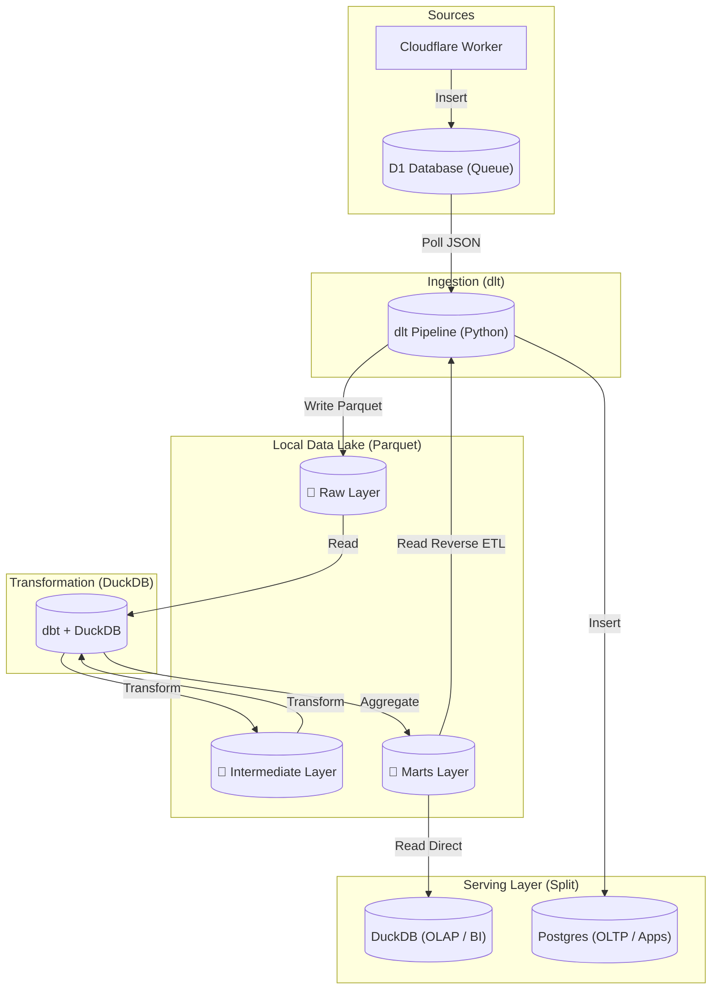
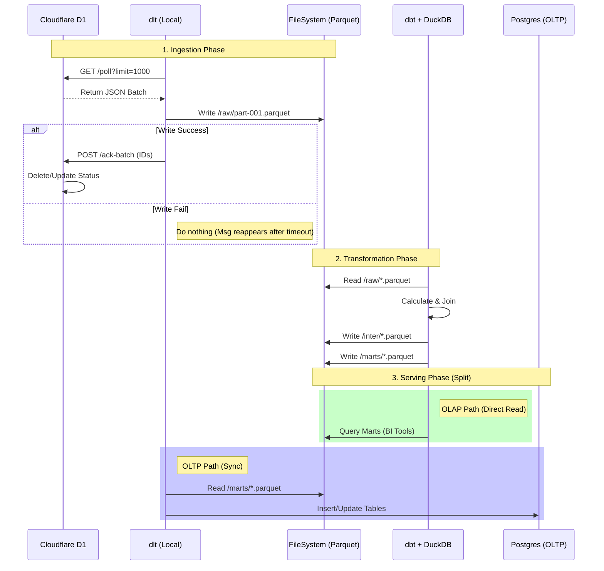

# System Architecture: Local Data Lakehouse (ELT Pipeline)

This document describes the modern **Local Data Lakehouse** pipeline designed to ingest, process, and serve webhook data using `dlt`, Parquet, and DuckDB.

## 1. Architecture Overview

The system follows a **File-Centric ELT** pattern, separating Compute (DuckDB) from Storage (Parquet Files), with a split serving strategy:

1.  **Extract (E)**: `dlt` polls Cloudflare D1 (Edge) for raw JSON.
2.  **Load (L)**: `dlt` dumps data into **Raw Parquet Files** (Data Lake).
3.  **Transform (T)**: `dbt` (powered by **DuckDB**) processes Raw Parquet into Intermediate and Marts Parquet files.
4.  **Serve (S)**:
    - **OLAP (Analysis)**: BI Tools connect directly to **DuckDB** reading Marts Parquet.
    - **OLTP (Apps)**: `dlt` pushes specific data subsets to **Postgres**.

### High-Level Data Flow

---

## 2. Component Details

### 2.1. Extract Layer (Edge + dlt)

- **Cloudflare Worker**: Receives Webhooks -> Saves to D1 (`webhooks` table).
- **dlt (Python)**:
  - **Action**: Polls Worker API (`GET /poll?limit=1000`).
  - **Logic**: Fetches batches of data. If successful, calls `POST /ack-batch` to clear D1.

### 2.2. Load Layer (Local Data Lake)

- **Storage**: Local Filesystem (HDD/SSD).
- **Format**: **Parquet** (Columnar Storage).
- **Path Structure**: `data_lake/raw/{table}/{YYYY}/{MM}/{DD}/{HH}/file.parquet`.
- **Advantage**:
  - **High Compression**: Reduces storage cost by ~90% vs JSON.
  - **Universal**: Can be read by DuckDB, Spark, Pandas, etc.

### 2.3. Transform Layer (dbt + DuckDB)

- **Engine**: **DuckDB** (In-process SQL Engine).
- **Orchestrator**: `dbt`.
- **Workflow**:
  - **Staging**: Read `raw/*.parquet`. Clean/Cast types. Write `inter/*.parquet`.
  - **Marts**: Aggregations for business needs. Write `marts/*.parquet`.
- **Key Feature**: DuckDB treats Parquet files as external tables (`read_parquet`), enabling SQL over files without importing them into a database.

### 2.4. Serving Layer (Split Strategy)

We use different serving technologies based on the consumption pattern:

#### A. OLAP (Reporting & Analytics)

- **Technology**: **DuckDB** (Embedded).
- **Consumers**: BI Tools (Metabase, Superset, Tableau), Data Analysts.
- **Architecture**: Tools connect via JDBC/ODBC to DuckDB, which queries the `marts/*.parquet` files directly (Zero-Copy).
- **Benefit**: Extremely fast aggregations, no data duplication cost.

#### B. OLTP (Internal Applications)

- **Technology**: **PostgreSQL**.
- **Consumers**: Admin Dashboards, CRM, Backend Services.
- **Architecture**: `dlt` runs a "Reverse ETL" job to sync specific, high-value tables from `marts/*.parquet` into Postgres.
- **Benefit**: Transactional integrity, high concurrency support for app users.

---

## 3. Sequence Diagram (Data Lifecycle)

---

## 4. Architecture Comparison

| Feature              | Old (Postgres-centric)          | New (Local Data Lakehouse)            |
| :------------------- | :------------------------------ | :------------------------------------ |
| **Ingestion**        | Node.js Consumer (Complex)      | **dlt** (Python - Simple/Robust)      |
| **Raw Storage**      | Postgres `webhook_logs` (Heavy) | **Parquet Files** (Lightweight)       |
| **Transform Engine** | Postgres (Slow for OLAP)        | **DuckDB** (Vectorized - Fast)        |
| **Serving (OLAP)**   | Postgres (Shared resource)      | **DuckDB** (Dedicated, In-memory)     |
| **Serving (OLTP)**   | Postgres (Shared resource)      | **Postgres** (Clean, App-only data)   |
| **Cost**             | Medium (Always-on DB resources) | **Low** (Batch compute, File storage) |