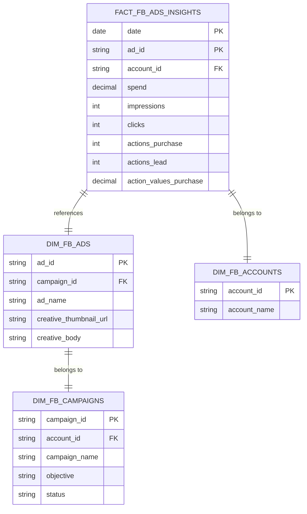

# Facebook Ads Integration Guide

This guide details the technical implementation for ingesting and modeling Facebook Ads data within our data warehouse.

## 1. Ingestion Strategy (Multi-Account)

We use **dlt (Data Load Tool)** with the verified `facebook_ads` source. Since our business operates multiple ad accounts (e.g., different brands, categories), we implement a multi-tenancy ingestion pattern.

### Technical Approach: Iterator Pattern

Instead of hardcoding a single `account_id`, the ingestion script iterates through a configured list of Account IDs.

**Key Components:**

- **Source:** `dlt.sources.facebook_ads`
- **Configuration:** List of `AD_ACCOUNTS` stored in environment variables or a configuration table.
- **Execution:** A Python script loops through accounts, initializing a source instance for each, and loading them into a unified dataset.

### Code Pattern Reference

```python
# Pseudo-code pattern for ingestion/run_facebook_ads_batch.py
import dlt
from dlt.sources.facebook_ads import facebook_ads_source

AD_ACCOUNTS = config.get("FACEBOOK_AD_ACCOUNT_IDS")

pipeline = dlt.pipeline(
    pipeline_name="facebook_ads_master",
    destination="duckdb", # or postgres/bigquery
    dataset_name="raw_facebook_ads"
)

for account_id in AD_ACCOUNTS:
    # dlt merges data from same schema automatically
    pipeline.run(facebook_ads_source(account_id=account_id))
```

### 1.1 `raw` Tables (Resources)

The standard `dlt` Facebook Ads source generates **6 primary tables** (resources) and associated child tables for nested data.

| Table Name  | Description                    | Key Content                                       |
| :---------- | :----------------------------- | :------------------------------------------------ |
| `campaigns` | Campaign metadata              | `id`, `name`, `objective`, `status`, `start_time` |
| `ad_sets`   | Ad Set configuration           | `id`, `campaign_id`, `targeting`, `billing_event` |
| `ads`       | Ad definition                  | `id`, `adset_id`, `creative_id`                   |
| `creatives` | Creative assets                | `id`, `image_url`, `body` (text), `title`         |
| `leads`     | (Optional) Lead Form responses | Customer info from Lead Ads forms                 |
| `insights`  | Performance metrics            | `date_start`, `spend`, `impressions`, `clicks`    |

**Child Tables (Nested Data):**
`dlt` automatically normalizes nested JSON arrays into child tables linked by parent keys. Common child tables for `insights` include:

- `insights__actions`: Breakdowns of action types (e.g., `link_click`, `post_reaction`, `purchase`, `landing_page_view`).
- `insights__action_values`: Value associated with actions (e.g., revenue from `purchase`).

## 2. Data Modeling Strategy (Star Schema)

Raw data from the Facebook API is deeply nested (JSON). We transform this into a **Star Schema** using dbt to enable efficient reporting in Metabase.

### Conceptual Model



### Table Definitions

#### A. Dimension Tables

- **`dim_fb_accounts`**: Central registry of all ad accounts.
- **`dim_fb_campaigns`**: Campaign metadata (Name, Status, Objective).
- **`dim_fb_ads`**: Ad level details, critically including **Creative** information (Images, Text) for visual analysis.

#### B. Fact Tables

- **`fact_fb_ads_insights_daily`**: The core reporting table.
  - **Grain**: Per Day, Per Ad.
  - **Metrics**: Spend, Impressions, Clicks, conversions (Purchases, Leads).
  - **Transformation Logic**:
    - Flatten nested `actions` array to extract specific conversion events (e.g., "purchase", "lead").
    - Flatten `action_values` to get revenue.
