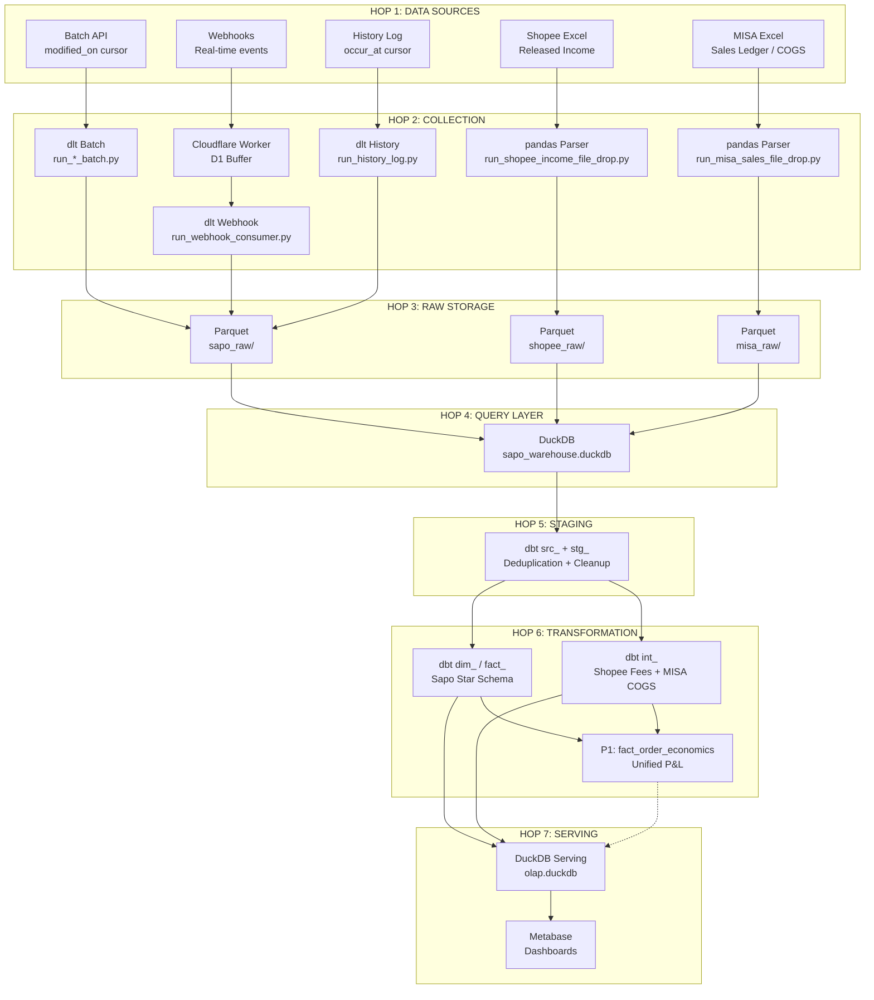

# Data Flow Documentation

> End-to-end data flow through the 7-hop pipeline

## Table of Contents

1. [Overview Diagram](#overview-diagram)
2. [Ingestion Channels (Hop 1-2)](#ingestion-channels-hop-1-2)
   - Channel 1-3: Sapo (Batch API, Webhooks, History Log)
   - Channel 4: Shopee File Drop (NEW)
   - Channel 5: MISA AMIS File Drop (NEW)
3. [Storage Layer (Hop 3)](#storage-layer-hop-3)
4. [Transformation (Hop 4-6)](#transformation-hop-4-6)
5. [Serving (Hop 7)](#serving-hop-7)
6. [Data Lineage](#data-lineage)

---

## Overview Diagram



### Latency by Hop

| Path | Hop 1→2 | Hop 2→3 | Hop 3→7 | Total |
|------|---------|---------|---------|-------|
| **Real-time (Webhook)** | ~1s | ~1 min | ~2 min | **~3 min** |
| **Near Real-time (History)** | 5-10 min | ~1 min | ~2 min | **~13 min** |
| **Batch (Daily)** | Scheduled | ~5 min | ~10 min | **~15 min** |

---

## Ingestion Channels (Hop 1-2)

### Channel 1: Batch API

**Purpose:** Reliable daily/hourly synchronization with cursor-based incremental loading.

```
┌─────────────────┐     GET /admin/orders.json?modified_on_min=X
│   Sapo API      │◄────────────────────────────────────────────────
│                 │─────────────────────────────────────────────────►
└─────────────────┘     JSON Response (up to 250 items)
         │
         │
         ▼
┌─────────────────┐
│  dlt Pipeline   │
│  run_*_batch.py │
│                 │
│  • Paginate     │
│  • Transform    │
│  • Track cursor │
└────────┬────────┘
         │
         ▼
┌─────────────────┐
│  Parquet File   │
│  ingest_method  │
│  =batch_sync    │
└─────────────────┘
```

**Entities & Cursors:**

| Entity | Cursor Field | Reliability | Notes |
|--------|--------------|-------------|-------|
| Orders | `modified_on` | High | Updates captured reliably |
| Customers | `created_on` | Medium | Updates may be missed |
| Accounts | N/A (full scan) | High | Small dataset |

**Schedule:**
- Orders: Daily at 04:00 AM (nightly reconciliation)
- Customers: Daily at 04:30 AM
- Accounts: Weekly

**Volume Estimates:**
- ~1,000 orders/day
- ~200 customers/day
- ~50 accounts total

---

### Channel 2: Webhooks

**Purpose:** Real-time event capture with high availability buffering.

```
┌─────────────────┐     POST /webhook/sapo/order/update
│  Sapo Platform  │─────────────────────────────────────►
└─────────────────┘     { entity_id, action, payload }
         │
         ▼
┌─────────────────────────────────────────────────────┐
│              Cloudflare Worker                       │
│  ┌───────────────────────────────────────────────┐  │
│  │  1. Validate HMAC signature                   │  │
│  │  2. Generate UUID                             │  │
│  │  3. INSERT INTO messages (pending)            │  │
│  │  4. Return 200 OK immediately                 │  │
│  └───────────────────────────────────────────────┘  │
└───────────────────────────┬─────────────────────────┘
                            │
                            ▼
┌─────────────────────────────────────────────────────┐
│                    D1 Database                       │
│  ┌───────────────────────────────────────────────┐  │
│  │  messages table:                              │  │
│  │  • id (UUID)                                  │  │
│  │  • status (pending/processing/done)          │  │
│  │  • source, entity, action                    │  │
│  │  • payload (JSON)                            │  │
│  │  • created_at, locked_until                  │  │
│  └───────────────────────────────────────────────┘  │
└───────────────────────────┬─────────────────────────┘
                            │
         Poll every 1 min   │  GET /poll?limit=1000
                            ▼
┌─────────────────────────────────────────────────────┐
│           dlt Webhook Consumer                       │
│  ┌───────────────────────────────────────────────┐  │
│  │  1. Fetch pending messages (with lock)        │  │
│  │  2. Transform to envelope format              │  │
│  │  3. Write to Parquet                          │  │
│  │  4. POST /ack-batch (mark done)              │  │
│  └───────────────────────────────────────────────┘  │
└───────────────────────────┬─────────────────────────┘
                            │
                            ▼
┌─────────────────────────────────────────────────────┐
│                   Parquet File                       │
│              ingest_method=webhook                   │
└─────────────────────────────────────────────────────┘
```

**Subscribed Events:**

| Entity | Events |
|--------|--------|
| Order | create, update, status_change, paid, shipped |
| Customer | create, update |
| Product | create, update |

**Reliability:**
- D1 provides at-least-once delivery
- Messages locked during processing (5 min TTL)
- Failed messages auto-retry after lock expires

---

### Channel 3: History Log

**Purpose:** Gap filling - catch events missed by webhooks.

```
┌─────────────────┐     GET /admin/settings/get_logs?from=X
│  Sapo History   │◄────────────────────────────────────────
│  Log API        │─────────────────────────────────────────►
└─────────────────┘     Array of change events
         │
         │
         ▼
┌─────────────────────────────────────────────────────┐
│           dlt History Log Pipeline                   │
│  ┌───────────────────────────────────────────────┐  │
│  │  For each log entry:                          │  │
│  │  1. Parse entity_type, entity_id, action      │  │
│  │  2. Fetch full entity via API                 │  │
│  │  3. Wrap in envelope format                   │  │
│  │  4. Write to Parquet                          │  │
│  └───────────────────────────────────────────────┘  │
└───────────────────────────┬─────────────────────────┘
                            │
                            ▼
┌─────────────────────────────────────────────────────┐
│                   Parquet File                       │
│            ingest_method=history_log                 │
└─────────────────────────────────────────────────────┘
```

**Cursor:** `occur_at` (when the change happened)

**Schedule:** Every 10 minutes

**Coverage:** All entity types that appear in the log

---

### Channel 4: Shopee File Drop (NEW — planned)

**Purpose:** Ingest Shopee released-income Excel exports containing per-order platform fees, shipping subsidies, and voucher costs.

```
app_data/input_source/shopee/*.xlsx
         │
         │  Dagster reactive sensor (file mtime change)
         ▼
┌─────────────────────────────────────┐
│  ingestion/run_shopee_income_       │
│  file_drop.py                       │
│  (pandas + openpyxl, NO dlt SDK)    │
│                                     │
│  • Parse 2 sheets (Doanh thu,       │
│    Service Fee Details)             │
│  • Split Order/Sku grain            │
│  • Rename VN→snake_case             │
│  • Inject ingested_at metadata      │
└────────────┬────────────────────────┘
             │  Writes 3 parquet tables
             ▼
data_lake/shopee_raw/
├── order_revenue/ingest_method=file_drop/year=*/month=*/*.parquet
├── order_revenue_items/ingest_method=file_drop/year=*/month=*/*.parquet
└── order_service_fees/ingest_method=file_drop/year=*/month=*/*.parquet
```

**Key design:** append-only parquet (unique filename per ingest), dedup at dbt read-time. No API.

**Schedule:** Reactive sensor; manual file drop cadence (weekly est.)

**Entities:** `order_revenue`, `order_revenue_items`, `order_service_fees`

**Plan:** `plans/260409-1710-shopee-pipeline/`

---

### Channel 5: MISA AMIS File Drop (NEW — planned)

**Purpose:** Ingest MISA AMIS **Sổ chi tiết bán hàng** (Sales Detail Ledger) Excel exports containing per-line cost-of-goods-sold (giá vốn).

```
app_data/input_source/misa-amis/*.xlsx
         │
         │  Dagster reactive sensor (file mtime change)
         ▼
┌─────────────────────────────────────┐
│  ingestion/run_misa_sales_          │
│  file_drop.py                       │
│  (pandas + openpyxl, NO dlt SDK)    │
│                                     │
│  • Parse single sheet               │
│  • Filter totals footer             │
│  • Synthesize line_no per voucher   │
│  • Rename VN→snake_case             │
│  • Inject ingested_at metadata      │
└────────────┬────────────────────────┘
             │  Writes 1 parquet table
             ▼
data_lake/misa_raw/
└── sales_lines/ingest_method=file_drop/year=*/month=*/*.parquet
```

**Key design:** append-only parquet (unique filename per ingest), dedup at dbt read-time. Voucher_no bridges to Sapo/Shopee orders.

**Schedule:** Reactive sensor; manual file drop cadence (weekly/monthly est.)

**Entities:** `sales_lines`

**Plan:** `plans/260409-1742-misa-amis-pipeline/`

---

### Ingestion Latency Summary (updated)

| Path | Hop 1→2 | Hop 2→3 | Hop 3→7 | Total |
|------|---------|---------|---------|-------|
| **Real-time (Webhook)** | ~1s | ~1 min | ~2 min | **~3 min** |
| **Near Real-time (History)** | 5-10 min | ~1 min | ~2 min | **~13 min** |
| **Batch (Daily)** | Scheduled | ~5 min | ~10 min | **~15 min** |
| **File Drop (Shopee/MISA)** | Manual | ~30s | ~2 min | **Manual + ~2.5 min** |

---

## Storage Layer (Hop 3)

### Partition Structure

```
data_lake/
├── sapo_raw/                              # Sapo API data (dlt-managed)
│   ├── order/
│   │   ├── ingest_method=batch_sync/
│   │   │   └── year=2026/month=01/*.parquet
│   │   ├── ingest_method=webhook/
│   │   │   └── year=2026/month=01/*.parquet
│   │   └── ingest_method=history_log/
│   │       └── year=2026/month=01/*.parquet
│   ├── customer/  ... (same structure)
│   └── account/   ... (same structure)
│
├── shopee_raw/                            # Shopee file-drop (pandas-managed)
│   ├── order_revenue/
│   │   └── ingest_method=file_drop/year=2026/month=02/
│   │       ├── shopee_income_2026-02_20260301T080000Z.parquet
│   │       └── shopee_income_2026-02_20260315T090000Z.parquet
│   ├── order_revenue_items/  ... (same partition layout)
│   └── order_service_fees/   ... (same partition layout)
│
└── misa_raw/                              # MISA file-drop (pandas-managed)
    └── sales_lines/
        └── ingest_method=file_drop/year=2026/month=01/
            ├── misa_sales_2026-01_20260201T100000Z.parquet
            └── misa_sales_2026-01_20260315T080000Z.parquet
```

> **Note:** Shopee/MISA use **append-only** writes with unique `{ingested_at_ts}` in filenames. Sapo uses dlt-generated `{file_id}`. Both patterns produce multiple files per partition; dedup happens at dbt read-time.

### File Naming Convention

```
{YYYYMMDD}_{HHMMSS}_{load_id}.parquet
```

- `YYYYMMDD_HHMMSS` - Processing timestamp
- `load_id` - dlt load identifier (for traceability)

### Envelope Schema

Every record follows this structure:

```json
{
  "entity_id": "12345",
  "entity_type": "order",
  "ingest_method": "webhook",
  "event_type": "update",
  "event_timestamp": "2026-01-28T10:05:30Z",
  "payload": {
    "id": 12345,
    "code": "ORD-001",
    "status": "confirmed",
    "total": 500000,
    "...": "full entity snapshot"
  },
  "_dlt_load_id": "abc123",
  "_dlt_id": "unique-record-id",
  "year": "2026",
  "month": "01"
}
```

### Retention Policy

| Data Type | Retention | Action |
|-----------|-----------|--------|
| Raw Parquet | 2 years | Archive to cold storage |
| Export Parquet | 30 days | Delete old snapshots |
| DuckDB state | Indefinite | Part of warehouse |

---

## Transformation (Hop 4-6)

### Hop 4: Query Layer (DuckDB)

DuckDB reads Parquet files using hive partitioning:

```sql
-- DuckDB automatically discovers partitions
SELECT * FROM read_parquet(
    'data_lake/sapo_raw/order/**/*.parquet',
    hive_partitioning = true
);

-- Efficient partition pruning
SELECT * FROM read_parquet(...)
WHERE ingest_method = 'webhook'
  AND year = '2026'
  AND month = '01';
```

### Hop 5: Staging Layer (dbt)

**Purpose:** JSON extraction, deduplication, enrichment, normalization

**Strategy:** 2-Level Dedup in src_ (Incremental Extraction)

```
src_ (INCREMENTAL)                stg_ (VIEW)              std_ (VIEW)
┌─────────────────────┐    ┌��─────────────────┐    ┌─────────────────┐
│ Read raw parquet     │    │ Enrichment joins  │    │ Status mapping   │
│ Tech dedup (entity)  │───►│ (ref tables)      │───►│ Normalization    │
│ JSON extraction      │    │ Unnest models     │    │ Standard schema  │
│ Biz dedup (order_id) │    │ (items/pay/ful)   │    │                 │
│ Output: flat, 1/order│    └──────────────────┘    └─────────────────┘
└─────────────────────┘
```

Key design: src_ reads parquet + extracts + deduplicates → outputs flat data (no payload). stg_ and std_ work with lightweight flat columns only. This prevents OOM by ensuring the heavy payload processing is isolated in one incremental model.

**Output:** One row per business entity (order_id) with all fields extracted

---

### Hop 6: Transformation Layer (dbt)

#### Intermediate Layer

```sql
-- int_orders_enriched.sql
SELECT
    o.order_id,
    o.order_code,
    o.status,
    o.total,
    o.discount,
    o.total - o.discount AS net_total,

    -- Customer info
    c.customer_name,
    c.customer_group,

    -- Geography
    g.province,
    g.district,

    -- Time
    o.created_at,
    o.modified_at

FROM {{ ref('stg_sapo_orders') }} o
LEFT JOIN {{ ref('stg_sapo_customers') }} c
    ON o.customer_id = c.customer_id
LEFT JOIN {{ ref('dim_geography') }} g
    ON o.shipping_ward_id = g.ward_id
```

#### Marts Layer (Star Schema)

**Dimensions:**

| Table | Grain | Key Columns |
|-------|-------|-------------|
| `dim_date` | One row per day | date_key, year, month, quarter |
| `dim_customers` | One row per customer | customer_key, name, group, tier |
| `dim_products` | One row per product | product_key, name, category |
| `dim_geography` | One row per ward | geography_key, province, district |
| `dim_staff` | One row per staff | staff_key, name, role |

**Facts:**

| Table | Grain | Measures |
|-------|-------|----------|
| `fact_orders` | One row per order | total, discount, net_total |
| `fact_sales` | One row per line item | quantity, amount, cost |
| `fact_targets` | One row per target period | target_amount |

---

## Serving (Hop 7)

### Rolling Snapshot Strategy

```
data_lake/export/marts/rolling/
├── dim_customers/
│   ├── dim_customers_20260127_0400.parquet  (old)
│   ├── dim_customers_20260128_0400.parquet  (current)
│   └── ...
├── fact_orders/
│   ├── fact_orders_20260127_0400.parquet    (old)
│   ├── fact_orders_20260128_0400.parquet    (current)
│   └── ...
└── ...
```

### Rolling Self-Refresh View Generation

```sql
-- olap.duckdb automatically selects latest file
CREATE OR REPLACE VIEW dim_customers AS
SELECT * FROM read_parquet(
    '/data_lake/export/marts/rolling/dim_customers/*.parquet'
)
WHERE _snapshot_ts = (
    SELECT MAX(_snapshot_ts)
    FROM read_parquet('/data_lake/export/marts/rolling/dim_customers/*.parquet')
);
```

### Metabase Connection

```
┌─────────────────────────────────────────────────────┐
│              Metabase (Docker)                       │
│                                                     │
│  Database Connection:                               │
│  • Type: DuckDB                                     │
│  • Path: /data_lake/serving/olap.duckdb            │
│                                                     │
│  Volume Mount:                                      │
│  • Host: ./data_lake → Container: /data_lake       │
└─────────────────────────────────────────────────────┘
```

---

## Data Lineage

### Order Entity Lineage

```
Sapo Order
    │
    ├── [Batch API] ──► sapo_raw/order/ingest_method=batch_sync/
    ├── [Webhook]   ──► sapo_raw/order/ingest_method=webhook/
    └── [History]   ──► sapo_raw/order/ingest_method=history_log/
            │
            ▼
    src_sapo_orders (INCREMENTAL: extract JSON + tech dedup + biz dedup)
            │  Output: flat columns, 1 row per order_id, no payload
            │
            ├──► stg_sapo_order_items (unnest line items)
            ├──► stg_sapo_payments (unnest payments)
            ├──► stg_sapo_fulfillments (unnest fulfillments)
            │
            ▼
    stg_sapo_orders (VIEW: enrichment joins)
            │
            ▼
    std_orders (VIEW: status mapping + normalization)
            │
            ├──► fact_orders ──► Export to Parquet ──► olap.duckdb
            ├──► fact_sales
            └──► dim_geography, dim_promotions
```

### Column Lineage (Key Fields)

| Final Column | Source | Transformation |
|--------------|--------|----------------|
| `fact_orders.order_id` | `payload.id` | Type cast to VARCHAR |
| `fact_orders.order_total` | `payload.total` | Type cast to DECIMAL |
| `fact_orders.customer_key` | `stg_customers.customer_key` | Surrogate key lookup |
| `dim_customers.customer_name` | `payload.name` | Direct mapping |
| `dim_geography.province` | Seed data | Static lookup by ward_id |

---

## Related Documents

- [Architecture](./overview.md) - System design overview
- [Data Dictionary](./data-dictionary.md) - Schema reference
- [Transformation Details](../transformation/docs/README.md) - dbt model docs
