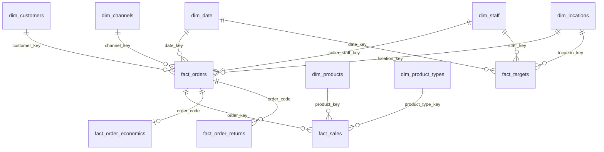

# Data Model

> System-wide map of analytical tables, grains, keys, relationships, and planned model additions.

## Purpose

This document owns the big-picture data model: how source entities, dbt models, facts, dimensions, and serving tables relate to each other. Use it when the question is "what tables exist or should exist, what grain do they represent, and how do they join?"

It complements, but does not replace:

- [`data-dictionary.md`](./data-dictionary.md), which documents table and column definitions.
- [`source-entities/`](./source-entities/index.md), which documents raw source payloads before dbt modeling.
- dbt `schema.yml` files, which are the executable technical metadata for implemented dbt models.

## Document Roles

| Document | Owns | Does not own |
|----------|------|--------------|
| [`data-model.md`](./data-model.md) | Table-level model map, grains, primary keys, foreign keys, fact/dimension relationships, cross-source joins, planned tables, and ERD-style diagrams | Full column-by-column dictionary, raw payload field catalog, metric formulas |
| [`data-dictionary.md`](./data-dictionary.md) | Column definitions, types, table descriptions, business meaning of important fields, quick reference for implemented and planned entities | The authoritative ERD or detailed relationship narrative |
| [`source-entities/<source>.md`](./source-entities/index.md) | Raw source entity contracts: source payload fields, nested structures, API/file origin, source-level keys, ingestion envelope, and raw availability | Curated mart relationships, dbt model tests, BI metric definitions |
| `transformation/models/**/schema.yml` and [`sources.yml`](../../transformation/models/sources.yml) | dbt source/model declarations, columns, descriptions, uniqueness/not-null/relationship tests | Business-facing explanation or future-state architecture narrative |
| `docs/analytics-handbook/domains/*.md` | Business questions, metric definitions, formulas, scope, caveats, and references to data models used | Full table schemas, ERDs, source payload contracts |

## Relationship With Data Dictionary

Use this rule of thumb:

- Add or update this file when a table, source, or planned model changes the shape of the analytical model: new fact, new dimension, new bridge, new cross-source join, new grain, or changed relationship.
- Add or update [`data-dictionary.md`](./data-dictionary.md) when a table needs column-level explanation: field names, types, descriptions, allowed values, examples, or business meaning.

For example, a new inventory mart would be described here as:

- `fact_inventory_snapshot`
- Grain: one row per SKU x warehouse x snapshot date
- Primary key: `inventory_snapshot_key`
- Foreign keys: `product_key`, `location_key`, `date_key`
- Relationships: joins to `dim_products`, `dim_locations`, `dim_date`
- Status: planned or active

The same table would be documented in [`data-dictionary.md`](./data-dictionary.md) with its columns, types, and field descriptions.

## Relationship With Source Entities

Source entity documents answer "what does the raw data look like before modeling?" They should live under [`source-entities/`](./source-entities/index.md), grouped by source area.

Use source entity docs for:

- Raw API or file payload schema.
- Nested JSON structures.
- Raw natural keys from the source system.
- Source-specific status values and timestamps.
- Ingestion envelope fields and partitioning behavior.
- Whether a raw source is active, planned, deprecated, or partially available.

Then use this data model document to describe how those raw entities become analytical models and how they relate to existing facts/dimensions.

## Current High-Level Model

## Model Inventory

| Model | Type | Grain | Primary Key | Main Relationships | Status |
|-------|------|-------|-------------|--------------------|--------|
| `fact_orders` | Fact | One row per order | `order_key` | `dim_date`, `dim_customers`, `dim_channels`, `dim_staff`, `dim_locations` | active |
| `fact_sales` | Fact | One row per order line item | `sales_key` | `fact_orders`, `dim_products`, `dim_product_types` | active |
| `fact_payments` | Fact | One row per payment transaction | `payment_key` | `fact_orders`, `dim_payment_methods`, `dim_date` | active |
| `fact_targets` | Fact | One row per staff/location/month | `target_key` | `dim_staff`, `dim_locations`, `dim_date` | active |
| `fact_order_economics` | Fact | One row per order with cost/profit economics | `order_key` or economics key | `fact_orders`, Shopee fee intermediates, MISA sales lines | active |
| `fact_order_costs` | Fact | One row per order cost component or order cost summary | cost key | `fact_orders`, product/channel dimensions as applicable | active |
| `fact_order_returns` | Fact | One row per return event | `return_key` | `fact_orders`, `dim_channels`, `dim_date` | active |
| `fact_inventory_snapshot` | Fact | SKU x warehouse x snapshot date | `inventory_snapshot_key` | `dim_products`, `dim_locations`, `dim_date` | planned |
| `fact_gl_entries` | Fact | One row per accounting ledger entry | `gl_entry_key` | `dim_date`, account/cost-center dimensions | planned |
| `fact_account_balances` | Fact | Account x period snapshot | `account_balance_key` | `dim_date`, account dimension | planned |
| `dim_customers` | Dimension | One row per customer | `customer_key` | Used by order and customer analysis facts | active |
| `dim_products` | Dimension | One row per product/variant | `product_key` | Used by sales, inventory, product economics | active |
| `dim_channels` | Dimension | One row per standardized sales channel | `channel_key` | Used by order, sales, finance, marketing facts | active |
| `dim_staff` | Dimension | One row per staff/account | `staff_key` | Used by order attribution and targets | active |
| `dim_locations` | Dimension | One row per store/warehouse/location | `location_key` | Used by order, inventory, targets | active |
| `dim_date` | Dimension | One row per calendar date | `date_key` | Shared date dimension | active |

## Planned Source or Table Additions

When a domain metric requires a new source that does not exist in dbt yet:

1. Add the planned source entity under [`source-entities/`](./source-entities/index.md) if the raw payload or file schema is known.
2. Add the planned analytical table here with grain, key, relationships, and status.
3. Add column-level details to [`data-dictionary.md`](./data-dictionary.md) if enough schema detail is known.
4. Reference the planned model from the relevant analytics domain with `Status: planned` and list the missing model/fields in `Needs Added`.

Do not put the full raw schema or ERD inside analytics domain documents.
