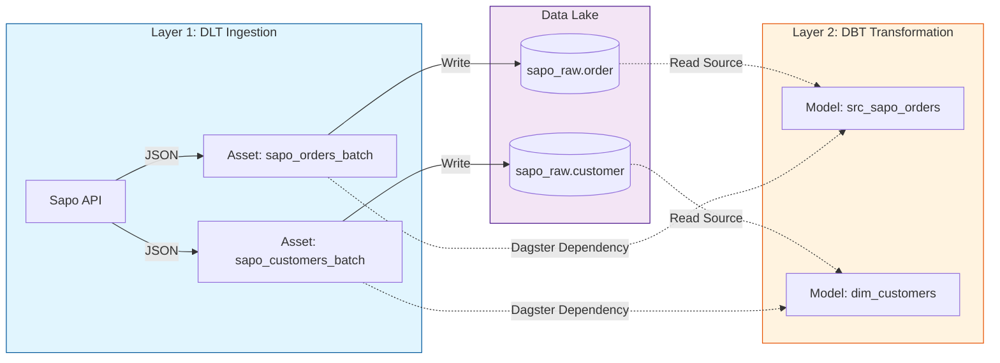

# Dagster Dependency Management & Sapo Integration

Tài liệu này mô tả chi tiết cách hệ thống xử lý Dependencies (phụ thuộc dữ liệu) giữa các layer (Ingestion, Transformation), đặc biệt là cơ chế tích hợp giữa **DLT Pipeline** và **dbt Core** để tránh Race Condition.

## 1. Kiến trúc luồng dữ liệu (Data Flow)

Hệ thống được chia thành 2 layer chính được quản lý bởi Dagster:

1.  **Ingestion Layer (`dlt`)**:
    *   Nhiệm vụ: Tải dữ liệu từ API (Sapo) về Data Lake (Parquet).
    *   Đại diện: Các Asset Python thuần (`sapo_orders_batch_asset`, `sapo_customers_batch_asset`...).
    *   Output: File parquet trong `/app/data_lake/sapo_raw/`.

2.  **Transformation Layer (`dbt`)**:
    *   Nhiệm vụ: Đọc file Parquet từ Data Lake, làm sạch và tổng hợp thành Marts.
    *   Đại diện: Các dbt models (`src_sapo_orders`, `dim_customers`...).
    *   Input: `source('sapo_raw', 'table_name')` trong dbt.

### Sơ đồ phụ thuộc (Dependency Graph)



## 2. Vấn đề "Race Condition" (Chạy đua)

Theo mặc định, Dagster hiểu hai layer này là độc lập nếu không được chỉ định rõ ràng. Khi Job bắt đầu:
*   `dlt` bắt đầu chạy để tải file.
*   `dbt` *cũng bắt đầu chạy ngay lập tức* (song song).
*   **Hệ quả**: `dbt` cố gắng đọc các file parquet (Source) khi `dlt` chưa kịp tạo ra chúng => Gây lỗi `IO Error: No files found`.

## 3. Giải pháp: Liên kết Dependency "Source-to-Asset"

Chúng ta sử dụng class `DagsterDbtTranslator` tùy chỉnh để "dạy" Dagster hiểu rằng: **"Các bảng Source của dbt chính là Output của Ingestion Asset".**

### 3.1. Định nghĩa Asset Key

*   **DLT Assets**: Được gán prefix `sapo`.
    *   Ví dụ: `sapo/sapo_orders_batch_asset`.
*   **dbt Sources**: Được định nghĩa trong `sources.yml`.
    *   Source: `sapo_raw`.
    *   Table: `order`.

### 3.2. Cầu nối tự động (`SapoDbtTranslator`)

File cấu hình: `orchestration/assets/dbt.py`

Chúng ta override phương thức `get_asset_key` để ánh xạ lại tên Source của dbt sang tên Asset của Dagster.

```python
class SapoDbtTranslator(DagsterDbtTranslator):
    def get_asset_key(self, dbt_resource_props: Mapping[str, Any]) -> AssetKey:
        resource_type = dbt_resource_props.get("resource_type")
        source_name = dbt_resource_props.get("source_name")
        name = dbt_resource_props.get("name")

        # Kiểm tra nếu là Source của Sapo
        if resource_type == "source" and source_name == "sapo_raw":
            # MAP TỪNG BẢNG CỤ THỂ
            if name == "order":
                # KHI DBT CẦN SOURCE 'order' -> HÃY ĐỢI ASSET 'sapo_orders_batch_asset'
                return AssetKey(["sapo", "sapo_orders_batch_asset"])
                
            elif name == "customer":
                return AssetKey(["sapo", "sapo_customers_batch_asset"])
                
            elif name == "account":
                return AssetKey(["sapo", "sapo_accounts_batch_asset"])

        # Mặc định (giữ nguyên logic gốc cho Model, Seed...)
        return super().get_asset_key(dbt_resource_props)
```

## 4. Quy trình thêm Dependency mới

Khi bạn thêm một nguồn dữ liệu mới (Ví dụ: `products`):

1.  **Ingestion**: Tạo Asset `sapo_products_batch_asset` trong `sapo_assets.py`.
    ```python
    @asset(key_prefix=["sapo"])
    def sapo_products_batch_asset(context): ...
    ```

2.  **Transformation**: Khai báo source trong dbt `sources.yml`.
    ```yaml
    sources:
      - name: sapo_raw
        tables:
          - name: product
    ```

3.  **Bridge**: Cập nhật `SapoDbtTranslator` trong `orchestration/assets/dbt.py`.
    ```python
    if name == "product":
        return AssetKey(["sapo", "sapo_products_batch_asset"])
    ```

## 5. Kiểm tra hoạt động

Để xác nhận Dependency hoạt động đúng:
1.  Vào Dagster UI -> Global Asset Graph.
2.  Tìm Asset của DLT (ví dụ `sapo_orders_batch_asset`).
3.  Bạn sẽ thấy mũi tên nối từ nó sang Asset dbt (`src_sapo_orders`).
4.  Khi chạy Job, dbt sẽ chuyển sang trạng thái "Waiting" cho đến khi DLT hoàn tất.

## 6. Bài học kinh nghiệm: Hybird Jobs & Explicit Dependencies (Gotcha)

Có một trường hợp đặc biệt cần lưu ý khi thiết lập **Incremental Job** chạy cả 2 loại Ingestion (History Log & Webhook) và dbt Model.

**Vấn đề:**
- dbt Source (`sapo_raw.order`) thường được map vào **Batch Asset** (`sapo_orders_batch_asset`) vì đó là nguồn dữ liệu đầy đủ nhất (Full Load).
- Trong **Incremental Job**, ta lại chạy **Incremental Asset** (`sapo_history_log_asset`) và các dbt model `stg_`.
- Do dbt model `stg_sapo_orders` phụ thuộc vào Batch Asset (theo định nghĩa Source), Dagster thấy Batch Asset không nằm trong Job này -> Nó cho phép dbt chạy ngay lập tức!
- **Hệ quả:** dbt chạy song song với History Log Ingestion, gây sai lệch dữ liệu hoặc thiếu data mới nhất vừa tải về.

**Giải pháp (Explicit Dependencies):**
Chúng ta phải **cưỡng chế** dependency cho các model `stg_` hoặc `src_` để chúng phải chờ cả History Log Ingestion.

Cập nhật `get_upstream_asset_keys` trong `dbt.py`:

```python
    def get_upstream_asset_keys(self, dbt_resource_props: Mapping[str, Any]) -> set[AssetKey]:
        upstream_keys = super().get_upstream_asset_keys(dbt_resource_props)
        name = dbt_resource_props.get("name")

        # CƯỠNG CHẾ: Các model Staging phải đợi Ingestion Incremental (History/Webhook) xong mới được chạy
        if name in [
            "stg_sapo_orders", "stg_sapo_customers", "stg_sapo_accounts",
            "src_sapo_orders", "src_sapo_customers", "src_sapo_accounts"
        ]:
            upstream_keys.add(AssetKey(["sapo", "sapo_history_log_asset"]))
            upstream_keys.add(AssetKey(["sapo", "sapo_webhook_consumer_asset"]))
            
        elif name == "stg_targets":
            upstream_keys.add(AssetKey(["sapo", "sapo_targets_asset"]))
        
        return upstream_keys
```

**Nguyên tắc chung:**
> Nếu Job của bạn chạy một tập con các Asset (VD: chỉ Incremental Ingestion), hãy đảm bảo rằng các Transformation downstream trong Job đó phải có Dependency **trực tiếp** tới các Ingestion Asset đó, chứ không chỉ dựa vào Dependency gián tiếp qua dbt Source (nếu Source đó trỏ tới Asset khác).
