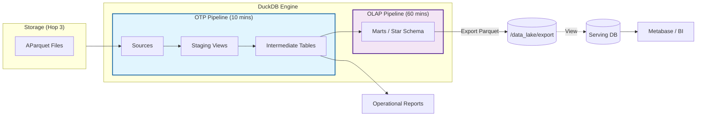
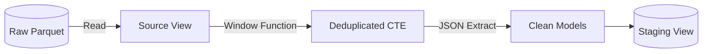
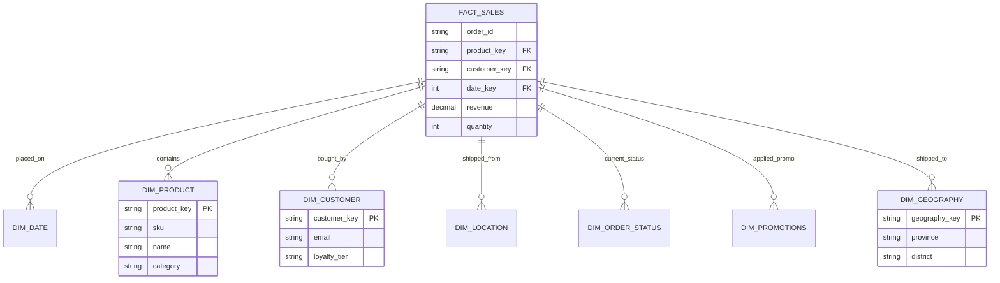

# Transformation Layer Technical Documentation

## 1. Overview

The **Transformation Layer** (Hop 5 & 6) is the engine of the data warehouse, built on **dbt** (Data Build Tool) and **DuckDB**. It transforms raw JSON-based Parquet files into structured, clean, and business-ready data models.

We employ a **Lambda Architecture-inspired** approach, separating transformation into two distinct pipelines to balance latency and throughput:

1.  **OTP Pipeline (Operational)**: Fast, frequent, operational data for apps and daily workflows.
2.  **OLAP Pipeline (Analytical)**: Comprehensive, dimensional data for reporting and BI.

---

## 2. High-Level Architecture Diagram



---

## 3. Pipeline Design: OTP vs OLAP

| Feature             | OTP Pipeline (Operational)                  | OLAP Pipeline (Analytical)                  |
| :------------------ | :------------------------------------------ | :------------------------------------------ |
| **Goal**            | Clean, standarized data for immediate use   | Deep insights, historical data, aggregation |
| **Frequency**       | **Every 10 minutes** (`*/10 * * * *`)       | **Hourly** (`0 * * * *`)                    |
| **Layers**          | `staging` -> `intermediate`                 | `marts`                                     |
| **Materialization** | Views (Stg), Tables (Int)                   | Tables (Facts, Dims)                        |
| **Latency**         | < 15 mins (Near Real-time)                  | ~ 1 hour                                    |
| **Key Use Case**    | "Did Order #123 sync?" "Current inventory?" | "Monthly Revenue?" "Cohort Retention?"      |

---

## 4. Layer Details & Data Flow

### 4.1. Staging Layer (`models/staging`)

**Role:** Technical cleaning & standardization.

- **Input**: Raw Parquet files (via `read_parquet`).
- **Tasks**:
  - Renaming columns (Snake Case).
  - Type Casting (String -> Integer, Decimal).
  - JSON Unnesting (Extracting fields from `payload` JSON).
  - **Deduplication**: Selecting the latest version of an entity based on `source_timestamp`.
- **Output**: `stg_sapo_orders`, `stg_sapo_customers`.

**Diagram: Staging Logic**



### 4.2. Intermediate Layer (`models/intermediate`)

**Role:** Business Logic & Enrichment.

- **Input**: Staging Views.
- **Tasks**:
  - Joins (e.g., Joining Order with Customer).
  - Calculations (Net Price, Discount Amount).
  - Filtering (Removing test orders).
- **Output**: `int_sales_summary`, `int_customer_metrics`.

### 4.3. Marts Layer (`models/marts`)

**Role:** Reporting & API Consumption.

- **Input**: Intermediate Tables.
- **Output**: **Parquet Files** (Saved to `data_lake/export/marts`).
- **Serving**: Uses a lightweight DuckDB file (`serving/olap.duckdb`) containing **Views** that point to these Parquet files.
- **Modeling Strategy**: **Kimball Dimensional Modeling (Star Schema)**.

**Schema Diagram (ERD):**



---

## 5. Orchestration (Dagster Integration)

The separation is enforced at the orchestrator level using **Dagster Jobs** and **dbt Tags**.

### 5.1. Job Configuration

- **`sapo_dbt_otp_job`**: Runs `dbt build --select tag:otp`.
  - Covering: `staging/*`, `intermediate/*`.
- **`sapo_dbt_olap_job`**: Runs `dbt build --select tag:olap`.
  - Covering: `marts/*`.

### 5.2. Schedule Timeline

```mermaid
gantt
    title Pipeline Execution Schedule
    dateFormat HH:mm
    axisFormat %H:%M

    section Ingestion (dlt)
    Webhook/Logs Consumer :active, 08:00, 08:59

    section Transform (dbt)
    OTP Job (Run 1) :done, 08:10, 5m
    OTP Job (Run 2) :done, 08:20, 5m
    OTP Job (Run 3) :done, 08:30, 5m
    OTP Job (Run 4) :done, 08:40, 5m
    OTP Job (Run 5) :done, 08:50, 5m
    OLAP Job (Hourly) :crit, 08:55, 10m
```



---

## 6. Development Workflow

1.  **Modify Model**: Edit SQL in `transformation/models`.
2.  **Tagging**: Ensure `dbt_project.yml` has correct tags (`otp` or `olap`) for the folder.
3.  **Local Test**:

    ```powershell
    # Test OTP logic
    dbt build --select tag:otp

    # Test OLAP logic
    dbt build --select tag:olap
    ```

4.  **Deploy**: Push to Git. Dagster (if configured with CI/CD) will pick up definitions.
