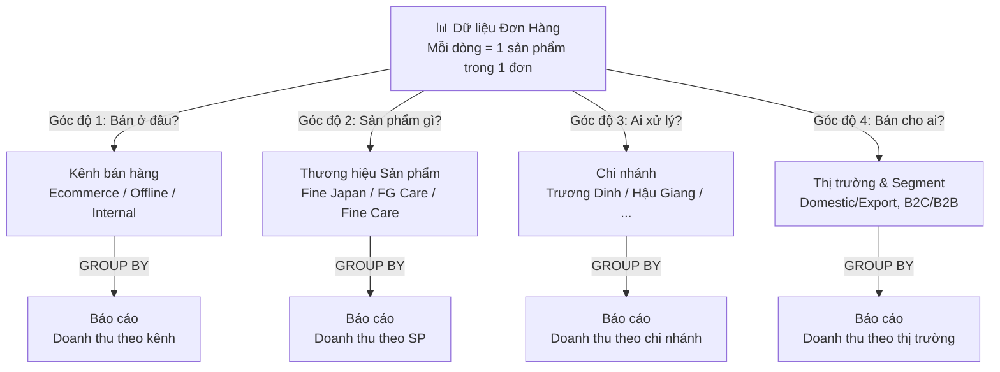
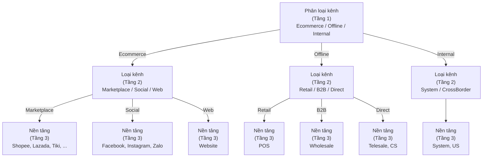
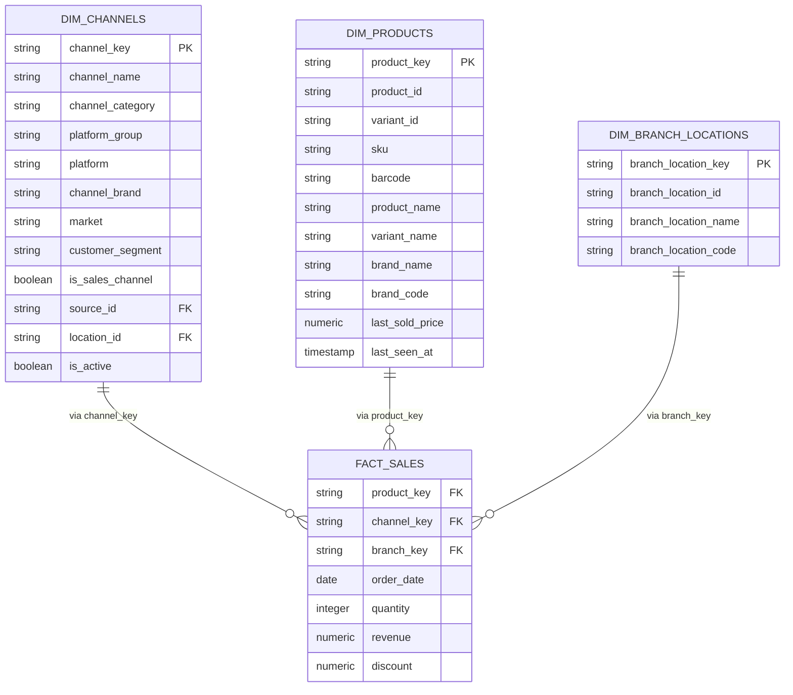

# Hướng dẫn Phân loại Kênh bán hàng & Gom nhóm Báo cáo

> **Dành cho:** Tất cả nhân sự xem/tạo báo cáo doanh thu
> **Cập nhật:** 2026-04-13
> **Bảo trì:** Data Team

## Tài liệu này trả lời những câu hỏi nào?

1. Làm sao để báo cáo doanh thu Ecommerce vs Offline?
2. Doanh thu Fine Japan bao nhiêu? (sản phẩm? hay kênh?)
3. Cần gom nhóm theo cột nào để trả lời câu hỏi của tôi?
4. Thương hiệu sản phẩm khác gì thương hiệu kênh?
5. Dữ liệu phân loại (seed files) lưu ở đâu?

---

## TL;DR — Nắm bắt cơ bản trong 5 phút

- **Hệ thống phân loại dùng 4 chiều độc lập** — Kênh bán, Sản phẩm, Chi nhánh, Thị trường/Segment — có thể kết hợp tự do để trả lời bất kỳ câu hỏi nào.
- **Mỗi chiều = một câu hỏi riêng** — Không cần tạo báo cáo khác nhau, cùng dữ liệu, nhìn từ nhiều góc độ.
- **Kênh bán có 3 tầng** — Phân loại kênh (Ecommerce/Offline/Internal) → Loại kênh (Sàn/MXH/Web/Cửa hàng) → Nền tảng (Shopee/Lazada/Facebook).
- **Hai loại "thương hiệu" khác nhau** — Thương hiệu sản phẩm (ai làm) vs Thương hiệu kênh (ai bán). Cùng shop JPC có thể bán sản phẩm của Fine Japan, FG Care, v.v.
- **Seed files là dữ liệu tham chiếu** — Lưu trong `transformation/seeds/`, maintain thủ công, sử dụng bởi dbt để tạo dimension tables.

---

## PHẦN A: HƯỚNG DẪN CHO NGƯỜI TẠO BÁO CÁO

---

## 1. Nguyên tắc cốt lõi

**Mỗi đơn hàng có thể được nhìn từ 4 góc độ độc lập. Để báo cáo theo một góc độ, chỉ cần GROUP BY theo cột tương ứng.**



**Ưu điểm:** Không cần tạo báo cáo riêng — cùng một bộ dữ liệu, nhiều cách nhìn.

---

## 2. Bảng tham chiếu nhanh

Khi cần báo cáo, tra bảng bên dưới để biết cần gom nhóm theo cột nào.

| Tôi muốn xem doanh thu theo...              | Gom nhóm theo                           | Ví dụ kết quả                               |
| --------------------------------------------- | ---------------------------------------- | ----------------------------------------------- |
| Ecommerce vs Offline                          | Phân loại kênh                        | Ecommerce: 70%, Offline: 30%                    |
| Loại kênh (Sàn, MXH, Web, Cửa hàng)      | Loại kênh                              | Marketplace: 50%, Social: 15%, Retail: 25%      |
| Từng nền tảng                              | Nền tảng                               | Shopee: 35%, Lazada: 10%, TikTok: 5%            |
| Từng nguồn cụ thể                         | Nguồn đơn hàng                       | Shopee JPC OFFICIAL: 12%, Shopee Fine Japan: 8% |
| Từng thương hiệu sản phẩm               | Thương hiệu SP                        | Fine Japan: 40%, FG Care: 25%, Fine Care: 15%   |
| Từng thương hiệu kênh                    | Thương hiệu kênh                     | JPC: 35%, Fine Japan: 30%, The Healthy Us: 20%  |
| Từng chi nhánh                              | Chi nhánh                               | Trương Dinh: 50%, Hau Giang: 30%              |
| Nội địa vs Xuất khẩu                     | Thị trường                            | Domestic: 95%, Export: 5%                       |
| Bán lẻ vs Bán sỉ                          | Phân khúc KH                           | B2C: 85%, B2B: 15%                              |
| SP Fine Japan bán ở sàn nào?              | Thương hiệu SP + Nền tảng           | *(kết hợp 2 chiều)*                        |
| JPC bán bao nhiêu SP Fine Japan?            | Thương hiệu kênh + Thương hiệu SP | *(kết hợp 2 chiều)*                        |

---

## 3. Chi tiết từng chiều phân loại

### 3.1. Kênh bán hàng — "Bán ở đâu?"

Kênh bán hàng có 3 tầng, từ tổng quát đến chi tiết:



#### Bảng phân loại đầy đủ

| Tầng 1: Phân loại kênh   | Tầng 2: Loại kênh                        | Tầng 3: Nền tảng | Nguồn cụ thể (ví dụ)                                  |
| ---------------------------- | ------------------------------------------- | ------------------- | ---------------------------------------------------------- |
| **Ecommerce (Online)** | Marketplace (Sàn TMDT)                     | Shopee              | Shopee - JPC OFFICIAL, Shopee - Fine Japan Vietnam         |
|                              |                                             | Lazada              | Lazada - JPC SHOP, Lazada - Fine Japan Vietnam             |
|                              |                                             | TikTok              | TiktokShop                                                 |
|                              |                                             | Tiki                | Tiki - FINE WORLD GROUP                                    |
|                              |                                             | Sendo               | Sendo                                                      |
|                              |                                             | Grab                | GrabMart                                                   |
|                              | Social Commerce (MXH)                       | Facebook            | Facebook, FaceBookJPC, FaceBookFJPTViet                    |
|                              |                                             | Instagram           | Instagram                                                  |
|                              |                                             | Zalo                | Zalo                                                       |
|                              | Website (DTC)                               | Website             | Web, WebOrder                                              |
| **Offline**            | Retail (Cửa hàng)                         | POS                 | POS - Trương Dinh, POS - Hau Giang                       |
|                              | B2B (Bán sỉ)                              | Wholesale           | Đại Lý, Chợ sỉ                                        |
|                              | Direct Sales (Bán trực tiếp)              | Direct              | Telesale, CS — đơn tạo thủ công bởi staff, khách mua thật |
| **Internal**           | System (Nội bộ)                           | System              | Test Sản Phẩm, Quà Tặng, Ưu đãi Nhân Viên             |
|                              | CrossBorder (Giao hàng xuyên biên giới) | US                  | Fine Japan-USA — giao hàng tại VN cho khách FG Care US |

**Lưu ý quan trọng:**

- **Ecommerce** bao gồm tất cả kênh bán hàng trực tuyến: sàn TMDT, mạng xã hội, và website.
- **Direct Sales** (Telesale, CS): Đơn tạo thủ công bởi staff khi khách mua trực tiếp. Đây là **doanh thu bán hàng thật** (`is_sales_channel = true`). Xếp vào Offline vì không chảy qua API marketplace.
- **Internal** (Test SP, Quà Tặng, Ưu đãi NV) **không tính vào doanh thu bán hàng**.
- **CrossBorder** (US): Doanh thu = 0đ — thanh toán theo hợp đồng B2B riêng. **Không tính vào doanh thu bán hàng VN.**
- Mỗi nền tảng có thể có nhiều nguồn cụ thể (nhiều shop Shopee, nhiều page Facebook...).

---

### 3.2. Thương hiệu sản phẩm vs. Thương hiệu kênh

**Đây là khái niệm dễ nhầm lẫn nhất. Công ty có hai loại thương hiệu hoàn toàn khác nhau.**

#### Thương hiệu sản phẩm (Product Brand)

**Định nghĩa:** Thương hiệu gắn liền với sản phẩm — ai sản xuất, ai sở hữu sản phẩm đó.

**Ví dụ:** Fine Japan Vietnam, FG Care, Fine Care.

Mỗi sản phẩm (SKU) thuộc về **đúng một** thương hiệu sản phẩm. Thông tin này nằm trên dữ liệu sản phẩm (trường "vendor" trên Sapo).

#### Thương hiệu kênh (Channel Brand)

**Định nghĩa:** Thương hiệu mà công ty **tạo ra để xây kênh bán hàng**. Đây là "danh nghĩa" mà khách hàng nhìn thấy khi mua hàng.

**Ví dụ:**
- **JPC (Japanese Premium Collection)**: Thương hiệu kênh do công ty tạo ra. JPC có shop riêng trên Shopee, Lazada, Website, Facebook.
- **Fine Japan Vietnam**: Vừa là thương hiệu sản phẩm, vừa là thương hiệu kênh (có shop riêng).
- **The Healthy Us**: Chỉ là thương hiệu kênh, bán sản phẩm từ nhiều thương hiệu sản phẩm khác nhau.

#### Tại sao phải phân biệt?

Một shop (kênh) có thể bán sản phẩm của **nhiều thương hiệu sản phẩm**:

```
Shop "JPC OFFICIAL" trên Shopee         (Thương hiệu kênh: JPC)
  ├── Bán sản phẩm Fine Japan           (Thương hiệu SP: Fine Japan)
  ├── Bán sản phẩm FG Care              (Thương hiệu SP: FG Care)
  └── Bán sản phẩm khác...              (Thương hiệu SP: khác)
```

Nếu trộn lẫn hai khái niệm, khi hỏi "doanh thu Fine Japan bao nhiêu?" sẽ không biết đang hỏi:

- **(A)** Tổng doanh thu **sản phẩm** Fine Japan, bất kể bán ở shop nào? (kể cả bán trên shop JPC)
- **(B)** Tổng doanh thu **các kênh** mang tên Fine Japan? (chỉ shop Fine Japan Vietnam, không tính shop JPC)

**Hai con số này khác nhau.** Hệ thống phân loại cho phép trả lời cả hai:

| Câu hỏi                                     | Cách lọc                                                        |
| --------------------------------------------- | ----------------------------------------------------------------- |
| (A) Doanh thu SP Fine Japan ở mọi kênh     | Thương hiệu sản phẩm = "Fine Japan Vietnam"                  |
| (B) Doanh thu các kênh Fine Japan           | Thương hiệu kênh = "Fine Japan Vietnam"                       |
| JPC bán bao nhiêu SP Fine Japan?            | Thương hiệu kênh = "JPC" AND Thương hiệu SP = "Fine Japan" |
| SP Fine Japan bán mạnh nhất ở kênh nào? | Thương hiệu SP = "Fine Japan" + gom theo Thương hiệu kênh  |

#### Bảng tham chiếu thương hiệu

| Tên               | Là TH sản phẩm? | Là TH kênh? | Ghi chú                                 |
| ------------------ | :-----------: | :-----------: | --------------------------------------- |
| Fine Japan Vietnam | ✓           | ✓           | Vừa sản xuất, vừa có kênh riêng           |
| FG Care            | ✓           | ✓           | Vừa sản xuất, vừa có kênh riêng           |
| Fine Care          | ✓           | ✓           | Vừa sản xuất, vừa có kênh riêng           |
| JPC                | ✗           | ✓           | Chỉ là thương hiệu kênh, không sản xuất |
| The Healthy Us     | ✗           | ✓           | Chỉ là thương hiệu kênh, không sản xuất |
| Fine World Group   | ✗           | ✓           | Thương hiệu công ty mẹ                      |

---

### 3.3. Chi nhánh — "Ai xử lý?"

Chi nhánh là đơn vị vật lý chịu trách nhiệm thực hiện đơn hàng (lưu kho, đóng gói, giao hàng, hoặc bán tại quầy).

| Chi nhánh        | Ma  | Ghi chú              |
| ----------------- | --- | --------------------- |
| 16 Trương Dinh  | VVT | Trụ sở / kho chính |
| Hậu Giang        | HG  |                       |
| MM Market An Phú | MMA |                       |
| TheHealthyUs      | HUS |                       |
| ShowroomVVT       | ST  |                       |

**Lưu ý:** Chi nhánh liên quan đến **vận hành**, không liên quan đến kênh bán. Một đơn hàng từ Shopee có thể được xử lý bởi bất kỳ chi nhánh nào.

---

### 3.4. Thị trường & Phân khúc khách hàng

Hai phân loại bổ sung, dùng khi cần tách riêng doanh thu theo đối tượng:

| Chiều phân loại       | Giá trị             | Áp dụng cho                                                                  |
| ------------------------ | --------------------- | ------------------------------------------------------------------------------ |
| **Thị trường**  | Domestic (Nội địa) | Hầu hết các kênh                                                           |
|                          | Export (Xuất khẩu)  | Các kênh xuất khẩu tương lai (US đã chuyển sang Internal/CrossBorder) |
| **Phân khúc KH** | B2C (Bán lẻ)        | Shopee, Lazada, Website, POS...                                                |
|                          | B2B (Bán sỉ)        | Đại Lý, Chợ Sỉ                                                            |

---

## 4. Common Misunderstandings — Những nhầm lẫn phổ biến

| Nhầm lẫn | Sai | Đúng |
|---------|-----|------|
| **Ecommerce ≠ Marketplace** | "Ecommerce = chỉ bán trên Shopee/Lazada" | Ecommerce = bất kỳ kênh trực tuyến nào (Marketplace + Social + Website) |
| **channel_category ≠ platform_group** | Dùng "Ecom" khi báo cáo | Dùng "Ecommerce" trong báo cáo (channel_category), "Ecom" là mã seed nội bộ |
| **channel_brand ≠ brand_name** | "JPC là thương hiệu sản phẩm" | JPC chỉ là thương hiệu kênh. Sản phẩm trên JPC có brand từ Fine Japan, FG Care, v.v. |
| **Chi nhánh ≠ Kênh** | "POS ở Trương Dinh = kênh bán khác" | Chi nhánh là execution, kênh là where. Một shop Shopee có thể xử lý từ nhiều chi nhánh. |
| **is_sales_channel = false ≠ doanh thu = 0** | "Internal không bán hàng" | Internal là kênh nội bộ, không bán (doanh thu = 0). Direct Sales/Telesale là kênh bán thật (is_sales_channel = true) |

---

## 5. Ví dụ kết hợp thực tế

Sức mạnh của hệ thống phân loại này nằm ở khả năng **kết hợp nhiều chiều** trong cùng một báo cáo.

### Ví dụ 1: "Shopee đang bán thương hiệu nào tốt nhất?"

> Gom nhóm: **Nền tảng** = Shopee + gom theo **Thương hiệu kênh**

| Thương hiệu kênh | Doanh thu Shopee |
| -------------------- | ---------------- |
| JPC                  | 120,000,000      |
| Fine Japan Vietnam   | 85,000,000       |
| The Healthy Us       | 45,000,000       |
| FG Care              | 30,000,000       |

### Ví dụ 2: "SP Fine Japan bán trên kênh nào nhiều nhất?"

> Lọc: **Thương hiệu SP** = Fine Japan + gom theo **Nền tảng**

| Nền tảng | Doanh thu SP Fine Japan |
| ---------- | ----------------------- |
| Shopee     | 95,000,000              |
| Lazada     | 40,000,000              |
| POS        | 35,000,000              |
| Website    | 15,000,000              |

### Ví dụ 3: "So sánh hiệu quả kênh JPC vs Fine Japan trên Marketplace"

> Lọc: **Loại kênh** = Marketplace + gom theo **Thương hiệu kênh** + **Nền tảng**

| TH kênh   | Shopee | Lazada | TikTok | Tiki |
| ---------- | ------ | ------ | ------ | ---- |
| JPC        | 120M   | 45M    | 30M    | 10M  |
| Fine Japan | 85M    | 35M    | —     | 8M   |

### Ví dụ 4: "Báo cáo tổng quát cho CEO"

> Gom nhóm: **Phân loại kênh** (tầng 1)

| Kênh     | Doanh thu   | Tỷ trọng |
| --------- | ----------- | ---------- |
| Ecommerce | 450,000,000 | 72%        |
| Offline   | 175,000,000 | 28%        |

---

## 6. Quick Reference — Một trang để in/screenshot

**Khi bạn cần báo cáo ngay:**

```
PHÂN LOẠI KÊNH (GROUP BY channel_category):
  Ecommerce / Offline / Internal

LOẠI KÊNH (GROUP BY platform_group):
  Ecom / Social / Web / Retail / B2B / System / CrossBorder / Other

NỀN TẢNG (GROUP BY platform):
  Shopee, Lazada, TikTok, Tiki, Facebook, Instagram, Website, POS, Wholesale, Telesale, ...

THƯƠNG HIỆU KÊnh (GROUP BY channel_brand):
  JPC / Fine Japan Vietnam / FG Care / Fine Care / The Healthy Us / Fine World Group

THƯƠNG HIỆU SẢN PHẨM (GROUP BY brand_name):
  Fine Japan Vietnam / FG Care / Fine Care / (other vendors)

CHI NHÁNH (GROUP BY branch_location_name):
  16 Trương Dinh / Hậu Giang / MM Market An Phú / TheHealthyUs / ShowroomVVT

THỊ TRƯỜNG (GROUP BY market):
  Domestic / Export

PHÂN KHÚC (GROUP BY customer_segment):
  B2C / B2B
```

**Bảng tra cứu tên cột SQL:**

| Thuật ngữ kinh doanh | Tên cột SQL | Bảng |
|----------------------|-------------|------|
| Phân loại kênh | `channel_category` | dim_channels |
| Loại kênh | `platform_group` | dim_channels |
| Nền tảng | `platform` | dim_channels |
| Thương hiệu kênh | `channel_brand` | dim_channels |
| Thương hiệu SP | `brand_name` | dim_products |
| Chi nhánh | `branch_location_name` | dim_branch_locations |

---

---

## PHẦN B: THAM KHẢO KỸ THUẬT (CHO DATA TEAM)

---

## 7. Tổng quan kiến trúc

Hệ thống phân loại kênh bán hàng được xây dựng trên **Star Schema**. Dữ liệu bán hàng (fact) được phân tích qua nhiều chiều (dimension) độc lập.



---

## 8. Seed Files — Dữ liệu tham chiếu

Seed files là các file CSV chứa dữ liệu phân loại, được maintain thủ công bởi Data Team.

### 8.1. ref_order_sources.csv — Danh sách nguồn đơn hàng

**File:** `transformation/seeds/ref_order_sources.csv`

Mỗi dòng đại diện cho một nguồn đơn hàng cụ thể trong Sapo (một shop trên sàn, một page Facebook, POS, hoặc nguồn nội bộ).

**Schema đầy đủ:**

| Cột                  | Kiểu   | Bắt buộc | Mô tả                                                                                                    | Ví dụ                         |
| --------------------- | ------- | ---------- | ---------------------------------------------------------------------------------------------------------- | ------------------------------- |
| `id`                | string  | Co         | ID nguồn trên Sapo (ví dụ `3988158` hoặc composite `3988158_1`)                                   | `3988158_1`                   |
| `name`              | string  | Co         | Tên hiển thị đầy đủ                                                                                 | `Shopee - Fine Japan Vietnam` |
| `status`            | boolean | Co         | Nguồn còn hoạt động không                                                                            | `true`                        |
| `platform_group`    | string  | Co         | Loại kênh. Giá trị: `Ecom`, `Social`, `Web`, `Retail`, `B2B`, `System`, `CrossBorder`, `Other` | `Ecom`                        |
| `platform`          | string  | Co         | Nền tảng cụ thể                                                                                              | `Shopee`                      |
| `is_generic_source` | boolean | Co         | `true` nếu nguồn cần expand theo chi nhánh (hiện chỉ POS)                                          | `false`                       |
| `mapping_tag`       | string  | Khong      | Tag dùng để map đơn hàng từ Sapo vào nguồn cụ thể                                               | `Shopee_Fine Japan Vietnam`   |
| `channel_brand`     | string  | Khong      | Thương hiệu kênh sở hữu nguồn này                                                                  | `Fine Japan Vietnam`          |
| `market`            | string  | Co         | Thị trường. Giá trị: `Domestic`, `Export`                                                          | `Domestic`                    |
| `customer_segment`  | string  | Co         | Phân khúc khách hàng. Giá trị: `B2C`, `B2B`                                                       | `B2C`                         |

**Quy tắc platform_group:**

| Giá trị platform_group | Ý nghĩa                                  | Thuộc channel_category |
| ---------------------- | ---------------------------------------- | ---------------------- |
| `Ecom`                 | Sàn thương mại điện tử (Marketplace)   | Ecommerce              |
| `Social`               | Mạng xã hội (Social Commerce)          | Ecommerce              |
| `Web`                  | Website công ty (DTC)                 | Ecommerce              |
| `Retail`               | Cửa hàng vật lý                        | Offline                |
| `B2B`                  | Bán sỉ, đại lý                        | Offline                |
| `System`               | Nội bộ (Telesale, CS, Test...)         | Internal               |
| `CrossBorder`          | Giao hàng xuyên biên giới (US)         | Internal               |
| `Other`                | Khác                                    | Other                  |

**Quy tắc is_generic_source:**

- `false` (mặc định): Nguồn map 1-1 → 1 channel.
- `true`: Nguồn expand qua chi nhánh (cross-join với `ref_branch_locations`). Chỉ áp dụng cho POS.

**Ví dụ dữ liệu:**

```csv
id,name,status,platform_group,is_generic_source,platform,mapping_tag,channel_brand,market,customer_segment
3988158_1,Shopee - Fine Japan Vietnam,true,Ecom,false,Shopee,"Shopee_Fine Japan Vietnam",Fine Japan Vietnam,Domestic,B2C
3988158_4,Shopee - JPC OFFICIAL,true,Ecom,false,Shopee,Shopee_JPC OFFICIAL,JPC,Domestic,B2C
3988155_2,Lazada - JPC SHOP,true,Ecom,false,Lazada,Lazada_JPC SHOP,JPC,Domestic,B2C
3988153,Facebook,true,Social,false,Facebook,,,Domestic,B2C
3988152,Web,true,Web,false,Website,,,Domestic,B2C
3988157,Pos,true,Retail,true,Retail,,,Domestic,B2C
4164989,Đại Lý,false,B2B,false,Wholesale,,,Domestic,B2B
4110169,US,false,CrossBorder,false,Other,,,Export,B2B
4517138,Telesale,false,System,false,System,,,Domestic,B2C
```

### 8.2. ref_brands.csv — Chuẩn hóa vendor

**File:** `transformation/seeds/ref_brands.csv`

Bảng mapping để chuẩn hóa giá trị `vendor` trên Sapo thành tên thương hiệu sản phẩm thống nhất.

**Schema:**

| Cột           | Kiểu  | Mô tả                                      | Ví dụ                |
| -------------- | ------ | ------------------------------------------- | -------------------- |
| `vendor_raw`  | string | Giá trị vendor gốc trên Sapo (khớp chính xác) | `Fine Japan`         |
| `brand_name`  | string | Tên thương hiệu sản phẩm chuẩn              | `Fine Japan Vietnam` |
| `brand_code`  | string | Mã viết tắt                                | `FJV`                |

**Ví dụ dữ liệu:**

```csv
vendor_raw,brand_name,brand_code
Fine Japan,Fine Japan Vietnam,FJV
Fine Japan Vietnam,Fine Japan Vietnam,FJV
FINE JAPAN,Fine Japan Vietnam,FJV
JPC,JPC,JPC
FG Care,FG Care,FGC
FG CARE,FG Care,FGC
The Healthy Us,The Healthy Us,THU
Fine Care,Fine Care,FC
```

**Lưu ý:** Nếu một vendor trên Sapo không có trong bảng này, `dim_products` sẽ giữ nguyên giá trị vendor gốc làm `brand_name` với `brand_code = NULL`.

### 8.3. ref_branch_locations.csv — Danh sách chi nhánh

**File:** `transformation/seeds/ref_branch_locations.csv`

| Cột     | Kiểu   | Mô tả                  | Ví dụ                |
| -------- | ------- | ---------------------- | -------------------- |
| `id`    | integer | ID chi nhánh trên Sapo | `68578`              |
| `code`  | string  | Mã viết tắt            | `VVT`                |
| `name`  | string  | Tên chi nhánh          | `16 Trương Định`    |

---

## 9. Dimension Models

### 9.1. dim_channels

**File:** `transformation/models/marts/core/dim_channels.sql`

**Nguồn:** `ref_order_sources`, `ref_branch_locations`

**Logic xây dựng:**

1. Lấy specific sources (`is_generic_source = false`) → mỗi source = 1 channel
2. Lấy generic sources (`is_generic_source = true`) → cross-join với branches
3. UNION ALL kết quả
4. Derive `channel_category` từ `platform_group` và `is_sales_channel = (platform_group != 'System')`
5. Generate surrogate key từ source_id + location_id
6. Thêm Unknown Member

**Output schema:**

| Cột                 | Kiểu    | Null  | Mô tả                        |
| ------------------- | ------- | ----- | ---------------------------- |
| `channel_key`       | string  | Khong | Surrogate key (MD5)         |
| `channel_name`      | string  | Khong | Tên hiển thị                |
| `channel_code`      | string  | Khong | Mã viết tắt                 |
| `channel_category`  | string  | Khong | Ecommerce / Offline / Internal |
| `platform_group`    | string  | Khong | Loại kênh (Tầng 2)          |
| `platform`          | string  | Khong | Nền tảng (Tầng 3)           |
| `channel_brand`     | string  | Co    | Thương hiệu kênh           |
| `market`            | string  | Khong | Domestic / Export           |
| `customer_segment`  | string  | Khong | B2C / B2B                   |
| `is_sales_channel`  | boolean | Khong | true = kênh bán hàng thật  |
| `source_id`         | string  | Co    | FK về Sapo source           |
| `location_id`       | string  | Co    | FK về chi nhánh (chỉ POS)   |
| `is_active`         | boolean | Khong | Nguồn còn hoạt động         |

### 9.2. dim_products

**File:** `transformation/models/marts/core/dim_products.sql`

**Nguồn:** `std_order_items`, `ref_brands`

**Logic xây dựng:**

1. Lấy order items có `product_id NOT NULL`
2. `ROW_NUMBER() PARTITION BY product_id, variant_id` → bản ghi mới nhất ("Last Record Wins")
3. `LEFT JOIN ref_brands` → map vendor sang brand_name chuẩn hóa
4. Generate surrogate key
5. Thêm Unknown Member

**Output schema:**

| Cột                | Kiểu      | Null  | Mô tả                            |
| ------------------- | --------- | ----- | -------------------------------- |
| `product_key`       | string    | Khong | Surrogate key (MD5)             |
| `product_id`        | string    | Khong | ID sản phẩm trên Sapo           |
| `variant_id`        | string    | Co    | ID biến thể                     |
| `sku`               | string    | Co    | Mã SKU                          |
| `barcode`           | string    | Co    | Mã barcode                      |
| `product_name`      | string    | Khong | Tên sản phẩm                    |
| `variant_name`      | string    | Co    | Tên biến thể                    |
| `product_type`      | string    | Co    | Loại sản phẩm                   |
| `brand_name`        | string    | Co    | Thương hiệu SP chuẩn hóa       |
| `brand_code`        | string    | Co    | Mã TH viết tắt                  |
| `unit`              | string    | Co    | Đơn vị                          |
| `weight_grams`      | numeric   | Co    | Trọng lượng (gram)              |
| `last_sold_price`   | numeric   | Co    | Giá bán gần nhất                |
| `last_seen_at`      | timestamp | Co    | Lần cuối xuất hiện trong đơn    |

### 9.3. dim_branch_locations

**File:** `transformation/models/marts/core/dim_branch_location.sql`

| Cột                     | Kiểu  | Mô tả             |
| ----------------------- | ----- | ----------------- |
| `branch_location_key`   | string | Surrogate key (MD5) |
| `branch_location_id`    | string | ID trên Sapo      |
| `branch_location_name`  | string | Tên chi nhánh     |
| `branch_location_code`  | string | Mã viết tắt       |

---

## 10. Fact Tables

Các bảng fact không cần sửa đổi. Chúng đã có sẵn các foreign key cần thiết:

| Fact Table               | channel_key | product_key | branch_key | Ghi chú                              |
| ----------------------- | ----------- | ----------- | ---------- | ------------------------------------ |
| `fact_orders`           | Co          | Khong       | Co         | Grain: 1 đơn hàng                   |
| `fact_sales`            | Co          | Co          | Co         | Grain: 1 dòng sản phẩm trong đơn |
| `fact_marketing_spend`  | Co          | Khong       | Khong      | Grain: chi phí theo kênh/ngày      |
| `fact_targets`          | Co          | Khong       | Khong      | Grain: chỉ tiêu theo kênh/kỳ       |

**Lưu ý:** Báo cáo theo **thương hiệu sản phẩm** chỉ khả dụng trên `fact_sales` (có `product_key`), không khả dụng trên `fact_orders`.

---

## 11. Quy trình vận hành

### Khi thêm nguồn đơn hàng mới

1. Tạo nguồn đơn hàng trên Sapo
2. Thêm 1 dòng vào `ref_order_sources.csv`
3. Chạy `dbt build --select ref_order_sources+ `
4. Kiểm tra nguồn mới xuất hiện đúng trong `dim_channels`

### Khi phát hiện vendor mới

1. Query `dim_products` tìm `brand_code = NULL`
2. Thêm mapping vào `ref_brands.csv`
3. Chạy `dbt build --select ref_brands dim_products`

### Khi thay đổi cơ cấu tổ chức

- **Thêm chi nhánh:** Thêm dòng vào `ref_branch_locations.csv`. POS channels tự động expand.
- **Đổi team:** Không ảnh hưởng data model. Hiện derive từ `platform_group`.

---

## 12. Lưu ý về chất lượng dữ liệu

| Rủi ro                                  | Ảnh hưởng                                    | Cách phát hiện                              | Cách xử lý                                      |
| --------------------------------------- | -------------------------------------------- | ------------------------------------------- | ----------------------------------------------- |
| `vendor` trống trên Sapo                | brand_name = NULL, không gom nhóm được      | Query: `WHERE brand_name IS NULL` trên dim_products | Bổ sung vendor hoặc thêm vào ref_brands |
| `vendor` ghi không nhất quán            | Cùng brand tách thành nhiều dòng           | Query: `GROUP BY brand_name` tìm tên gần giống | Thêm tất cả biến thể vào ref_brands    |
| Đơn không có source trên Sapo           | channel = Unknown                          | Query: `WHERE channel_name = 'Unknown'`     | Kiểm tra quy trình tạo đơn trên Sapo          |
| Shop mới chưa thêm vào seed             | Đơn hàng rơi vào source cha                | So sánh source IDs trong raw data vs seed   | Thêm dòng mới vào ref_order_sources            |

---

## Kết luận

> "Phân loại kênh bán hàng chuẩn hóa giúp tất cả người dùng cùng nói một ngôn ngữ, báo cáo từ dữ liệu duy nhất mà không mâu thuẫn."
