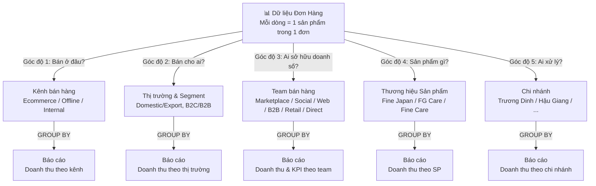
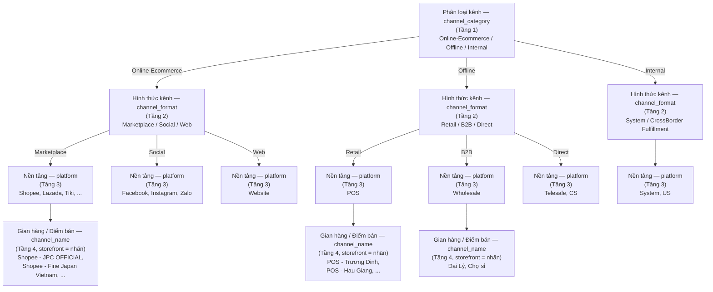
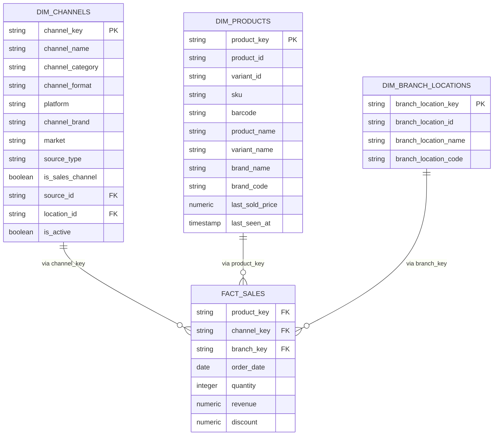

# Hướng dẫn Phân loại Kênh bán hàng & Gom nhóm Báo cáo

> **Dành cho:** Tất cả nhân sự xem/tạo báo cáo doanh thu
> **Cập nhật:** 2026-04-15
> **Bảo trì:** Data Team

## Tài liệu này trả lời những câu hỏi nào?

1. Làm sao để báo cáo doanh thu Ecommerce vs Offline?
2. Doanh thu Fine Japan bao nhiêu? (sản phẩm? hay kênh?)
3. Cần gom nhóm theo cột nào để trả lời câu hỏi của tôi?
4. Thương hiệu sản phẩm khác gì thương hiệu kênh?
5. Dữ liệu phân loại (seed files) lưu ở đâu?

---

## TL;DR — Nắm bắt cơ bản trong 5 phút

- **Hệ thống phân loại dùng 5 chiều độc lập** — Kênh bán, Sản phẩm, Chi nhánh, Thị trường/Segment, Team (sales team sở hữu doanh số) — có thể kết hợp tự do để trả lời bất kỳ câu hỏi nào.
- **Mỗi chiều = một câu hỏi riêng** — Không cần tạo báo cáo khác nhau, cùng dữ liệu, nhìn từ nhiều góc độ.
- **Kênh bán có 4 tầng** — `channel_category` (Online-Ecommerce/Offline/Internal) → `channel_format` (Marketplace/Social/Web/Retail/B2B/Direct) → `platform` (Shopee/Lazada/Facebook/POS...) → `channel_name` (Shopee-JPC OFFICIAL, POS-Trương Dinh...; "storefront" là nhãn khái niệm, cột thật là `channel_name`).
- **Hai loại "thương hiệu" khác nhau** — Thương hiệu sản phẩm (ai làm) vs Thương hiệu kênh (ai bán). Cùng shop JPC có thể bán sản phẩm của Fine Japan, FG Care, v.v.
- **Seed files là dữ liệu tham chiếu** — Lưu trong `transformation/seeds/`, maintain thủ công, sử dụng bởi dbt để tạo dimension tables.

---

## PHẦN A: HƯỚNG DẪN CHO NGƯỜI TẠO BÁO CÁO

---

## 1. Nguyên tắc cốt lõi

**Mỗi đơn hàng có thể được nhìn từ 5 góc độ độc lập. Để báo cáo theo một góc độ, chỉ cần GROUP BY theo cột tương ứng.**



**Ưu điểm:** Không cần tạo báo cáo riêng — cùng một bộ dữ liệu, nhiều cách nhìn.

**Lưu ý về chiều Team:**
- **Team ≠ Chi nhánh:** Chi nhánh là đơn vị **vận hành vật lý** (ai đóng gói, giao hàng). Team là đơn vị **sở hữu doanh số** (ai chịu KPI, ăn commission). Một đơn Shopee giao từ kho Trương Dinh (chi nhánh) nhưng thuộc Team Marketplace (team).
- **Team ≠ Kênh:** Team **trực giao** (orthogonal) với kênh — không thay thế `channel_category`. Một user có thể bán chéo nhiều kênh nhưng chỉ thuộc 1 team.
- **Exclusivity:** 1 source/user = 1 team tại mỗi thời điểm (theo ràng buộc FG Care). Không chia tỷ lệ, không tranh giữa các team.
- **Scope:** Chỉ gán team cho đơn `is_sales_channel = true`. Internal (Test SP, Quà Tặng, NV) và CrossBorder Fulfillment (US) → team = NULL.
- **Attribution:** Ưu tiên user-based (theo `assignee_id` — người chốt đơn), fallback source-based (theo `source_id` → `default_team`) cho đơn auto-sync không có user thật.

---

## 2. Bảng tham chiếu nhanh

Khi cần báo cáo, tra bảng bên dưới để biết cần gom nhóm theo cột nào.

| Tôi muốn xem doanh thu theo...              | Gom nhóm theo                           | Ví dụ kết quả                               |
| --------------------------------------------- | ---------------------------------------- | ----------------------------------------------- |
| Online vs Offline                             | Phân loại kênh (`channel_category`)    | Online-Ecommerce: 70%, Offline: 30%           |
| Loại kênh (Sàn, MXH, Web, Cửa hàng)      | Hình thức kênh (`channel_format`)       | Marketplace: 50%, Social: 15%, Retail: 25%      |
| Từng nền tảng                              | Nền tảng (`platform`)                   | Shopee: 35%, Lazada: 10%, TikTok: 5%            |
| Từng gian hàng / điểm bán cụ thể        | Gian hàng / Điểm bán (`channel_name` — Tầng 4, = `order_source` Sapo; "storefront" = nhãn khái niệm) | Shopee JPC OFFICIAL: 12%, Shopee Fine Japan: 8% |
| Từng thương hiệu sản phẩm               | Thương hiệu SP                        | Fine Japan: 40%, FG Care: 25%, Fine Care: 15%   |
| Từng thương hiệu kênh                    | Thương hiệu kênh                     | JPC: 35%, Fine Japan: 30%, The Healthy Us: 20%  |
| Từng chi nhánh                              | Chi nhánh                               | Trương Dinh: 50%, Hau Giang: 30%              |
| Nội địa vs Xuất khẩu                     | Thị trường                            | Domestic: 95%, Export: 5%                       |
| Bán lẻ vs Bán sỉ                          | Phân khúc KH                           | B2C: 85%, B2B: 15%                              |
| Từng team bán hàng                         | Team                                     | Marketplace: 55%, Social: 20%, B2B: 15%, Direct: 10% |
| Từng nhân viên trong team                  | Team + Seller (user)                     | Team Social → Vũ Ngọc: 40%, Ngoc Anh: 35%... |
| Team nào bán thương hiệu nào tốt?         | Team + Thương hiệu SP                  | *(kết hợp 2 chiều)*                        |
| SP Fine Japan bán ở sàn nào?              | Thương hiệu SP + Nền tảng           | *(kết hợp 2 chiều)*                        |
| JPC bán bao nhiêu SP Fine Japan?            | Thương hiệu kênh + Thương hiệu SP | *(kết hợp 2 chiều)*                        |

---

## 3. Chi tiết từng chiều phân loại

### 3.1. Kênh bán hàng — "Bán ở đâu?"

Kênh bán hàng có 4 tầng, từ tổng quát đến chi tiết:



> **Naming note (finalized 2026-04-15):**
> - Tầng 1 column `channel_category` (không đổi), value `Ecommerce` → **`Online-Ecommerce`** (hyphen, không space, không parens) để SQL filter sạch và tầng 1 không overlap value với tầng 2.
> - Tầng 2 column `platform_group` → **`channel_format`** (rename) để semantic rõ + align với 4-tier taxonomy.
> - Tầng 3 giữ `platform`. Tầng 4 **giữ `channel_name`** (không rename sang `storefront`): ưu tiên consistency `channel_*` prefix cho cả 4 tầng; "storefront" chỉ dùng như nhãn khái niệm trong tài liệu vì industry thường hiểu "storefront" = retail outlet vật lý, dễ gây hiểu nhầm cho shop marketplace.
> - Lý do chọn `category` + `format`: safe (không collision với MISA's `channel_group` + marketing_spend's derived bucket — đã rename thành `marketing_spend_bucket`), minimal blast radius (chỉ 1 column rename ở tầng 2).

> **Note về Tầng 4 — Gian hàng / Điểm bán:**
> - Đây là đơn vị cụ thể nhất mà khách hàng tương tác: 1 shop trên marketplace, 1 cửa hàng POS, 1 page Facebook, v.v.
> - **Mapping 1:1 với field `order_source` (source_name/source_id)** của Sapo. Mỗi giá trị Sapo `source_name` = 1 "Gian hàng / Điểm bán".
> - Seed file tham chiếu: `transformation/seeds/ref_order_sources.csv`.

#### Bảng phân loại đầy đủ

| Tầng 1: Phân loại kênh<br/>(`channel_category`)   | Tầng 2: Hình thức kênh<br/>(`channel_format`)                        | Tầng 3: Nền tảng<br/>(`platform`) | Tầng 4: Gian hàng / Điểm bán<br/>(`channel_name` — map 1:1 vào `order_source` của Sapo) |
| ---------------------------- | ------------------------------------------- | ------------------- | ---------------------------------------------------------- |
| **Online-Ecommerce** | Marketplace (Sàn TMDT)                     | Shopee              | Shopee - JPC OFFICIAL, Shopee - Fine Japan Vietnam         |
|                              |                                             | Lazada              | Lazada - JPC SHOP, Lazada - Fine Japan Vietnam             |
|                              |                                             | TikTok              | TiktokShop                                                 |
|                              |                                             | Tiki                | Tiki - FINE WORLD GROUP                                    |
|                              |                                             | Sendo               | Sendo                                                      |
|                              |                                             | Grab                | GrabMart                                                   |
|                              | Social Commerce (MXH)                       | Facebook            | Facebook, FaceBookJPC, FaceBookFJPTViet                    |
|                              |                                             | Instagram           | Instagram                                                  |
|                              |                                             | Zalo                | Zalo                                                       |
|                              | Website (DTC)                               | Website             | Web, WebOrder                                              |
| **Offline**            | Retail (Cửa hàng)                         | POS                 | POS - Trương Dinh, POS - Hau Giang                       |
|                              | B2B (Bán sỉ)                              | Wholesale           | Đại Lý, Chợ sỉ                                        |
|                              | Direct Sales (Bán trực tiếp)              | Direct              | Telesale, CS — đơn tạo thủ công bởi staff, khách mua thật |
| **Internal**           | System (Nội bộ)                           | System              | Test Sản Phẩm, Quà Tặng, Ưu đãi Nhân Viên             |
|                              | CrossBorder Fulfillment (Fulfill xuyên biên giới tại VN) | US                  | Fine Japan-USA — FG Care US đặt hàng, FG Care VN fulfill & giao tại VN theo hợp đồng B2B |

**Lưu ý quan trọng:**

- **Ecommerce** bao gồm tất cả kênh bán hàng trực tuyến: sàn TMDT, mạng xã hội, và website.
- **Direct Sales** (Telesale, CS): Đơn tạo thủ công bởi staff khi khách mua trực tiếp. Đây là **doanh thu bán hàng thật** (`is_sales_channel = true`). Xếp vào Offline vì không chảy qua API marketplace.
- **Internal** (Test SP, Quà Tặng, Ưu đãi NV) **không tính vào doanh thu bán hàng**.
- **CrossBorder Fulfillment** (US): Đây **không phải** cross-border ecommerce theo nghĩa ngành (bán xuyên biên giới qua platform). Đây là **fulfillment service** — FG Care US đặt hàng, FG Care VN fulfill & giao tại VN cho khách hàng cuối của FG Care US. Doanh thu ghi nhận = 0đ trên Sapo — thanh toán qua hợp đồng B2B nội bộ giữa 2 pháp nhân. **Không tính vào doanh thu bán hàng VN.**
- Mỗi nền tảng có thể có nhiều nguồn cụ thể (nhiều shop Shopee, nhiều page Facebook...).

---

### 3.2. Thương hiệu sản phẩm vs. Thương hiệu kênh

**Đây là khái niệm dễ nhầm lẫn nhất. Công ty có hai loại thương hiệu hoàn toàn khác nhau.**

#### Thương hiệu sản phẩm (Product Brand)

**Định nghĩa:** Thương hiệu gắn liền với sản phẩm — ai sản xuất, ai sở hữu sản phẩm đó.

**Ví dụ:** Fine Japan Vietnam, FG Care, Fine Care.

Mỗi sản phẩm (SKU) thuộc về **đúng một** thương hiệu sản phẩm. Thông tin này nằm trên dữ liệu sản phẩm (trường "vendor" trên Sapo).

#### Thương hiệu kênh (Channel Brand)

**Định nghĩa:** Thương hiệu mà công ty **tạo ra để xây kênh bán hàng**. Đây là "danh nghĩa" mà khách hàng nhìn thấy khi mua hàng.

**Ví dụ:**
- **JPC (Japanese Premium Collection)**: Thương hiệu kênh do công ty tạo ra. JPC có shop riêng trên Shopee, Lazada, Website, Facebook.
- **Fine Japan Vietnam**: Vừa là thương hiệu sản phẩm, vừa là thương hiệu kênh (có shop riêng).
- **The Healthy Us**: Chỉ là thương hiệu kênh, bán sản phẩm từ nhiều thương hiệu sản phẩm khác nhau.

#### Tại sao phải phân biệt?

Một shop (kênh) có thể bán sản phẩm của **nhiều thương hiệu sản phẩm**:

```
Shop "JPC OFFICIAL" trên Shopee         (Thương hiệu kênh: JPC)
  ├── Bán sản phẩm Fine Japan           (Thương hiệu SP: Fine Japan)
  ├── Bán sản phẩm FG Care              (Thương hiệu SP: FG Care)
  └── Bán sản phẩm khác...              (Thương hiệu SP: khác)
```

Nếu trộn lẫn hai khái niệm, khi hỏi "doanh thu Fine Japan bao nhiêu?" sẽ không biết đang hỏi:

- **(A)** Tổng doanh thu **sản phẩm** Fine Japan, bất kể bán ở shop nào? (kể cả bán trên shop JPC)
- **(B)** Tổng doanh thu **các kênh** mang tên Fine Japan? (chỉ shop Fine Japan Vietnam, không tính shop JPC)

**Hai con số này khác nhau.** Hệ thống phân loại cho phép trả lời cả hai:

| Câu hỏi                                     | Cách lọc                                                        |
| --------------------------------------------- | ----------------------------------------------------------------- |
| (A) Doanh thu SP Fine Japan ở mọi kênh     | Thương hiệu sản phẩm = "Fine Japan Vietnam"                  |
| (B) Doanh thu các kênh Fine Japan           | Thương hiệu kênh = "Fine Japan Vietnam"                       |
| JPC bán bao nhiêu SP Fine Japan?            | Thương hiệu kênh = "JPC" AND Thương hiệu SP = "Fine Japan" |
| SP Fine Japan bán mạnh nhất ở kênh nào? | Thương hiệu SP = "Fine Japan" + gom theo Thương hiệu kênh  |

#### Bảng tham chiếu thương hiệu

| Tên               | Là TH sản phẩm? | Là TH kênh? | Ghi chú                                 |
| ------------------ | :-----------: | :-----------: | --------------------------------------- |
| Fine Japan Vietnam | ✓           | ✓           | Vừa sản xuất, vừa có kênh riêng           |
| FG Care            | ✓           | ✓           | Vừa sản xuất, vừa có kênh riêng           |
| Fine Care          | ✓           | ✓           | Vừa sản xuất, vừa có kênh riêng           |
| JPC                | ✗           | ✓           | Chỉ là thương hiệu kênh, không sản xuất |
| The Healthy Us     | ✗           | ✓           | Chỉ là thương hiệu kênh, không sản xuất |
| Fine World Group   | ✗           | ✓           | Thương hiệu công ty mẹ                      |

---

### 3.3. Chi nhánh — "Ai xử lý?"

Chi nhánh là đơn vị vật lý chịu trách nhiệm thực hiện đơn hàng (lưu kho, đóng gói, giao hàng, hoặc bán tại quầy).

| Chi nhánh        | Ma  | Ghi chú              |
| ----------------- | --- | --------------------- |
| 16 Trương Dinh  | VVT | Trụ sở / kho chính |
| Hậu Giang        | HG  |                       |
| MM Market An Phú | MMA |                       |
| TheHealthyUs      | HUS |                       |
| ShowroomVVT       | ST  |                       |

**Lưu ý:** Chi nhánh liên quan đến **vận hành**, không liên quan đến kênh bán. Một đơn hàng từ Shopee có thể được xử lý bởi bất kỳ chi nhánh nào.

---

### 3.4. Team — "Ai sở hữu doanh số?"

**Định nghĩa:** Team là đơn vị tổ chức bán hàng chịu trách nhiệm doanh số. Khác với chi nhánh (vận hành vật lý), team phản ánh **cơ cấu sales** — ai chịu KPI, ai ăn commission.

**Đặc điểm chính:**
- **Orthogonal với channel:** Team là chiều độc lập, không thay thế `channel_category`
- **3 cách tính doanh số:** `member` (theo nhân viên), `platform` (theo tier 3), `channel_name` (theo tier 4)
- **SCD2 membership:** Track lịch sử nhân viên chuyển team

> **Chi tiết đầy đủ:** Xem [Team Management](./team-management.md) — bao gồm 6 nhóm mô hình attribution theo chuẩn ngành, cách cấu hình trên Google Sheet, và các vấn đề thường gặp.

---

### 3.5. Thị trường & Phân khúc khách hàng

Hai phân loại bổ sung, dùng khi cần tách riêng doanh thu theo đối tượng:

| Chiều phân loại       | Giá trị             | Áp dụng cho                                                                  |
| ------------------------ | --------------------- | ------------------------------------------------------------------------------ |
| **Thị trường**  | Domestic (Nội địa) | Hầu hết các kênh                                                           |
|                          | Export (Xuất khẩu)  | Các kênh xuất khẩu tương lai (US đã chuyển sang Internal/CrossBorder Fulfillment) |
| **Phân khúc KH** | B2C (Bán lẻ)        | Shopee, Lazada, Website, POS...                                                |
|                          | B2B (Bán sỉ)        | Đại Lý, Chợ Sỉ                                                            |

---

### 3.6. Giới hạn của Channel — Khi nào cần thêm Customer?

**Channel trả lời:** Giao dịch xảy ra ở đâu?

**Channel KHÔNG trả lời:** Bản chất giao dịch là gì? (sỉ hay lẻ)

#### Phân loại kênh theo khả năng suy luận bản chất

| Kênh | Channel → Order Nature? | Giải thích |
|------|-------------------------|------------|
| **Đại Lý, Chợ sỉ** | ✅ Đủ | `channel_format = B2B` → chắc chắn wholesale |
| **Shopee, Lazada, Tiki** | ✅ Đủ | Marketplace B2C → chắc chắn retail |
| **POS** | ✅ Đủ | Retail store → chắc chắn retail |
| **Zalo, Facebook** | ❌ Không đủ | Social = dual-purpose → có thể retail HOẶC wholesale |
| **Other** | ❌ Không đủ | Catch-all → không biết |

#### Vấn đề: Social/Other là kênh "dual-purpose"

```
Kênh Zalo
    ├── Khách lẻ nhắn mua 1 hộp     → retail
    └── Khách sỉ nhắn mua 50 hộp    → wholesale
    
    → Cùng 1 kênh, 2 bản chất khác nhau
```

Đây không phải lỗi của channel classification — mà là **bản chất của kênh Social**: ai cũng có thể nhắn tin, bất kể họ là khách lẻ hay sỉ.

#### Giải pháp: Order Nature = f(Channel, Customer)

Để xác định bản chất giao dịch, cần kết hợp **Channel** + **Customer Group**:

```sql
order_nature = CASE
  -- Channel đủ sức suy luận
  WHEN channel_format = 'B2B' THEN 'wholesale'
  WHEN channel_format IN ('Marketplace', 'Retail', 'Web') THEN 'retail_sale'
  WHEN channel_format IN ('System', 'CrossBorder Fulfillment') THEN 'internal'
  
  -- Channel dual-purpose → dựa vào Customer Group
  WHEN channel_format = 'Social' AND customer_group = 'WHOLESALE' THEN 'wholesale'
  WHEN channel_format = 'Social' THEN 'retail_sale'
  
  -- Direct (Telesale, CS) → dựa vào Customer Group
  WHEN channel_format = 'Direct' AND customer_group = 'WHOLESALE' THEN 'wholesale'
  WHEN channel_format = 'Direct' THEN 'retail_sale'
  
  ELSE 'retail_sale'
END
```

#### Tóm lại

| Dimension | Trả lời câu hỏi | Đủ một mình? |
|-----------|-----------------|--------------|
| **Channel** | Giao dịch ở đâu? | Đủ cho ~80% cases (Marketplace, B2B, Retail) |
| **Customer Group** | Khách thuộc tier nào? | Bổ sung cho ~20% còn lại (Social, Direct, Other) |
| **Order Nature** | Bản chất giao dịch? | = Channel + Customer |

> **Xem thêm:** [Customer Segmentation](./customer-segmentation.md) — Chi tiết về phân loại khách hàng và customer_group

---

## 4. Common Misunderstandings — Những nhầm lẫn phổ biến

| Nhầm lẫn | Sai | Đúng |
|---------|-----|------|
| **Ecommerce ≠ Marketplace** | "Ecommerce = chỉ bán trên Shopee/Lazada" | Ecommerce = bất kỳ kênh trực tuyến nào (Marketplace + Social + Website) |
| **channel_category ≠ channel_format** | Dùng "Marketplace" khi báo cáo tầng 1 | Tầng 1 là `channel_category` (`Online-Ecommerce`/`Offline`/`Internal`). Tầng 2 `channel_format` (Marketplace/Social/Web/...). Không lẫn. |
| **channel_brand ≠ brand_name** | "JPC là thương hiệu sản phẩm" | JPC chỉ là thương hiệu kênh. Sản phẩm trên JPC có brand từ Fine Japan, FG Care, v.v. |
| **Chi nhánh ≠ Kênh** | "POS ở Trương Dinh = kênh bán khác" | Chi nhánh là execution, kênh là where. Một shop Shopee có thể xử lý từ nhiều chi nhánh. |
| **is_sales_channel = false ≠ doanh thu = 0** | "Internal không bán hàng" | Internal là kênh nội bộ, không bán (doanh thu = 0). Direct Sales/Telesale là kênh bán thật (is_sales_channel = true) |
| **Social channel ≠ chỉ B2C** | "Zalo/Facebook = bán lẻ" | Social là dual-purpose: có cả khách lẻ và khách sỉ ẩn. Cần kết hợp `customer_group` để xác định. |
| **Discount Social ≠ promotion** | "Discount 50% trên Zalo = KM" | Có thể là giá sỉ (khách WHOLESALE) hoặc promotion (khách RETAIL). Check `customer_group` trước khi kết luận. |

---

## 5. Ví dụ kết hợp thực tế

Sức mạnh của hệ thống phân loại này nằm ở khả năng **kết hợp nhiều chiều** trong cùng một báo cáo.

### Ví dụ 1: "Shopee đang bán thương hiệu nào tốt nhất?"

> Gom nhóm: **Nền tảng** = Shopee + gom theo **Thương hiệu kênh**

| Thương hiệu kênh | Doanh thu Shopee |
| -------------------- | ---------------- |
| JPC                  | 120,000,000      |
| Fine Japan Vietnam   | 85,000,000       |
| The Healthy Us       | 45,000,000       |
| FG Care              | 30,000,000       |

### Ví dụ 2: "SP Fine Japan bán trên kênh nào nhiều nhất?"

> Lọc: **Thương hiệu SP** = Fine Japan + gom theo **Nền tảng**

| Nền tảng | Doanh thu SP Fine Japan |
| ---------- | ----------------------- |
| Shopee     | 95,000,000              |
| Lazada     | 40,000,000              |
| POS        | 35,000,000              |
| Website    | 15,000,000              |

### Ví dụ 3: "So sánh hiệu quả kênh JPC vs Fine Japan trên Marketplace"

> Lọc: **Loại kênh** = Marketplace + gom theo **Thương hiệu kênh** + **Nền tảng**

| TH kênh   | Shopee | Lazada | TikTok | Tiki |
| ---------- | ------ | ------ | ------ | ---- |
| JPC        | 120M   | 45M    | 30M    | 10M  |
| Fine Japan | 85M    | 35M    | —     | 8M   |

### Ví dụ 4: "Báo cáo tổng quát cho CEO"

> Gom nhóm: **Phân loại kênh** (tầng 1)

| Kênh     | Doanh thu   | Tỷ trọng |
| --------- | ----------- | ---------- |
| Online-Ecommerce | 450,000,000 | 72%        |
| Offline          | 175,000,000 | 28%        |

---

## 6. Quick Reference — Một trang để in/screenshot

**Khi bạn cần báo cáo ngay:**

```
PHÂN LOẠI KÊNH (GROUP BY channel_category):
  Online-Ecommerce / Offline / Internal

LOẠI KÊNH (GROUP BY channel_format):
  Marketplace / Social / Web / Retail / B2B / Direct / System / CrossBorder Fulfillment / Other

NỀN TẢNG (GROUP BY platform):
  Shopee, Lazada, TikTok, Tiki, Facebook, Instagram, Website, POS, Wholesale, Telesale, ...

THƯƠNG HIỆU KÊnh (GROUP BY channel_brand):
  JPC / Fine Japan Vietnam / FG Care / Fine Care / The Healthy Us / Fine World Group

THƯƠNG HIỆU SẢN PHẨM (GROUP BY brand_name):
  Fine Japan Vietnam / FG Care / Fine Care / (other vendors)

CHI NHÁNH (GROUP BY branch_location_name):
  16 Trương Dinh / Hậu Giang / MM Market An Phú / TheHealthyUs / ShowroomVVT

THỊ TRƯỜNG (GROUP BY market):
  Domestic / Export

LOẠI NGUỒN (GROUP BY source_type):
  channel / customer_type / team / purpose / arrangement
```

**Bảng tra cứu tên cột SQL:**

| Thuật ngữ kinh doanh | Tên cột SQL | Bảng |
|----------------------|-------------|------|
| Phân loại kênh | `channel_category` | dim_channels |
| Loại kênh | `channel_format` | dim_channels |
| Nền tảng | `platform` | dim_channels |
| Thương hiệu kênh | `channel_brand` | dim_channels |
| Thương hiệu SP | `brand_name` | dim_products |
| Chi nhánh | `branch_location_name` | dim_branch_locations |

---

## 7. Known Limitations — Source Field Overloading

### Vấn đề

Sapo `source` field (và `ref_order_sources.csv`) đang trộn lẫn **5 khái niệm khác nhau** vào cùng 1 field:

| Khái niệm | Trả lời câu hỏi | Sources thuộc nhóm | Có phải Channel? |
|-----------|-----------------|-------------------|------------------|
| **Channel** | Mua Ở ĐÂU? | Shopee, Zalo, POS, Web | ✅ Đúng |
| **Customer Type** | AI mua? | Đại Lý, Chợ sỉ | ❌ Không |
| **Team/Function** | AI xử lý? | CS, Telesale | ❌ Không |
| **Order Purpose** | MỤC ĐÍCH gì? | Test SP, Quà Tặng, Ưu đãi NV | ❌ Không |
| **Business Arrangement** | LOẠI HỢP ĐỒNG? | US (CrossBorder) | ❌ Không |

### Minh họa

```
Sapo "source" field (legacy catch-all)
    │
    ├── Channel (WHERE)           → Shopee, Zalo, POS, Web
    │
    ├── Customer Type (WHO)       → Đại Lý, Chợ sỉ
    │
    ├── Team/Function (BY WHOM)   → CS, Telesale
    │
    ├── Order Purpose (WHY)       → Test SP, Quà Tặng, Ưu đãi NV
    │
    └── Business Arrangement      → US (CrossBorder Fulfillment)
```

### Giải pháp: Thêm `source_type`

Thay vì tạo nhiều field mới, thêm **1 field `source_type`** vào seed để phân loại rõ mỗi source thuộc concept nào:

| source_type | Mô tả | Ví dụ sources |
|-------------|-------|---------------|
| `channel` | Kênh bán hàng thực sự | Shopee, Zalo, POS, Web |
| `customer_type` | Loại khách hàng (không phải channel) | Đại Lý, Chợ sỉ |
| `team` | Team/function xử lý | CS, Telesale |
| `purpose` | Mục đích đơn hàng (không phải bán) | Test SP, Quà Tặng, Ưu đãi NV |
| `arrangement` | Thỏa thuận kinh doanh đặc biệt | US (CrossBorder Fulfillment) |

**Ví dụ mapping:**

```csv
id,name,source_type,channel_format,...
3988158_1,Shopee - Fine Japan Vietnam,channel,Marketplace,...
4164989,Đại Lý,customer_type,B2B,...
4517138,Telesale,team,Direct,...
3988160,Test Sản Phẩm,purpose,System,...
4110169,US,arrangement,CrossBorder Fulfillment,...
```

### Cách sử dụng

| Nhu cầu | Cách filter |
|---------|-------------|
| Báo cáo doanh thu theo kênh thực | `WHERE source_type = 'channel'` |
| Loại đơn nội bộ | `WHERE is_sales_channel = true` |
| Phân tích theo loại khách | Join với `dim_customers.customer_type` |
| Doanh thu theo team | Join với `dim_teams` theo `revenue_type` logic |

### Tại sao không tách thành nhiều dimension?

Phân tích cho thấy hầu hết đề xuất ban đầu đã được cover bởi schema hiện có:

| Đề xuất ban đầu | Đã cover bởi |
|-----------------|--------------|
| `channel` | 4-tier taxonomy (channel_category/format/platform/name) |
| `customer_group` | `dim_customers.customer_type` |
| `team` | `dim_teams` với `revenue_type` logic |
| `order_purpose` | `is_sales_channel` + `source_name` |
| `fulfillment_type` | `channel_format` value |

→ Chỉ cần thêm `source_type` để phân loại, không cần thêm 5 field mới.

### Lưu ý khi sử dụng

- **Đừng gọi tất cả source là "channel"** — Kiểm tra `source_type` để biết source thuộc concept nào
- **`source_type != 'channel'` không có nghĩa là không có doanh thu** — Đại Lý có doanh thu nhưng không phải channel
- Xem thêm: [Data Model Overview](./data-model-overview.md)

---

---

## PHẦN B: THAM KHẢO KỸ THUẬT (CHO DATA TEAM)

---

## 7. Tổng quan kiến trúc

Hệ thống phân loại kênh bán hàng được xây dựng trên **Star Schema**. Dữ liệu bán hàng (fact) được phân tích qua nhiều chiều (dimension) độc lập.



---

## 8. Seed Files — Dữ liệu tham chiếu

Seed files là các file CSV chứa dữ liệu phân loại, được maintain thủ công bởi Data Team.

### 8.1. ref_order_sources.csv — Danh sách nguồn đơn hàng

**File:** `transformation/seeds/ref_order_sources.csv`

Mỗi dòng đại diện cho một nguồn đơn hàng cụ thể trong Sapo (một shop trên sàn, một page Facebook, POS, hoặc nguồn nội bộ).

**Schema đầy đủ:**

| Cột                  | Kiểu   | Bắt buộc | Mô tả                                                                                                    | Ví dụ                         |
| --------------------- | ------- | ---------- | ---------------------------------------------------------------------------------------------------------- | ------------------------------- |
| `id`                | string  | Co         | ID nguồn trên Sapo (ví dụ `3988158` hoặc composite `3988158_1`)                                   | `3988158_1`                   |
| `name`              | string  | Co         | Tên hiển thị đầy đủ                                                                                 | `Shopee - Fine Japan Vietnam` |
| `status`            | boolean | Co         | Nguồn còn hoạt động không                                                                            | `true`                        |
| `source_type`       | string  | Co         | Loại source. Giá trị: `channel`, `customer_type`, `team`, `purpose`, `arrangement` | `channel`                     |
| `channel_format`    | string  | Co         | Loại kênh. Giá trị: `Marketplace`, `Social`, `Web`, `Retail`, `B2B`, `Direct`, `System`, `CrossBorder Fulfillment`, `Other` | `Marketplace`                 |
| `platform`          | string  | Co         | Nền tảng cụ thể                                                                                              | `Shopee`                      |
| `is_generic_source` | boolean | Co         | `true` nếu nguồn cần expand theo chi nhánh (hiện chỉ POS)                                          | `false`                       |
| `mapping_tag`       | string  | Khong      | Tag dùng để map đơn hàng từ Sapo vào nguồn cụ thể                                               | `Shopee_Fine Japan Vietnam`   |
| `channel_brand`     | string  | Khong      | Thương hiệu kênh sở hữu nguồn này                                                                  | `Fine Japan Vietnam`          |
| `market`            | string  | Co         | Thị trường. Giá trị: `Domestic`, `Export`                                                          | `Domestic`                    |

> **Deprecated:** `customer_segment` đã được loại bỏ. Phân khúc khách hàng thuộc về `dim_customers.customer_type`, không phải channel. Xem [customer-segmentation.md](./customer-segmentation.md).

**Quy tắc channel_format:**

| Giá trị channel_format | Ý nghĩa                                  | Thuộc channel_category |
| ------------------------ | ---------------------------------------- | ---------------------- |
| `Marketplace`            | Sàn thương mại điện tử                 | Online-Ecommerce       |
| `Social`                 | Mạng xã hội (Social Commerce)          | Online-Ecommerce       |
| `Web`                    | Website công ty (DTC)                 | Online-Ecommerce       |
| `Retail`                 | Cửa hàng vật lý                        | Offline                |
| `B2B`                    | Bán sỉ, đại lý                        | Offline                |
| `Direct`                 | Direct Sales — Telesale, CS (đơn tạo thủ công, khách mua thật) | Offline                |
| `System`                 | Nội bộ (Test SP, Quà Tặng, Ưu đãi NV) | Internal               |
| `CrossBorder Fulfillment`| Fulfill tại VN cho đơn của FG Care US (không phải cross-border ecom) | Internal               |
| `Other`                  | Khác (không xác định)                 | Internal               |

**Quy tắc is_generic_source:**

- `false` (mặc định): Nguồn map 1-1 → 1 channel.
- `true`: Nguồn expand qua chi nhánh (cross-join với `ref_branch_locations`). Chỉ áp dụng cho POS.

**Ví dụ dữ liệu:**

```csv
id,name,status,source_type,channel_format,is_generic_source,platform,mapping_tag,channel_brand,market
3988158_1,Shopee - Fine Japan Vietnam,true,channel,Marketplace,false,Shopee,"Shopee_Fine Japan Vietnam",Fine Japan Vietnam,Domestic
3988158_4,Shopee - JPC OFFICIAL,true,channel,Marketplace,false,Shopee,Shopee_JPC OFFICIAL,JPC,Domestic
3988155_2,Lazada - JPC SHOP,true,channel,Marketplace,false,Lazada,Lazada_JPC SHOP,JPC,Domestic
3988153,Facebook,true,channel,Social,false,Facebook,,,Domestic
3988152,Web,true,channel,Web,false,Website,,,Domestic
3988157,Pos,true,channel,Retail,true,POS,,,Domestic
4164989,Đại Lý,false,customer_type,B2B,false,Wholesale,,,Domestic
4110169,US,false,arrangement,CrossBorder Fulfillment,false,US,,,Export
4517138,Telesale,false,team,Direct,false,Direct,,,Domestic
3988160,Test Sản Phẩm,false,purpose,System,false,System,,,Domestic
```

### 8.2. ref_brands.csv — Chuẩn hóa vendor

**File:** `transformation/seeds/ref_brands.csv`

Bảng mapping để chuẩn hóa giá trị `vendor` trên Sapo thành tên thương hiệu sản phẩm thống nhất.

**Schema:**

| Cột           | Kiểu  | Mô tả                                      | Ví dụ                |
| -------------- | ------ | ------------------------------------------- | -------------------- |
| `vendor_raw`  | string | Giá trị vendor gốc trên Sapo (khớp chính xác) | `Fine Japan`         |
| `brand_name`  | string | Tên thương hiệu sản phẩm chuẩn              | `Fine Japan Vietnam` |
| `brand_code`  | string | Mã viết tắt                                | `FJV`                |

**Ví dụ dữ liệu:**

```csv
vendor_raw,brand_name,brand_code
Fine Japan,Fine Japan Vietnam,FJV
Fine Japan Vietnam,Fine Japan Vietnam,FJV
FINE JAPAN,Fine Japan Vietnam,FJV
JPC,JPC,JPC
FG Care,FG Care,FGC
FG CARE,FG Care,FGC
The Healthy Us,The Healthy Us,THU
Fine Care,Fine Care,FC
```

**Lưu ý:** Nếu một vendor trên Sapo không có trong bảng này, `dim_products` sẽ giữ nguyên giá trị vendor gốc làm `brand_name` với `brand_code = NULL`.

### 8.3. ref_branch_locations.csv — Danh sách chi nhánh

**File:** `transformation/seeds/ref_branch_locations.csv`

| Cột     | Kiểu   | Mô tả                  | Ví dụ                |
| -------- | ------- | ---------------------- | -------------------- |
| `id`    | integer | ID chi nhánh trên Sapo | `68578`              |
| `code`  | string  | Mã viết tắt            | `VVT`                |
| `name`  | string  | Tên chi nhánh          | `16 Trương Định`    |

---

## 9. Dimension Models

### 9.1. dim_channels

**File:** `transformation/models/marts/core/dim_channels.sql`

**Nguồn:** `ref_order_sources`, `ref_branch_locations`

**Logic xây dựng:**

1. Lấy specific sources (`is_generic_source = false`) → mỗi source = 1 channel
2. Lấy generic sources (`is_generic_source = true`) → cross-join với branches
3. UNION ALL kết quả
4. Derive `channel_category` từ `channel_format` và `is_sales_channel = channel_format NOT IN ('System', 'CrossBorder')`
5. Generate surrogate key từ source_id + location_id
6. Thêm Unknown Member

**Output schema:**

Bảng `dim_channels` materialize đầy đủ **4 tầng** của hệ thống phân loại kênh (xem Phần A, Section 3.1). Mỗi dòng = 1 channel (Gian hàng / Điểm bán cụ thể), với đầy đủ attributes để GROUP BY theo bất kỳ tầng nào.

| Cột                 | Kiểu    | Null  | Tầng | Mô tả | Giá trị hợp lệ |
| ------------------- | ------- | ----- | ---- | ------------- | -------------- |
| `channel_key`       | string  | Khong | —   | Surrogate key (MD5 của `source_id` + `location_id`) | MD5 hash |
| `channel_name`      | string  | Khong | **4** | **Gian hàng / Điểm bán** — tên hiển thị. Map 1:1 với `order_source` Sapo | `Shopee - JPC OFFICIAL`, `POS - Trương Dinh`, `Facebook`, `Đại Lý`... |
| `channel_code`      | string  | Khong | 4   | Mã viết tắt | |
| `channel_category`  | string  | Khong | **1** | **Phân loại kênh** (Channel Category) | `Online-Ecommerce`, `Offline`, `Internal` |
| `channel_format`    | string  | Khong | **2** | **Hình thức kênh** (Channel Format) — renamed từ `platform_group` | `Marketplace`, `Social`, `Web`, `Retail`, `B2B`, `Direct`, `System`, `CrossBorder Fulfillment`, `Other` |
| `platform`          | string  | Khong | **3** | **Nền tảng** (Platform) | `Shopee`, `Lazada`, `TikTok`, `Tiki`, `Sendo`, `Grab`, `Facebook`, `Instagram`, `Zalo`, `Website`, `POS`, `Wholesale`, `Direct`, `System`, `US`, `Other` |
| `source_type`       | string  | Khong | —   | Loại source (xem Section 7) | `channel`, `customer_type`, `team`, `purpose`, `arrangement` |
| `channel_brand`     | string  | Co    | —   | Thương hiệu kênh (Channel Brand) — khác thương hiệu sản phẩm | `JPC`, `Fine Japan Vietnam`, `FG Care`, `The Healthy Us`, `Fine World Group`, NULL |
| `market`            | string  | Khong | —   | Thị trường (Market) | `Domestic`, `Export` |
| `is_sales_channel`  | boolean | Khong | —   | `true` = kênh bán hàng thật (tính vào doanh thu). `false` = Internal (System) + CrossBorder Fulfillment | true/false |
| `source_id`         | string  | Co    | —   | FK về `ref_order_sources` (= `order_source.id` của Sapo) | |
| `location_id`       | string  | Co    | —   | FK về `ref_branch_locations` (chỉ có giá trị khi `is_generic_source=true`, e.g. POS expand theo chi nhánh) | |
| `is_active`         | boolean | Khong | —   | Nguồn còn hoạt động trên Sapo | true/false |

> **Deprecated:** `customer_segment` đã được loại bỏ khỏi dim_channels. Phân khúc khách hàng thuộc về `dim_customers`, không phải channel.

**Cross-reference tầng ↔ cột:**

| Tầng hệ thống phân loại | Cột trong `dim_channels` | Dùng để GROUP BY |
|-------------------------|--------------------------|------------------|
| Tầng 1: Channel Category (Phân loại kênh) | `channel_category` | Doanh thu Online vs Offline vs Internal |
| Tầng 2: Channel Format (Hình thức kênh) | `channel_format` | Doanh thu Marketplace vs Social vs Web vs Retail vs B2B... |
| Tầng 3: Platform (Nền tảng) | `platform` | Doanh thu từng platform (Shopee, Lazada, Facebook...) |
| Tầng 4: Storefront / Outlet (Gian hàng / Điểm bán) | `channel_name` (hoặc `source_id`) | Doanh thu từng shop/điểm bán cụ thể |

**Các chiều phụ (không thuộc 4 tầng kênh):**

| Chiều phân loại | Cột | Dùng để GROUP BY |
|----------------|-----|------------------|
| Loại source | `source_type` | Filter channel thực vs customer_type vs team vs purpose |
| Thương hiệu kênh | `channel_brand` | So sánh JPC vs Fine Japan vs THU (ở cấp channel brand, không phải product brand) |
| Thị trường | `market` | Domestic vs Export |

> **Lưu ý:** Phân khúc khách hàng (B2C/B2B) nay thuộc về `dim_customers.customer_type`, không nằm trên channel.

**Lưu ý quan trọng về `is_sales_channel`:**

- Chỉ các dòng có `is_sales_channel = true` nên vào báo cáo doanh thu bán hàng.
- `is_sales_channel = false` khi `channel_format IN ('System', 'CrossBorder Fulfillment')` — bao gồm Internal (Test SP, Quà Tặng, Ưu đãi NV) và CrossBorder Fulfillment (US — fulfill tại VN cho đơn FG Care US, không phải cross-border ecom).
- Team attribution (xem Section 3.4) cũng chỉ áp cho `is_sales_channel = true`.

### 9.2. dim_products

**File:** `transformation/models/marts/core/dim_products.sql`

**Nguồn:** `std_order_items`, `ref_brands`

**Logic xây dựng:**

1. Lấy order items có `product_id NOT NULL`
2. `ROW_NUMBER() PARTITION BY product_id, variant_id` → bản ghi mới nhất ("Last Record Wins")
3. `LEFT JOIN ref_brands` → map vendor sang brand_name chuẩn hóa
4. Generate surrogate key
5. Thêm Unknown Member

**Output schema:**

| Cột                | Kiểu      | Null  | Mô tả                            |
| ------------------- | --------- | ----- | -------------------------------- |
| `product_key`       | string    | Khong | Surrogate key (MD5)             |
| `product_id`        | string    | Khong | ID sản phẩm trên Sapo           |
| `variant_id`        | string    | Co    | ID biến thể                     |
| `sku`               | string    | Co    | Mã SKU                          |
| `barcode`           | string    | Co    | Mã barcode                      |
| `product_name`      | string    | Khong | Tên sản phẩm                    |
| `variant_name`      | string    | Co    | Tên biến thể                    |
| `product_type`      | string    | Co    | Loại sản phẩm                   |
| `brand_name`        | string    | Co    | Thương hiệu SP chuẩn hóa       |
| `brand_code`        | string    | Co    | Mã TH viết tắt                  |
| `unit`              | string    | Co    | Đơn vị                          |
| `weight_grams`      | numeric   | Co    | Trọng lượng (gram)              |
| `last_sold_price`   | numeric   | Co    | Giá bán gần nhất                |
| `last_seen_at`      | timestamp | Co    | Lần cuối xuất hiện trong đơn    |

### 9.3. dim_branch_locations

**File:** `transformation/models/marts/core/dim_branch_location.sql`

| Cột                     | Kiểu  | Mô tả             |
| ----------------------- | ----- | ----------------- |
| `branch_location_key`   | string | Surrogate key (MD5) |
| `branch_location_id`    | string | ID trên Sapo      |
| `branch_location_name`  | string | Tên chi nhánh     |
| `branch_location_code`  | string | Mã viết tắt       |

---

## 10. Fact Tables

Các bảng fact không cần sửa đổi. Chúng đã có sẵn các foreign key cần thiết:

| Fact Table               | channel_key | product_key | branch_key | Ghi chú                              |
| ----------------------- | ----------- | ----------- | ---------- | ------------------------------------ |
| `fact_orders`           | Co          | Khong       | Co         | Grain: 1 đơn hàng                   |
| `fact_sales`            | Co          | Co          | Co         | Grain: 1 dòng sản phẩm trong đơn |
| `fact_marketing_spend`  | Co          | Khong       | Khong      | Grain: chi phí theo kênh/ngày      |
| `fact_targets`          | Co          | Khong       | Khong      | Grain: chỉ tiêu theo kênh/kỳ       |

**Lưu ý:** Báo cáo theo **thương hiệu sản phẩm** chỉ khả dụng trên `fact_sales` (có `product_key`), không khả dụng trên `fact_orders`.

---

## 11. Quy trình vận hành

### Khi thêm nguồn đơn hàng mới

1. Tạo nguồn đơn hàng trên Sapo
2. Thêm 1 dòng vào `ref_order_sources.csv`
3. Chạy `dbt build --select ref_order_sources+ `
4. Kiểm tra nguồn mới xuất hiện đúng trong `dim_channels`

### Khi phát hiện vendor mới

1. Query `dim_products` tìm `brand_code = NULL`
2. Thêm mapping vào `ref_brands.csv`
3. Chạy `dbt build --select ref_brands dim_products`

### Khi thay đổi cơ cấu tổ chức

- **Thêm chi nhánh:** Thêm dòng vào `ref_branch_locations.csv`. POS channels tự động expand.
- **Đổi team:** Không ảnh hưởng data model. Hiện derive từ `channel_format`.

---

## 12. Lưu ý về chất lượng dữ liệu

| Rủi ro                                  | Ảnh hưởng                                    | Cách phát hiện                              | Cách xử lý                                      |
| --------------------------------------- | -------------------------------------------- | ------------------------------------------- | ----------------------------------------------- |
| `vendor` trống trên Sapo                | brand_name = NULL, không gom nhóm được      | Query: `WHERE brand_name IS NULL` trên dim_products | Bổ sung vendor hoặc thêm vào ref_brands |
| `vendor` ghi không nhất quán            | Cùng brand tách thành nhiều dòng           | Query: `GROUP BY brand_name` tìm tên gần giống | Thêm tất cả biến thể vào ref_brands    |
| Đơn không có source trên Sapo           | channel = Unknown                          | Query: `WHERE channel_name = 'Unknown'`     | Kiểm tra quy trình tạo đơn trên Sapo          |
| Shop mới chưa thêm vào seed             | Đơn hàng rơi vào source cha                | So sánh source IDs trong raw data vs seed   | Thêm dòng mới vào ref_order_sources            |

---

## Kết luận

> "Phân loại kênh bán hàng chuẩn hóa giúp tất cả người dùng cùng nói một ngôn ngữ, báo cáo từ dữ liệu duy nhất mà không mâu thuẫn."
