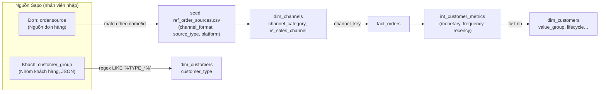

# Hướng dẫn Chọn Phân loại khi Tạo Đơn hàng & Khách hàng

> **Dành cho:** Nhân viên Sales / CS / nhập liệu tạo đơn & khách hàng trên Sapo (Phần A). Data team (Phần B).
> **Cập nhật:** 2026-06-05
> **Bảo trì:** Data team
> **Tài liệu liên quan:** [report_segmentation](../analytics-handbook/guides/report_segmentation.md) · [channel_classification](../analytics-handbook/guides/channel_classification_implementation_prompt.md) · [sales-segmentation-guide](sales-segmentation-guide.md) · [customer-segmentation](customer-segmentation.md)

## Tài liệu này trả lời những câu hỏi nào?

1. Khi **tạo đơn hàng**, tôi chọn **Nguồn đơn hàng** nào cho đúng để đơn được tính vào doanh thu?
2. Khi **tạo khách hàng**, tôi chọn **Nhóm khách hàng** nào để hệ thống phân loại đúng (lẻ / sỉ / đối tác…)?
3. Vì sao một đơn có thật lại **không xuất hiện** trong báo cáo bán hàng?
4. Cái gì tôi **phải chọn tay**, cái gì hệ thống **tự tính** (VIP, hạng khách…)?
5. Chọn sai thì **hỏng** chuyện gì trong báo cáo?

---

## TL;DR — Những điều tối thiểu phải nhớ

- Bạn chỉ kiểm soát **2 ô** quyết định phân loại: **(1) Nguồn đơn hàng** khi tạo đơn, **(2) Nhóm khách hàng** khi tạo khách. Mọi phân loại khác hệ thống **tự tính**.
- **Nguồn đơn hàng = "đơn này bán qua kênh nào".** Chọn đúng kênh thật (Shopee, Zalo, POS, Đại Lý, CS, Telesale…). **Đừng để rơi vào "Other"/"Unknown"** — đơn vào đó bị **loại khỏi mọi báo cáo doanh thu**, dù tiền có thật.
- **Nhóm khách hàng = "quan hệ mua bán"** (lẻ / sỉ / đối tác / nhân viên / KOL). Khách **sỉ** mà để mặc định **Bán lẻ** → phá toàn bộ phân tích khuyến mãi (giá sỉ bị tính lẫn vào giảm giá KM).
- **VIP / Gold / Silver / Bronze KHÔNG phải ô để chọn** — đó là **hạng giá trị tự động** theo tổng chi tiêu. Đừng cố set tay.
- "Số đẹp" trong báo cáo phụ thuộc vào lúc bạn gõ đơn/khách. **Phân loại sai ở khâu nhập = số sai ở khâu báo cáo**, không ai sửa lại được trừ khi sửa từ gốc Sapo.

---

# PHẦN A: HƯỚNG DẪN CHO NHÂN VIÊN TẠO ĐƠN & KHÁCH

---

## 1. Bảng tra nhanh — "Tôi đang làm X thì chọn gì?"

### 1A. Khi TẠO ĐƠN — chọn **Nguồn đơn hàng**

| Tình huống thực tế | Chọn Nguồn | Đừng chọn | Vì sao |
|---|---|---|---|
| Khách mua trên Shopee / Lazada / Tiki / TikTok | *(sàn tự đồng bộ)* | "Other" | Đơn sàn tự về, không cần gõ tay |
| Khách nhắn Zalo / Facebook / Instagram đặt hàng | **Zalo / Facebook / Instagram** | "Other", "Web" | Đúng kênh mạng xã hội |
| Khách đặt qua Website | **Web / WebOrder** | "Other" | |
| Khách gọi điện / CSKH chốt đơn | **CS** hoặc **Telesale** | "Other", "Internal" | Telesale & CS **là bán thật**, có tính doanh thu |
| Bán tại cửa hàng / showroom | **POS - <tên cửa hàng>** | "POS - Unknown Location" | Chọn đúng chi nhánh |
| Đại lý / khách sỉ lấy hàng | **Đại Lý** hoặc **Chợ sỉ** | Zalo/Web/Facebook | Đây là kênh **B2B**, giá sỉ — xem thêm mục 3 |
| Hàng test / QA nội bộ | **Test Sản Phẩm** | Kênh bán bất kỳ | Cố tình **không** tính doanh thu (đúng) |
| Tặng quà / hàng KM cho 0đ | **Quà Tặng** | Kênh bán bất kỳ | Không tính doanh thu (đúng) |
| Đơn nội bộ / ưu đãi nhân viên | **Ưu đãi Nhân Viên** | Kênh bán bất kỳ | Không tính doanh thu ops (đúng) |
| **Không rõ đơn từ đâu** | **HỎI quản lý / Data team** | ❌ "Other" / để trống | "Other" = **mất đơn khỏi báo cáo** |

> ⚠️ **Quy tắc vàng:** Nếu đơn là **bán hàng thật cho khách**, nó phải nằm ở một kênh **cụ thể** trong danh sách trên. Rơi vào **"Other"** hay **"Unknown Location"** nghĩa là hệ thống coi nó **không phải doanh thu** → biến mất khỏi báo cáo CEO, doanh thu kênh, v.v.

### 1B. Khi TẠO KHÁCH — chọn **Nhóm khách hàng** (Customer Group)

| Khách là ai | Chọn Nhóm khách hàng | Hệ thống hiểu là | Ai được phép gán |
|---|---|---|---|
| Khách mua lẻ bình thường | **Bán lẻ** *(mặc định)* | `RETAIL` | Mọi người |
| Khách **mua sỉ / số lượng lớn / giá sỉ** | **Bán buôn** | `WHOLESALE` | Sales (cần duyệt) |
| Đối tác / CTV / đại lý nhỏ / ký gửi | **Đối tác (Partner)** | `PARTNER` | Sales |
| Nhân viên mua nội bộ | **Nhân viên (Staff)** | `STAFF` | HR |
| KOL / Influencer | **KOL** | `KOL` | Marketing |
| Đơn giao hộ US (hiếm — NV ít tạo tay) | **CrossBorder (US)** | `CROSSBORDER` | Data team / Sales |

> ⚠️ Khách **mua sỉ mà để Nhóm "Bán lẻ"** là lỗi tốn tiền nhất — xem **mục 3**.

### 1C. Cái gì hệ thống TỰ TÍNH (bạn KHÔNG cần và KHÔNG nên chọn tay)

| Phân loại | Hệ thống tính theo | Ví dụ giá trị |
|---|---|---|
| **Hạng giá trị** (value_group) | Tổng chi tiêu trọn đời của khách | VIP, Gold, Silver, Bronze |
| **Giai đoạn vòng đời** | Lần mua gần nhất | Mới, Đang hoạt động, Có nguy cơ rời, Đã rời |
| **Kênh ưa thích, vùng miền, hành vi giảm giá…** | Lịch sử mua | Tự động, cập nhật hằng ngày |

→ Nếu thấy hạng khách "sai", **đừng sửa tay** — đó là vấn đề dữ liệu, báo Data team.

---

## 2. Khái niệm chính

### 2.1. "Nguồn đơn hàng" quyết định "Kênh" — và kênh có 3 nhóm lớn

Mỗi đơn có một **Nguồn đơn hàng** (Shopee, Zalo, POS, Đại Lý…). Hệ thống xếp nguồn đó vào **3 nhóm kênh**:

```
KÊNH (channel_category)
├── Online-Ecommerce   → Sàn TMDT (Shopee, Lazada, Tiki…), Mạng xã hội (FB, Zalo, IG), Website
├── Offline            → Cửa hàng/POS, Bán sỉ B2B (Đại Lý, Chợ sỉ), Bán trực tiếp (CS, Telesale)
└── Internal           → KHÔNG phải doanh thu bán hàng (Test, Quà tặng, Ưu đãi NV, US, "Other")
```

**Điều người ta hay hiểu sai:** "Online/Ecommerce" **không chỉ là sàn TMDT** — nó gồm **cả Mạng xã hội (Facebook, Zalo) và Website**. Và "Bán trực tiếp" qua **CS/Telesale là doanh thu thật**, không phải nội bộ.

→ Hai nhóm đầu (**Online-Ecommerce + Offline**) = **doanh thu bán hàng thật** (`is_sales_channel = true`). Nhóm **Internal** = bị loại khỏi báo cáo bán hàng.

### 2.2. "Nhóm khách hàng" (customer_type) ≠ "Hạng khách" (value_group)

Đây là **hai thứ khác nhau hoàn toàn**, hay bị nhầm:

| | **Nhóm khách hàng** (customer_type) | **Hạng giá trị** (value_group) |
|---|---|---|
| Nghĩa | Khách **mua kiểu gì** (lẻ / sỉ / đối tác) | Khách **chi nhiều hay ít** |
| Ai quyết định | **Bạn chọn tay** khi tạo khách | **Hệ thống tự tính** theo chi tiêu |
| Giá trị | RETAIL, WHOLESALE, PARTNER, STAFF, KOL, CROSSBORDER | VIP, Gold, Silver, Bronze |
| Đổi khi nào | Chỉ đổi khi bạn đổi Nhóm | Tự đổi khi khách mua thêm |

**Ví dụ:** Một khách **lẻ** chi 60 triệu → `customer_type = RETAIL` **và** `value_group = VIP`. "VIP" ở đây nói **khách giá trị cao**, **không** biến họ thành khách sỉ.

---

## 3. ⭐ BẪY TỐN TIỀN NHẤT: Khách **sỉ** bị để mặc định **Bán lẻ**

> Đây là lỗi phân loại gây sai số lớn nhất, và **bạn là người duy nhất chặn được nó** ngay tại khâu tạo khách.

### Vấn đề

Nếu khách **mua sỉ** (số lượng lớn, **giá sỉ giảm 40–70%**) nhưng Nhóm khách để **"Bán lẻ"** (mặc định), hệ thống xếp họ là `RETAIL`. Khi đó:

- **Giá sỉ bị hiểu nhầm thành "khuyến mãi"** → báo cáo "tỷ lệ giảm giá", "hiệu quả KM" **vô nghĩa** (trộn giá sỉ với giảm giá thật).
- Doanh thu lẻ vs sỉ **không tách được** → sai cơ cấu doanh thu.

### "Giảm giá" có hai nghĩa khác nhau — đừng trộn

| "Giảm giá" trên đơn | Bản chất | Đúng khi khách là |
|---|---|---|
| Giảm 50% trên Shopee dịp sale | **Khuyến mãi** (promotion) | RETAIL |
| Giảm 50% cho đại lý lấy sỉ | **Giá sỉ** (chính sách giá) | WHOLESALE |

→ Cùng con số "giảm 50%" nhưng **một cái là KM, một cái là giá sỉ**. Chỉ có **Nhóm khách hàng** mới phân biệt được. Đó là lý do gán đúng Nhóm rất quan trọng.

### Cách làm đúng

- Khách lấy hàng **số lượng lớn / giá sỉ / đại lý** → gán Nhóm **"Bán buôn"** (cần Sales duyệt).
- Đừng dựa vào việc "đơn này giảm nhiều nên chắc là sỉ" — **phải gán Nhóm cho khách**, hệ thống không tự đoán.

> ✅ **Hiện trạng dữ liệu (ĐÃ XỬ LÝ 2026-06-05):** Regex đã mở rộng để bắt cả mã/nhóm cũ. Hiện: WHOLESALE=161, CROSSBORDER=662, PARTNER=11. `customer_type` giờ tin được. Chi tiết kỹ thuật ở **Phần B (mục 8.2, 9, 12)**.

---

## 4. Những hiểu nhầm thường gặp

1. **"Other / Unknown ≠ một kênh hợp lệ."** — Đơn rơi vào "Other" hay "POS - Unknown Location" **bị loại khỏi mọi báo cáo doanh thu** (coi như nội bộ). Hậu quả: đơn có thật, tiền có thật, nhưng **sếp không thấy** trong báo cáo. *(Đây chính là lý do đơn SON07311 "biến mất" — xem Ví dụ 1.)*

2. **"Bán lẻ mặc định ≠ khách lẻ thật."** — Khách sỉ chưa gán Nhóm sẽ **tự rơi về RETAIL**. Hậu quả: phân tích khuyến mãi sai vì giá sỉ bị tính là giảm giá KM.

3. **"VIP / Gold ≠ Nhóm khách hàng."** — Đó là **hạng giá trị tự động** theo chi tiêu, **không phải** ô để chọn. Cố set tay sẽ bị hệ thống ghi đè.

4. **"CS / Telesale ≠ nội bộ."** — *(**TRƯỚC ĐÂY:** từng bị xếp Internal → **HIỆN TẠI:** Offline / Bán trực tiếp, **là doanh thu thật**, ĐÃ XÁC NHẬN 2026-04-13.)* Chọn CS/Telesale cho đơn gọi điện là **đúng**, không phải bỏ vào "Other".

5. **"is_sales_channel = false ≠ doanh thu = 0 thật."** — Ví dụ kênh **US** (giao hàng hộ xuyên biên): gross hiển thị rất lớn nhưng **doanh thu VN thật = 0đ**, nên bị loại đúng. Đừng tưởng "US doanh thu lớn".

---

## 5. Ví dụ thực tế

### Ví dụ 1: "Đơn SON07311 có thật, sao không thấy trong báo cáo?"

> **Tình huống:** Đơn `SON07311` đặt 03/06/2026, trạng thái OPEN, tiền có thật.
> **Nguyên nhân:** Nguồn đơn = **"Other"** → nhóm **Internal** → `is_sales_channel = false` → **bị loại** khỏi mọi widget của dashboard bán hàng.
> **Cách sửa:** Mở đơn trong Sapo, đổi **Nguồn đơn hàng** sang đúng kênh đã bán (vd Zalo / Facebook / CS…). Sau khi đồng bộ, đơn sẽ xuất hiện lại.
> **Bài học:** Ngày kỳ & trạng thái **đều đạt**; chỉ **Nguồn sai** là đủ làm đơn biến mất.

### Ví dụ 2: "Đại lý lấy 200 hộp, giảm 45% — gõ sao cho đúng?"

> 1. **Khách:** gán Nhóm khách hàng = **"Bán buôn"** (không để Bán lẻ).
> 2. **Đơn:** chọn Nguồn = **"Đại Lý"** (không chọn Zalo/Web).
> → Hệ thống hiểu: doanh thu B2B, mức giảm 45% là **giá sỉ** (không phải KM). Báo cáo khuyến mãi sạch, báo cáo sỉ đúng.

### Ví dụ 3: "Tặng 10 hộp cho KOL quay clip"

> Nguồn = **"Quà Tặng"** (hoặc Nhóm khách = KOL nếu là khách KOL mua). Hệ thống **không** tính 10 hộp này vào doanh thu bán → đúng, tránh thổi phồng số.

---

## 6. Cheat Sheet (1 màn hình — chụp lại để dùng)

| Bạn làm gì | Ô cần chọn | Chọn đúng | Hậu quả nếu sai |
|---|---|---|---|
| Tạo đơn bán thật | **Nguồn đơn hàng** | Kênh cụ thể (Shopee/Zalo/POS/CS/Đại Lý…) | "Other" → **mất đơn khỏi báo cáo** |
| Tạo đơn nội bộ | **Nguồn đơn hàng** | Test SP / Quà Tặng / Ưu đãi NV | Chọn kênh bán → **thổi phồng doanh thu** |
| Tạo khách lẻ | **Nhóm khách hàng** | Bán lẻ (mặc định) | — |
| Tạo khách sỉ | **Nhóm khách hàng** | **Bán buôn** | Để Bán lẻ → **phá phân tích KM** |
| Hạng VIP/Gold | *(không chọn)* | Để hệ thống tự tính | Set tay → bị ghi đè |
| Không rõ nguồn | — | **Hỏi quản lý/Data** | "Other" → mất đơn |

---

# PHẦN B: TÀI LIỆU KỸ THUẬT (Data team)

---

## 7. Kiến trúc dữ liệu



- **Kênh:** `order.source` → khớp `ref_order_sources.csv` → `channel_format` → `dim_channels` suy ra `channel_category` + `is_sales_channel`.
- **Khách:** `customer_group` (blob JSON snapshot từ Sapo) → regex để ra `customer_type`. `value_group` và các chiều hành vi **tự tính** từ lịch sử mua (`int_customer_metrics`).

### 7.1. Bảng ánh xạ thuật ngữ (business term → cột → giá trị)

| Thuật ngữ (Phần A) | Bảng.cột | Giá trị mẫu | Ai đặt |
|---|---|---|---|
| Nguồn đơn hàng | `order.source` → `dim_channels.channel_name` | Shopee, Zalo, Đại Lý, Other | NV (hoặc sàn tự đồng bộ) |
| Nhóm kênh | `dim_channels.channel_category` | Online-Ecommerce / Offline / Internal | tự suy |
| Có tính doanh thu? | `dim_channels.is_sales_channel` | true / false | tự suy |
| Nhóm khách hàng | `dim_customers.customer_type` | RETAIL, WHOLESALE, PARTNER, STAFF, KOL, CROSSBORDER | NV chọn (qua Sapo group) |
| Hạng giá trị | `dim_customers.value_group` | VALUE_VIP/GOLD/SILVER/BRONZE | tự tính (chi tiêu) |

## 8. Dữ liệu tham chiếu (Seed / nguồn sự thật)

### 8.1. `transformation/seeds/ref_order_sources.csv` — nguồn sự thật của KÊNH
Mỗi nguồn đơn 1 dòng. Cột quyết định:

| Cột | Mô tả | Ví dụ |
|---|---|---|
| `name` | Tên nguồn (khớp `order.source`) | Shopee, Zalo, Đại Lý, US, Other |
| `channel_format` | Phân loại Tier-2 (quyết định mọi thứ) | Marketplace / Social / Web / Retail / B2B / Direct / System / CrossBorder Fulfillment / Other |
| `source_type` | Bản chất nguồn | `channel` / `purpose` (Quà Tặng, Test SP) / `arrangement` (US) |
| `is_generic_source` | true → nở theo location (POS → từng cửa hàng) | true/false |
| `platform` | Tier-3 | Shopee, Facebook, US… |

### 8.2. Nhóm khách hàng Sapo — mã code quyết định `customer_type`
`customer_group` lưu **nguyên blob JSON** group của Sapo. Suy diễn khớp regex trên **`code`** (ĐÃ XÁC NHẬN 2026-06-05):

| Sapo group name / code | → customer_type | Ghi chú |
|---|---|---|
| `TYPE_RETAIL` (hoặc không tag) | RETAIL | mặc định |
| Selly / `CTN00013` | **RETAIL** | Khách cuối — tái tiếp thị được (n=104) |
| `TYPE_WHOLESALE` hoặc `BANBUON` | WHOLESALE | Regex bắt `%WHOLESALE%` (n=161) |
| `TYPE_PARTNER` hoặc `KY_GUI` (Ký Gửi) | **PARTNER** | Ký Gửi → PARTNER (n=11) |
| `TYPE_STAFF` | STAFF | |
| `TYPE_KOL` | KOL | |
| US / `CTN00014` | **CROSSBORDER** (MỚI) | Đơn giao hàng hộ — người nhận ở VN; regex bắt `%TYPE_CROSSBORDER%`+`%CTN00014%` (n=662) **HOẶC** đã có ≥1 đơn trên kênh Sapo `channel_name='US'` (tự động lúc ingest, không cần tag thủ công) — bổ sung 2026-07-08, xem mục 9 và 12 |

## 9. Logic xây dựng Model (derivation)

**channel_category** — `dim_channels.sql`, CASE trên `channel_format`:
```
Marketplace / Social / Web          → 'Online-Ecommerce'
Retail / B2B / Direct               → 'Offline'
System / CrossBorder Fulfillment / (ELSE)  → 'Internal'
```
**is_sales_channel** (verbatim):
```sql
channel_format NOT IN ('System', 'CrossBorder Fulfillment', 'Other') as is_sales_channel
```
**customer_type** — `dim_customers.sql` (regex đã mở rộng — ĐÃ XÁC NHẬN 2026-06-05; channel-signal bổ sung 2026-07-08):
```sql
CASE
  WHEN customer_group LIKE '%TYPE_WHOLESALE%'
    OR customer_group LIKE '%WHOLESALE%'        THEN 'WHOLESALE'
  WHEN customer_group LIKE '%TYPE_PARTNER%'
    OR customer_group LIKE '%KY_GUI%'           THEN 'PARTNER'
  WHEN customer_group LIKE '%TYPE_STAFF%'       THEN 'STAFF'
  WHEN customer_group LIKE '%TYPE_KOL%'         THEN 'KOL'
  WHEN customer_group LIKE '%TYPE_CROSSBORDER%'
    OR customer_group LIKE '%CTN00014%'
    OR EXISTS (SELECT 1 FROM us_channel_customers uc  -- NEW 2026-07-08: has >=1 order on
               WHERE uc.customer_key = joined_data.customer_key)  -- Sapo channel_name='US' (auto, not manual tag)
                                                 THEN 'CROSSBORDER'
  ELSE 'RETAIL'
END
```
Lưu ý thứ tự: WHOLESALE/PARTNER/STAFF/KOL vẫn kiểm tra TRƯỚC CROSSBORDER — channel-signal chỉ bổ sung (OR), không đổi precedence. Khách vừa có group WHOLESALE vừa có đơn US-channel vẫn là WHOLESALE.
**value_group** (tự động, theo chi tiêu trọn đời):
```sql
CASE
  WHEN monetary_value >= 50000000 OR frequency >= 20 THEN 'VALUE_VIP'
  WHEN monetary_value >= 20000000 THEN 'VALUE_GOLD'
  WHEN monetary_value >=  5000000 THEN 'VALUE_SILVER'
  ELSE 'VALUE_BRONZE'
END
```
**acquisition_source:** Giờ = `channel_name` của đơn hàng đầu tiên của khách (ĐÃ IMPLEMENT). Không còn luôn NULL.

## 10. Quy trình vận hành (theo tình huống)

### Khi thêm **nguồn đơn mới** (vd "Shopee - New Brand")
1. Mở `transformation/seeds/ref_order_sources.csv`, thêm 1 dòng: `name`, `channel_format` (chọn đúng: Marketplace/Social/Web/Retail/B2B/Direct), `platform`, `source_type=channel`, `is_generic_source` (false trừ khi nở theo location).
2. Chạy lại seed + mart: `dbt seed` rồi `dbt build -s dim_channels+` (build dim_channels và downstream).
3. Verify: `SELECT channel_name, channel_category, is_sales_channel FROM dim_channels WHERE channel_name LIKE 'Shopee%'` — đúng category + `is_sales_channel=true`.

### Khi đơn rơi vào **"Other" / "Unknown"**
1. Tìm: `SELECT o.order_code FROM fact_orders o JOIN dim_channels c USING(channel_key) WHERE c.channel_format='Other' OR c.channel_name LIKE '%Unknown%'`.
2. Nếu là **kênh thật chưa khai báo** → thêm vào `ref_order_sources.csv` (như trên).
3. Nếu **đơn gán sai nguồn** → sửa `order.source` trong Sapo, chờ re-sync.

### Khi **onboard / phát hiện khách sỉ**
1. Trong Sapo, gán khách vào nhóm có `code = TYPE_WHOLESALE` (hoặc `TYPE_PARTNER`/`TYPE_STAFF`/`TYPE_KOL`).
2. Chờ đồng bộ → `dim_customers.customer_type` cập nhật ở lần build kế tiếp.
3. Verify: `SELECT customer_type, COUNT(*) FROM dim_customers GROUP BY 1`.
4. ✅ Khách cũ mã `BANBUON`/`CTN*`/`KY_GUI` giờ đã tự nhận diện đúng nhờ regex mở rộng (ĐÃ XÁC NHẬN 2026-06-05).

## 11. Scope báo cáo (cho người làm dashboard)

```sql
scope_sales:   WHERE is_sales_channel = true AND status NOT IN ('CANCELLED','Voided')
scope_retail:  scope_sales AND customer_type = 'RETAIL'      -- BẮT BUỘC cho phân tích KM/giảm giá
scope_b2b:     scope_sales AND customer_type IN ('WHOLESALE','PARTNER')
```

## 12. Chất lượng dữ liệu

**TRƯỚC ĐÂY → HIỆN TẠI (2026-06-05):** Regex `customer_type` đã mở rộng để bắt cả mã/nhóm cũ (`BANBUON`, `CTN00014`, `KY_GUI`…). Kết quả xác minh live: WHOLESALE=161, CROSSBORDER=662, PARTNER=11. `customer_type` giờ **tin được**.

| Rủi ro | Ảnh hưởng | Phát hiện | Xử lý |
|---|---|---|---|
| **~~Migration `TYPE_*` chưa xong~~** — ~~chỉ 3 WHOLESALE~~ → **ĐÃ GIẢI QUYẾT**: regex mở rộng bắt `BANBUON`/`CTN*`/`KY_GUI`. WHOLESALE=161, CROSSBORDER=662, PARTNER=11 (ĐÃ XÁC NHẬN 2026-06-05) | ~~`customer_type` không tin được~~ → Đã tin được | `SELECT customer_type, COUNT(*) FROM dim_customers GROUP BY 1` | ✅ Xong. Khách mới: gán đúng nhóm Sapo là đủ. |
| Đơn rơi vào **"Other"/"Unknown"** | Mất khỏi doanh thu | `WHERE channel_category='Internal' AND channel_format='Other'` đếm theo tuần | Sửa `order.source` của đơn; bổ sung nguồn vào `ref_order_sources.csv` nếu là kênh mới |
| **~36 khách sỉ ẩn** (mua sỉ, giảm 40–73%, đang gắn RETAIL trên Zalo/FB/Web/POS) | ~800M doanh thu phân loại sai | file review `wholesale-customers-review-260526.csv` | **ĐỀ XUẤT** — chờ Sales xác nhận để gán `WHOLESALE` |
| **Group-tag CROSSBORDER có gap** — khách "đơn Mỹ" chưa được NV (re-)tag đúng group vẫn rơi về RETAIL | Lẫn vào action-queue/retention/benchmark như khách lẻ thường | So `customer_type` vs đơn có `dim_channels.channel_name='US'` | **ĐÃ GIẢI QUYẾT 2026-07-08** (`plans/260708-1628-crossborder-channel-detection`) — thêm tín hiệu channel-derived (`us_channel_customers` CTE, OR vào CASE + `is_us_gift_recipient`), **tự động/thường trực** — không phải patch tạm. **Kết quả xác nhận sau full-refresh**: 773 khách reclassify RETAIL→CROSSBORDER (CROSSBORDER: 754→1527); cross-check `us-customers-260606.csv` (817 dòng): 813 khớp CROSSBORDER, 4 còn lại là WHOLESALE (đúng thiết kế — group-tag WHOLESALE ưu tiên trước) nhưng `is_us_gift_recipient=TRUE` (đúng thiết kế — cờ độc lập với customer_type). Không có transition bất thường nào khác ngoài RETAIL→CROSSBORDER. **Khi NV tag đúng group sau này**: điều kiện group-tag tự TRUE, channel-signal thành dư thừa-nhưng-vô-hại — KHÔNG cần gỡ code này, giữ vĩnh viễn vì gap tag-thủ-công có thể tái diễn. |

## Decision Log

| Quyết định | Trạng thái | Ngày | Ghi chú |
|---|---|---|---|
| US = CrossBorder Fulfillment, `is_sales_channel=false` (doanh thu VN thật = 0đ) | ĐÃ XÁC NHẬN | 2026-04-13 | Loại ~11K đơn (gross lớn nhưng 0đ) khỏi báo cáo |
| Telesale & CS = Bán trực tiếp (Offline), doanh thu thật | ĐÃ XÁC NHẬN | 2026-04-13 | TRƯỚC ĐÂY: Internal → HIỆN TẠI: Offline/Direct |
| Báo cáo KM/giảm giá BẮT BUỘC lọc `customer_type='RETAIL'` | ĐÃ XÁC NHẬN | 2026-04-13 | Tránh giá sỉ B2B làm méo "tỷ lệ KM" |
| Đổi mã nhóm khách sang `TYPE_*` | ĐÃ GIẢI QUYẾT (regex mở rộng) | 2026-06-05 | TRƯỚC ĐÂY: migrate `TYPE_*` thủ công. HIỆN TẠI: regex bắt cả mã cũ — WHOLESALE=161, CROSSBORDER=662, PARTNER=11 |
| US (CTN00014) → `customer_type = CROSSBORDER` | ĐÃ XÁC NHẬN | 2026-06-05 | Đơn US bị loại ở tầng kênh; CROSSBORDER ngoài mọi scope doanh thu |
| Selly (CTN00013) → `customer_type = RETAIL` | ĐÃ XÁC NHẬN | 2026-06-05 | Khách cuối — tái tiếp thị được (n=104) |
| Ký Gửi (KY_GUI) → `customer_type = PARTNER` | ĐÃ XÁC NHẬN | 2026-06-05 | Consignment/ký gửi → scope_b2b (n=11) |
| `acquisition_source` = channel_name đơn đầu tiên | ĐÃ IMPLEMENT | 2026-06-05 | TRƯỚC ĐÂY: luôn NULL |
| Thêm dimension `order_nature` (retail_sale/wholesale/test/gift/cross_border/staff_benefit/affiliate) | ĐỀ XUẤT | — | Chưa implement |

## Câu hỏi mở

| Câu hỏi | Trạng thái | Ghi chú |
|---|---|---|
| Ngưỡng nhận diện "khách sỉ" (giảm ≥40%?) để cảnh báo tự động | CẦN XÁC NHẬN | |
| ~36 khách sỉ ẩn (gắn RETAIL, có pattern sỉ) — Sales xác nhận gán WHOLESALE? | CẦN XÁC NHẬN | File: `wholesale-customers-review-260526.csv` |

---

## Kết luận

> "Bạn chỉ chọn 2 ô — **Nguồn đơn** và **Nhóm khách** — nhưng chọn sai là số trong báo cáo sai: đơn rơi vào 'Other' thì mất, khách sỉ để 'Bán lẻ' thì méo."
