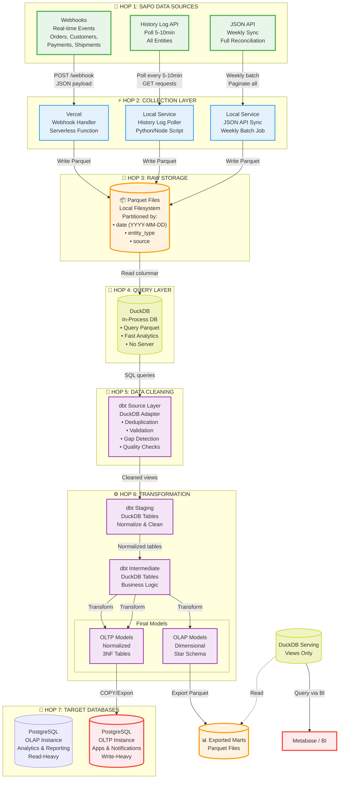
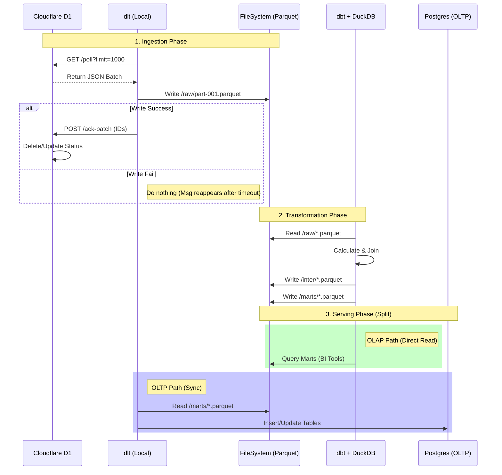

# Sapo Data Pipeline Architecture

## Parquet + DuckDB + PostgreSQL

**Version:** 1.0  
**Last Updated:** 2024-01-20  
**Purpose:** Complete data pipeline architecture từ Sapo e-commerce platform đến OLAP/OLTP databases

---

## 📊 Tổng Quan Kiến Trúc

Hệ thống data pipeline gồm **7 hops chính** để xử lý data từ nguồn Sapo đến các database phục vụ analytics (OLAP) và operations (OLTP).

### Architecture Transition (Evolution)

Chúng ta đang chuyển dịch từ kiến trúc cũ (Postgres-centric) sang kiến trúc mới (Local Data Lakehouse).

| Feature              | Old (Postgres-centric)          | New (Local Data Lakehouse)             |
| :------------------- | :------------------------------ | :------------------------------------- |
| **Ingestion**        | Node.js Consumer (Complex)      | **dlt** (Python - Simple/Robust)       |
| **Raw Storage**      | Postgres `webhook_logs` (Heavy) | **Parquet Files** (Lightweight)        |
| **Transform Engine** | Postgres (Slow for OLAP)        | **DuckDB** (Vectorized - Fast)         |
| **Serving (OLAP)**   | Postgres (Shared resource)      | **DuckDB** (Serverless, View-based)    |
| **Serving (OLTP)**   | Postgres (Shared resource)      | **Postgres** (Clean, App-only data)    |
| **Cost**             | Medium (Always-on DB resources) | **Very Low** (Static Files, No Server) |

### Nguyên Tắc Thiết Kế

- **Separation of Concerns:** Tách biệt collection, storage, processing, và serving
- **Immutable Data Lake:** Parquet files làm source of truth, không bao giờ xóa/sửa
- **ELT over ETL:** Extract → Load → Transform (transform sau khi load)
- **Dual-Purpose Output:** OLAP cho analytics, OLTP cho applications
- **Cost-Effective:** Sử dụng free tiers và local processing
- **Scalable:** Từ 1K đến 10K orders/day

---

## 🎨 Complete Data Flow Diagram



---

## 📋 Liệt Kê Các Data Hops

### **HOP 1: Data Sources (Sapo System - Nguồn dữ liệu)**

| Node                    | Description         | Frequency     | Coverage          |
| ----------------------- | ------------------- | ------------- | ----------------- |
| **1A: Webhooks**        | Real-time events    | Instant       | Orders, Customers |
| **1B: History Log API** | Entity update logs  | Poll 5-10 min | All entities      |
| **1C: JSON API**        | Full reconciliation | 10 min batch  | Orders, Customers |

**Characteristics:**

- Webhook: Push-based, real-time
- History Log API: Pull-based, near real-time
- JSON API: Pull-based, batch reconciliation

### **HOP 2: Data Collection Layer**

| Node                       | Technology    | Purpose          | Location          |
| -------------------------- | ------------- | ---------------- | ----------------- |
| **2A: Webhook Handler**    | Cloudflare/D1 | Receive webhooks | Cloud (free tier) |
| **2B: History Log Poller** | Python/DLT    | Poll API logs    | Local (scheduled) |
| **2C: JSON API Sync**      | Python/DLT    | Full sync        | Local (weekly)    |
| **2D: Webhook Consumer**   | Python/DLT    | Poll D1 Queue    | Local (Scheduled) |

**Functions:**

- Validate incoming data
- Transform to standard schema
- Write to Parquet files
- Handle errors and retries

#### **2D: Webhook Consumer (Cloudflare D1 + DLT)**

- **Architecture**: Pull-based (Poller).
- **Source**: Cloudflare Worker (D1 Database as Queue).
- **Mechanism**:
  - `dlt` pipeline (Python) running locally or on a scheduler.
  - Periodic `GET /poll` requests to fetch batches of webhooks.
  - `POST /ack-batch` to confirm processing and remove from D1.
- **Benefits**:
  - **Reliability**: No data loss if local machine is down (D1 buffers events).
  - **Control**: Rate-limited processing (e.g., process 1000 events/min).

### **HOP 3: Raw Data Storage**

**Technology:** Parquet Files

**Storage Structure (Unified Dataset, Segregated Ingestion Methods):**

```text
/data_lake/sapo_raw/orders/                   <-- Dataset Name (Implicit Source System: Sapo)
    │
    ├── ingest_method=webhook/                <-- Partition Key 1: Ingestion Method
    │   ├── year=2024/month=01/day=20/        <-- Partition Key 2,3,4: Date
    │   │   └── 103000_uuid.parquet
    │
    ├── ingest_method=batch_sync/
    │   ├── year=2024/month=01/day=20/
    │   │   └── full_dump_001.parquet
    │
    └── ingest_method=history_log/
        ├── year=2024/month=01/day=20/
        │   │   └── retry_log_abc.parquet
```

**Note on Source System:**

- `source_system` (vd: sapo, shopee) được quy định ngầm định bởi tên Dataset (`sapo_raw`, `shopee_raw`) để tách biệt vật lý ngay từ đầu.

**Partitioning Strategy:**

- **Level 1:** `ingest_method` (webhook, batch_sync, history_log) - Phân loại theo phương thức lấy dữ liệu (Technical Source).
- **Level 2:** `year` (YYYY)
- **Level 3:** `month` (MM)
- **Level 4:** `day` (DD) - Optional, tùy volume dữ liệu.

**Lợi ích:**

- **Provenance:** Dễ dàng biết record nào đến từ nguồn nào.
- **Performance:** DuckDB có thể đọc song song hoặc prune partition hiệu quả.

**Partition Strategy Comparison (Design Decision):**

Chúng ta đã lựa chọn chiến lược **Source-First** sau khi cân nhắc kỹ lưỡng các yếu tố:

| Feature               | Option 1: Method-First (Selected)                                                                                           | Option 2: Time-First (Alternative)                                                                |
| :-------------------- | :-------------------------------------------------------------------------------------------------------------------------- | :------------------------------------------------------------------------------------------------ |
| **Structure**         | `sapo_raw/{entity}/ingest_method=xxx/year=yyyy/...`                                                                         | `sapo_raw/{entity}/year=yyyy/ingest_method=xxx/...`                                               |
| **Data Ops**          | **Excellent.** Dễ dàng xóa/re-ingest toàn bộ 1 luồng (vd: `rm -rf ingest_method=batch_sync`) mà không ảnh hưởng luồng khác. | **Hard.** Dữ liệu luồng nằm rải rác trong từng folder thời gian. Rủi ro cao khi cleanup thủ công. |
| **File Management**   | **Clean.** Tách biệt luồng sinh nhiều file nhỏ (Webhook), luồng trung bình (History Log) và luồng sinh ít file lớn (Batch). | **Messy.** Trộn lẫn file nhỏ và lớn trong cùng folder tháng.                                      |
| **Query Performance** | **Good.** DuckDB discovery nhanh. Tối ưu cho query lọc theo method.                                                         | **Good.** Tối ưu nhẹ cho query lọc theo thời gian thuần túy (Time-range scan).                    |
| **Recommendation**    | ✅ **Chosen.** Phù hợp nhất với yêu cầu "Segregated Ingestion Methods".                                                     | ❌ Không chọn vì khó vận hành.                                                                    |

**Schema Example:**

```json
{
    "entity_id": "ord_12345",              // (Primary Key) ID thực thể duy nhất
    "entity_type": "order",                // Loại thực thể: order, customer, ...
    "ingest_method": "webhook",            // (Partition Key) Cách lấy: webhook, batch_sync, history_log
    "event_type": "update",                // [PROMOTED] Loại sự kiện: create, update, delete, snapshot
    "event_timestamp": "2024-01-20T10:30:00Z", // [PROMOTED] "Business Time" của sự kiện
    "payload_hash": "a1b2c3d4...",         // [PROMOTED] Hash của payload để deduplicate nhanh
    "year": "2024",                        // (Partition Key)
    "month": "01",                         // (Partition Key)
    "payload": {                           // Original Data (Full Snapshot)
        "id": 12345,
        "code": "ORD-001",
        "created_on": "2024-01-20T10:00:00Z",
        "modified_on": "2024-01-20T10:30:00Z",
        "total": 500000,
        ...
    },
    "sync_metadata": {                     // Audit Metadata (Chi tiết kỹ thuật)
        "source_system": "sapo",           // Nguồn business: sapo, shopee
        "event_timestamp": "2024-01-20T10:30:00Z", // "Business Time" của sự kiện
        "processing_timestamp": "2024-01-20T10:30:05Z", // Thời điểm DLT ghi file
        "original_event_id": "evt_abc123"  // ID của Webhook/Log gốc (nếu có)
    }
}
```

### **Standardization Strategy (Unified Envelope)**

Mọi nguồn dữ liệu (Webhook, History Log, Batch Sync) đều được chuẩn hóa về cấu trúc **Envelope** trên trước khi ghi xuống Parquet. Điều này đảm bảo:

1.  **Uniformity:** Downstream (Hop 4-5) chỉ cần biết đọc `payload` mà không cần xử lý riêng từng nguồn.
2.  **Replayability:** Có thể tái hiện lại lịch sử thay đổi nhờ `sync_metadata`.
3.  **Traceability:** Biết chính xác bản ghi này đến từ đâu, vào lúc nào.

### **Data Strategy: Time & Scheduling**

Để đảm bảo tính nhất quán (Consistency) và khả năng tái hiện (Replayability) trên toàn bộ pipeline, chúng ta sử dụng một bộ các trường thời gian chuẩn hóa.

#### **1. Time Fields & Purpose (Các trường thời gian)**

| Field Name                 | Origin                     | Type     | Description                                                         | Goal / Usage                                                                                                         |
| :------------------------- | :------------------------- | :------- | :------------------------------------------------------------------ | :------------------------------------------------------------------------------------------------------------------- |
| **`created_on`**           | Source (Sapo)              | Business | Thời điểm thực thể được sinh ra.                                    | **Analytics:** Phân tích Cohort, tuổi thọ khách hàng/đơn hàng.                                                       |
| **`modified_on`**          | Source (Sapo)              | Business | Thời điểm trạng thái thay đổi lần cuối trên nguồn.                  | **Merge Logic:** Dùng để xác định "Latest State" trong thuật toán Deduplication (Hop 4).                             |
| **`event_timestamp`**      | Pipeline (Promoted)        | Logical  | Thời điểm sự kiện _xảy ra_ (Webhook timestamp hoặc Log `occur_at`). | **Ordering:** Sắp xếp chuỗi sự kiện lịch sử một cách chính xác. **Cursor:** DLT dùng trường này để Incremental Load. |
| **`processing_timestamp`** | Pipeline (`sync_metadata`) | System   | Thời điểm DLT ghi file xuống đĩa.                                   | **Audit/Debug:** Dùng để truy vết sự cố pipeline hoặc độ trễ (Latency).                                              |
| **`year/month`**           | Partition                  | System   | Thời gian _ghi nhận_ dữ liệu.                                       | **Performance:** Cắt nhỏ dữ liệu (Data Pruning) giúp tăng tốc query DuckDB.                                          |

#### **2. Support Multiple Ingestion Methods**

Mỗi phương thức lấy data có đặc tính riêng nhưng đều đổ về cùng cấu trúc Envelope:

- **Webhook (Real-time):** `event_timestamp` ≈ `modified_on`.
- **History Log (Near Real-time Batch):** `event_timestamp` = Log `occur_at`.
- **Batch Sync (Scheduled):** `event_timestamp` = `modified_on` (Snapshot).

### **HOP 4: Query & Processing Layer**

**Technology:** DuckDB (Persistent File: `data_integration2.duckdb`)

**Capabilities:**

- **Transformation Engine:** Đóng vai trò là "Data Warehouse Compute".
- **State Storage:** Lưu trữ `staging`, `seeds` và metadata của quá trình dbt.
- **Processing:** Thực thi các query biến đổi data từ Raw Parquet -> Final Models.
- **Output:** KHÔNG lưu data cuối cùng (Marts) mà Export ra file Parquet để Serving Layer sử dụng.

### **Concept: Virtual Sorted Log (Logical Hop 3.5)**

**Vấn đề:**
Dữ liệu tại **HOP 3 (Raw Storage)** được ghi theo thời gian nhận (Ingestion Time). Do đặc tính của Webhook (out-of-order) và Batch Sync (quét hàng loạt), thứ tự file vật lý không phản ánh đúng thứ tự lịch sử thay đổi của đơn hàng (`modified_on`).

**Giải pháp:**
Thay vì tạo ra một tầng lưu trữ vật lý mới (tốn kém I/O và dung lượng), ta sử dụng sức mạnh của **DuckDB** để tạo một **Logical View**.

**SQL View Definition:**

```sql
CREATE VIEW view_sorted_orders AS
SELECT *
FROM (
    SELECT
        *,
        -- 1. Deduplication dựa trên modified_on (cùng 1 thời điểm sửa đổi chỉ lấy 1 bản ghi)
        -- 2. Ưu tiên bản tin mới nhất (source_timestamp DESC) nếu có trùng lặp
        ROW_NUMBER() OVER (
            PARTITION BY entity_id, modified_on
            ORDER BY source_timestamp DESC
        ) as rn
    FROM read_parquet('/data/*/orders/*.parquet')
)
WHERE rn = 1
-- 3. Sắp xếp lại theo đúng trình tự lịch sử
ORDER BY entity_id, modified_on ASC;
```

**Lý do cần thiết:**

1.  **Single Source of Truth:** Đảm bảo các tầng sau (Hop 5/6) luôn nhìn thấy lịch sử đơn hàng đúng trình tự logic, bất kể dữ liệu đến từ nguồn nào (Webhook hay API).
2.  **No Data Duplication:** Không cần sao chép dữ liệu ra file mới để sort.
3.  **Dynamic Consistency:** Khi có file Parquet mới (ví dụ từ History Log Poller trám vào quá khứ), View này tự động sắp xếp lại đúng vị trí của nó trong lịch sử mà không cần chạy job migrate dữ liệu.

#### **Design FAQ: Merge Strategy & Data Nature**

> **Q1: Bản chất dữ liệu tại Hop 3 là "Delta" (chỉ chứa thay đổi) hay "Full Snapshot"?**
>
> **A: Full Snapshot.**
> Tất cả các nguồn (Webhook, History Log, Batch Sync) đều cung cấp toàn bộ trạng thái của Entity tại thời điểm thu thập. Chúng ta không sử dụng CDC (Change Data Capture) dạng transaction diff. Do đó, mỗi bản ghi trong Parquet là một bức tranh hoàn chỉnh của dữ liệu tại thời điểm đó.
>
> **Q2: DuckDB có tự động Merge/Deduplicate dữ liệu không?**
>
> **A: Không.**
> DuckDB tại Hop 4 đóng vai trò là Compute Engine, nhìn thấy toàn bộ các file Parquet như một tập dữ liệu "Append-only". Nó sẽ trả về 3 bản ghi cho cùng 1 Order nếu Order đó được cập nhật 3 lần. Việc Merge/Deduplicate là trách nhiệm của Logic (dbt hoặc SQL View) tại Hop 5.
>
> **Q3: Cơ chế Gộp (Merge) là "Replay" hay "Selection"?**
>
> **A: Selection (Last Known Good State).**
> Vì mỗi bản ghi là một Full Snapshot, chúng ta **không cần** phải cộng dồn tuần tự các thay đổi (Replay) để tái tạo trạng thái cuối.
> Chiến lược là **Selection**: Chỉ cần tìm và chọn bản ghi có `modified_on` lớn nhất (Latest Timestamp).
>
> - _Logic:_ `ROW_NUMBER() OVER (PARTITION BY entity_id ORDER BY modified_on DESC) as rn` -> `WHERE rn = 1`.
>
> **Q4: Tại sao vẫn cần lưu tất cả bản ghi (append-only) mà không chỉ lưu bản mới nhất?**
>
> **A:** Việc lưu trữ lịch sử thay đổi (Historical Snapshots) mang lại 2 giá trị lớn mà chiến lược "Ghi đè" không có:
>
> 1.  **Chống sai lệch do Out-of-order:** Nếu Webhook A (Mới) đến sau Webhook B (Hoàn thành) do độ trễ mạng, việc lưu cả hai cho phép dbt sắp xếp lại đúng trình tự `modified_on` trước khi chọn. Nếu ghi đè ngay lúc nhận, ta sẽ mất bản ghi đúng (B) và giữ lại bản ghi sai (A).
> 2.  **Phát hiện chuyển đổi trạng thái (State Transition Analysis):** Giúp phân tích hành trình (Journey) của đơn hàng. Ví dụ: _"Trung bình mất bao lâu để đi từ trạng thái `pending` sang `shipping`?"_. Nếu chỉ giữ lại bản ghi cuối cùng, ta mất vĩnh viễn thông tin về thời điểm và trạng thái trung gian này.

### **HOP 5: Data Cleaning & Validation**

**Technology:** dbt with DuckDB adapter

**Data Quality Checks:**

1. **Deduplication**
   - Remove duplicate webhooks (same payload_hash)
   - Keep latest version by received_at timestamp

2. **Schema Validation**
   - Validate JSON structure
   - Check required fields
   - Type casting and conversion

3. **Data Integrity**
   - Check referential integrity (foreign keys)
   - Validate data ranges and constraints
   - Flag incomplete records

4. **Gap Detection**
   - Detect missing events in order lifecycle
   - Identify out-of-order events
   - Flag inconsistencies across sources

**dbt Source Models:**

```sql
-- models/sources/src_webhook_logs.sql
{{ config(materialized='view') }}

SELECT *
FROM read_parquet('{{ var("data_path") }}/*/orders/*.parquet')
WHERE entity_type = 'order'
  AND validation_status = 'valid'
```

### **HOP 6: Data Transformation**

**Technology:** dbt with DuckDB adapter

**Transformation Layers:**

#### **Layer 1: Staging Models**

- Unnest nested JSON structures
- Type casting and standardization
- Initial normalization
- Basic cleansing

```sql
-- models/staging/stg_orders.sql
{{ config(materialized='table') }}

WITH deduplicated AS (
    SELECT DISTINCT ON (payload_hash)
        *,
        ROW_NUMBER() OVER (
            PARTITION BY payload_hash
            ORDER BY received_at DESC
        ) as rn
    FROM {{ ref('src_webhook_logs') }}
    WHERE entity_type = 'order'
),

validated AS (
    SELECT *
    FROM deduplicated
    WHERE rn = 1
      AND payload IS NOT NULL
      AND json_valid(CAST(payload AS VARCHAR))
)

SELECT
    entity_id as order_id,
    action,
    action_group,
    source_timestamp,
    json_extract_string(payload, '$.code') as order_code,
    json_extract_string(payload, '$.status') as order_status,
    CAST(json_extract_string(payload, '$.total') AS DECIMAL) as order_total,
    CAST(json_extract_string(payload, '$.total_tax') AS DECIMAL) as order_tax,
    CAST(json_extract_string(payload, '$.total_discount') AS DECIMAL) as order_discount,
    json_extract_string(payload, '$.customer_id') as customer_id,
    json_extract_string(payload, '$.location_id') as location_id,
    received_at,
    payload_hash
FROM validated
```

#### **Layer 2: Intermediate Models**

- Business logic application
- Join related entities
- Calculate derived fields
- Apply business rules

```sql
-- models/intermediate/int_orders_enriched.sql
{{ config(materialized='table') }}

SELECT
    o.order_id,
    o.order_code,
    o.order_status,
    o.order_total,
    o.order_tax,
    o.order_discount,
    o.source_timestamp as order_date,

    -- Customer information
    c.customer_name,
    c.customer_group,
    c.customer_tier,

    -- Location information
    l.location_name,
    l.location_type,

    -- Calculated fields
    o.order_total - o.order_discount as net_total,
    o.order_discount / NULLIF(o.order_total, 0) as discount_rate,

    -- Metadata
    o.received_at,
    o.payload_hash

FROM {{ ref('stg_orders') }} o
LEFT JOIN {{ ref('stg_customers') }} c
    ON o.customer_id = c.customer_id
LEFT JOIN {{ ref('stg_locations') }} l
    ON o.location_id = l.location_id
```

#### **Layer 3A: OLAP Models (Dimensional)**

**Star Schema Design:**

```sql
-- models/marts/olap/fact_orders.sql
{{ config(materialized='table') }}

SELECT
    -- Fact Table Keys
    o.order_id,

    -- Dimension Keys
    c.customer_key,
    p.product_key,
    l.location_key,
    t.time_key,

    -- Measures
    o.order_total,
    o.order_tax,
    o.order_discount,
    o.net_total,
    oi.quantity,
    oi.line_amount,

    -- Degenerate Dimensions
    o.order_status,
    o.payment_status,
    o.fulfillment_status,

    -- Audit
    o.received_at as loaded_at

FROM {{ ref('int_orders_enriched') }} o
LEFT JOIN {{ ref('dim_customers') }} c
    ON o.customer_id = c.customer_id
LEFT JOIN {{ ref('dim_products') }} p
    ON oi.product_id = p.product_id
LEFT JOIN {{ ref('dim_locations') }} l
    ON o.location_id = l.location_id
LEFT JOIN {{ ref('dim_time') }} t
    ON DATE(o.order_date) = t.date_day
LEFT JOIN {{ ref('stg_order_items') }} oi
    ON o.order_id = oi.order_id
```

```sql
-- models/marts/olap/dim_customers.sql
{{ config(materialized='table') }}

SELECT
    {{ dbt_utils.generate_surrogate_key(['customer_id', 'valid_from']) }} as customer_key,
    customer_id,
    customer_code,
    customer_name,
    customer_email,
    customer_group,
    customer_tier,

    -- SCD Type 2 fields
    valid_from,
    valid_to,
    is_current,

    -- Audit
    loaded_at

FROM {{ ref('int_customers_scd') }}
```

#### **Layer 3B: OLTP Models (Normalized)**

**3NF Normalized Design:**

```sql
-- models/marts/oltp/orders.sql
{{ config(materialized='table') }}

SELECT
    order_id,
    order_code,
    customer_id,
    location_id,
    order_date,
    status,
    payment_status,
    fulfillment_status,
    total,
    tax,
    discount,
    net_total,

    -- Timestamps
    created_at,
    updated_at,

    -- Metadata
    source_system,
    last_sync_at

FROM {{ ref('int_orders_enriched') }}
```

```sql
-- models/marts/oltp/order_items.sql
{{ config(materialized='table') }}

SELECT
    order_item_id,
    order_id,
    product_id,
    variant_id,
    quantity,
    unit_price,
    line_amount,
    discount_amount,
    tax_amount,

    -- Timestamps
    created_at,
    updated_at

FROM {{ ref('stg_order_items') }}
```

### **HOP 7: Target / Serving Layer**

**Strategy:** Separation of Storage and Compute (Serverless OLAP)

Thay vì sử dụng một Database Server (như PostgreSQL) để chứa dữ liệu OLAP, chúng ta sử dụng kiến trúc **File-based Data Warehouse** kết hợp với **DuckDB** làm query engine.

#### **7A: OLAP Serving (DuckDB + Parquet)**

**Concept:**

- **Storage:** Dữ liệu đã xử lý (Marts) được dbt xuất ra thành các file **Parquet** tĩnh.
- **Compute (Serving):** Một file DuckDB (`olap.duckdb`) dùng riêng cho Serving. Nó **TÁCH BIỆT HOÀN TOÀN** với DB xử lý (`data_integration2.duckdb`).
- **Access:** Metabase (chạy Docker) mount folder chứa Parquet và query thông qua `olap.duckdb`.

**Folder Structure (Unified Mount Point):**

Để đảm bảo tính nhất quán giữa môi trường Host (Windows) và Container (Metabase), chúng ta tổ chức folder như sau:

| Environment           | Mount Point        | Path to Marts                   |
| :-------------------- | :----------------- | :------------------------------ |
| **Host (Windows)**    | `D:\...\data_lake` | `D:\...\data_lake\export\marts` |
| **Docker (Metabase)** | `/data_lake`       | `/data_lake/export/marts`       |

**Implementation:**

1.  **dbt (Transform & Export):**
    - Chạy model và export kết quả ra file Parquet:
    - `dbt run --select tag:olap` -> Writes to `data_lake/export/marts/*.parquet`

2.  **Serving Database Setup (`olap.duckdb`):**
    - Đây là database đích cho Metabase kết nối.
    - Nó không chứa bảng dữ liệu (Table), chỉ chứa **VIEW**.
    - View trỏ đến đường dẫn **bên trong Docker**.

    ```sql
    -- Example View Definition in olap.duckdb
    -- Note: Path starts with /data_lake (Docker path)
    CREATE OR REPLACE VIEW dim_customers AS
    SELECT * FROM '/data_lake/export/marts/dim_customers/*.parquet';

    CREATE OR REPLACE VIEW fact_orders AS
    SELECT * FROM '/data_lake/export/marts/fact_orders/*.parquet';
    ```

**Ưu điểm:**

- **Zero Locking:** dbt ghi file Parquet mới, Metabase đọc file Parquet cũ (hoặc file mới khi refresh). Không bao giờ bị lỗi `Database Locked`.
- **High Performance:** DuckDB đọc Parquet trực tiếp (Zero-copy).
- **Cost:** $0. Không tốn resource cho DB Server chờ.

**Configuration for User:**

- **Metabase Docker Compose:**

  ```yaml
  volumes:
    - ./data_lake:/data_lake # Map Host folder to Docker Path
  ```

- **Metabase Database Connection:**
  - **Database Type:** DuckDB
  - **Path:** `/data_lake/serving/olap.duckdb`

#### **7B: PostgreSQL OLTP (Operations Only)**

_(Giữ nguyên cho các ứng dụng vận hành cần Transaction)_

**Purpose:** Operational database cho internal apps, notifications, workflows

**Characteristics:**

- Write-heavy workload
- Transactional queries
- Current data (3-6 months)
- Normalized schema (3NF)
- Optimized for CRUD operations

**Configuration:**

```yaml
# profiles.yml
postgres_oltp:
  target: prod
  outputs:
    prod:
      type: postgres
      host: neon.tech
      port: 5432
      database: operations_db
      schema: public
      user: operations_user
      password: "{{ env_var('OLTP_PASSWORD') }}"
      threads: 2
      keepalives_idle: 0
```

**Schema:**

```sql
-- Normalized tables
CREATE TABLE orders (
    order_id VARCHAR(50) PRIMARY KEY,
    order_code VARCHAR(50) UNIQUE NOT NULL,
    customer_id VARCHAR(50) REFERENCES customers(customer_id),
    location_id VARCHAR(50) REFERENCES locations(location_id),
    status VARCHAR(50),
    payment_status VARCHAR(50),
    fulfillment_status VARCHAR(50),
    total DECIMAL(15,2),
    tax DECIMAL(15,2),
    discount DECIMAL(15,2),
    created_at TIMESTAMP,
    updated_at TIMESTAMP
);

CREATE TABLE order_items (
    order_item_id VARCHAR(50) PRIMARY KEY,
    order_id VARCHAR(50) REFERENCES orders(order_id),
    product_id VARCHAR(50) REFERENCES products(product_id),
    quantity INTEGER,
    unit_price DECIMAL(15,2),
    line_amount DECIMAL(15,2),
    created_at TIMESTAMP,
    updated_at TIMESTAMP
);

-- Indexes for transactional queries
CREATE INDEX idx_orders_customer ON orders(customer_id);
CREATE INDEX idx_orders_status ON orders(status);
CREATE INDEX idx_orders_created ON orders(created_at);
CREATE INDEX idx_order_items_order ON order_items(order_id);
```

---

## 🔄 Processing Workflows

### **Lifecycle Sequence Diagram (DLT Focus)**



### **Workflow 1: Real-time Path (Webhooks → OLTP)**

**Purpose:** Serve operational applications with near real-time data

**Steps:**

1. Webhook arrives at Vercel endpoint
2. Validate payload and extract metadata
3. Write to Parquet file (append mode)
4. Trigger incremental dbt run (via cron or webhook)
5. dbt reads new Parquet files via DuckDB
6. dbt transforms to normalized OLTP tables
7. Export to PostgreSQL OLTP (Neon)
8. Applications query PostgreSQL OLTP

**Latency:** < 5 minutes (target)

**Schedule:**

```bash
# Cron job - run every 5 minutes
*/5 * * * * /usr/bin/dbt run --select tag:oltp --target postgres_oltp
```

**Example dbt command:**

```bash
dbt run \
  --select tag:oltp \
  --target postgres_oltp \
  --vars '{"data_path": "/data", "incremental_date": "2024-01-20"}'
```

### **Workflow 2: Batch Path (Daily OLAP)**

**Purpose:** Update analytical database with yesterday's complete data

**Steps:**

1. Collect all Parquet files from yesterday
2. Run full dbt transformation pipeline
3. DuckDB processes all data files
4. dbt transforms to dimensional model (star schema)
5. Bulk load to PostgreSQL OLAP
6. Reporting tools query PostgreSQL OLAP
7. Generate data quality report

**Latency:** < 24 hours (run nightly)

**Schedule:**

```bash
# Cron job - run daily at 2 AM
0 2 * * * /usr/bin/dbt run --select tag:olap --target postgres_olap --full-refresh
```

**Example dbt command:**

```bash
dbt run \
  --select tag:olap \
  --target postgres_olap \
  --full-refresh \
  --vars '{"data_path": "/data", "batch_date": "2024-01-19"}'
```

### **Workflow 3: Reconciliation Path (Weekly)**

**Purpose:** Detect and fix data gaps, ensure data consistency

**Steps:**

1. JSON API full sync → write to Parquet
2. DuckDB compares with existing webhook/histlog data
3. Identify gaps, duplicates, and inconsistencies
4. dbt runs reconciliation models
5. Generate reconciliation report
6. Update both OLAP and OLTP databases
7. Archive old Parquet files

**Latency:** Run on weekends

**Schedule:**

```bash
# Cron job - run weekly on Sunday at 3 AM
0 3 * * 0 /usr/bin/python /scripts/json_api_sync.py
0 4 * * 0 /usr/bin/dbt run --select tag:reconciliation --target postgres_olap
```

**Reconciliation Script:**

```python
# scripts/json_api_sync.py
import duckdb
from datetime import datetime, timedelta

def reconcile_data():
    conn = duckdb.connect('/data/analytics.duckdb')

    # Compare webhook data with JSON API data
    query = """
    SELECT
        w.entity_id,
        w.entity_type,
        w.action,
        w.source_timestamp as webhook_ts,
        j.modified_on as api_ts,
        CASE
            WHEN j.entity_id IS NULL THEN 'Missing in API'
            WHEN w.entity_id IS NULL THEN 'Missing in Webhook'
            WHEN w.payload_hash != j.payload_hash THEN 'Data Mismatch'
            ELSE 'Match'
        END as status
    FROM read_parquet('/data/*/orders/webhook_*.parquet') w
    FULL OUTER JOIN read_parquet('/data/*/orders/fullsync_*.parquet') j
        ON w.entity_id = j.entity_id
    WHERE status != 'Match'
    """

    gaps = conn.execute(query).fetchall()

    # Log gaps
    print(f"Found {len(gaps)} data gaps")

    # Generate report
    generate_report(gaps)

    conn.close()
```

---

## 💾 Data Collection Implementation

### **Webhook Handler (Vercel)**

```javascript
// api/webhook.js
const { writeToParquet } = require("../lib/parquet-writer");
const crypto = require("crypto");

export default async function handler(req, res) {
  if (req.method !== "POST") {
    return res.status(405).json({ error: "Method not allowed" });
  }

  try {
    // Validate webhook signature
    const signature = req.headers["x-sapo-signature"];
    if (!validateSignature(req.body, signature)) {
      return res.status(401).json({ error: "Invalid signature" });
    }

    // Extract webhook data
    const webhookData = {
      id: `whk_${Date.now()}_${crypto.randomBytes(4).toString("hex")}`,
      type: "webhook_log",
      entity_type: req.body.entity_type || "order",
      entity_id: req.body.entity_id,
      action: req.body.action,
      action_group: req.body.action_group,
      source_system: "sapo",
      source_timestamp: req.body.timestamp || new Date().toISOString(),
      payload: req.body.data,
      raw_request: {
        headers: req.headers,
        body: req.body,
      },
      status: "received",
      received_at: new Date().toISOString(),
      payload_hash: generateHash(req.body.data),
      tenant_id: req.body.tenant_id || "default",
      processing_priority: determinePriority(req.body.action_group),
      schema_version: "1.0",
    };

    // Write to Parquet file
    const date = new Date().toISOString().split("T")[0];
    const timestamp = Date.now();
    const filename = `webhook_${timestamp}.parquet`;
    const path = `/data/${date}/${webhookData.entity_type}/${filename}`;

    await writeToParquet(webhookData, path);

    // Return success
    res.status(200).json({
      status: "ok",
      id: webhookData.id,
      received_at: webhookData.received_at,
    });
  } catch (error) {
    console.error("Webhook processing error:", error);
    res.status(500).json({ error: "Internal server error" });
  }
}

function validateSignature(body, signature) {
  const secret = process.env.WEBHOOK_SECRET;
  const hash = crypto
    .createHmac("sha256", secret)
    .update(JSON.stringify(body))
    .digest("hex");
  return hash === signature;
}

function generateHash(payload) {
  return crypto
    .createHash("sha256")
    .update(JSON.stringify(sortKeys(payload)))
    .digest("hex");
}

function determinePriority(actionGroup) {
  const priorities = {
    financial: "high",
    status: "high",
    workflow: "medium",
    crud: "low",
  };
  return priorities[actionGroup] || "low";
}

function sortKeys(obj) {
  if (typeof obj !== "object" || obj === null) return obj;
  if (Array.isArray(obj)) return obj.map(sortKeys);
  return Object.keys(obj)
    .sort()
    .reduce((result, key) => {
      result[key] = sortKeys(obj[key]);
      return result;
    }, {});
}
```

### **History Log Poller (Local)**

```python
# scripts/history_log_poller.py
import requests
import time
from datetime import datetime, timedelta
import pyarrow as pa
import pyarrow.parquet as pq
import hashlib
import json
from pathlib import Path

class HistoryLogPoller:
    def __init__(self, config):
        self.api_url = config['api_url']
        self.api_token = config['api_token']
        self.data_path = config['data_path']
        self.poll_interval = config.get('poll_interval', 300)  # 5 minutes

    def poll(self):
        """Poll history log API for new events"""
        last_sync = self.get_last_sync_time()

        # Get history logs since last sync
        logs = self.fetch_history_logs(from_date=last_sync)

        print(f"Found {len(logs)} new events")

        for log in logs:
            try:
                # Fetch entity data immediately
                entity_data = self.fetch_entity_data(log['entity_uri'])

                # Create webhook-compatible structure
                webhook_data = self.transform_to_webhook_format(log, entity_data)

                # Write to Parquet
                self.write_to_parquet(webhook_data)

            except Exception as e:
                print(f"Error processing log {log['id']}: {e}")
                continue

        # Update last sync time
        self.update_last_sync_time()

    def fetch_history_logs(self, from_date):
        """Fetch history logs from API"""
        url = f"{self.api_url}/admin/audit_logs"
        params = {
            'from_date': from_date.isoformat(),
            'limit': 100
        }
        headers = {
            'Authorization': f'Bearer {self.api_token}'
        }

        response = requests.get(url, params=params, headers=headers)
        response.raise_for_status()

        return response.json().get('logs', [])

    def fetch_entity_data(self, entity_uri):
        """Fetch entity data from URI"""
        url = f"{self.api_url}{entity_uri}"
        headers = {
            'Authorization': f'Bearer {self.api_token}'
        }

        response = requests.get(url, headers=headers)
        response.raise_for_status()

        return response.json()

    def transform_to_webhook_format(self, log, entity_data):
        """Transform history log to webhook format"""
        return {
            'id': f"histlog_{log['id']}",
            'type': 'webhook_log',
            'entity_type': log['entity_type'],
            'entity_id': log['entity_id'],
            'action': log['action'],
            'action_group': self.determine_action_group(log['action']),
            'source_system': 'sapo_histlog',
            'source_timestamp': log['changed_at'],
            'payload': entity_data,
            'raw_request': {
                'log': log,
                'entity_data': entity_data
            },
            'status': 'received',
            'received_at': datetime.utcnow().isoformat(),
            'payload_hash': self.generate_hash(entity_data),
            'tenant_id': entity_data.get('tenant_id', 'default'),
            'processing_priority': self.determine_priority(log['action']),
            'schema_version': '1.0'
        }

    def write_to_parquet(self, data):
        """Write data to Parquet file"""
        date = datetime.utcnow().strftime('%Y-%m-%d')
        timestamp = int(time.time() * 1000)

        # Create directory structure
        entity_type = data['entity_type']
        dir_path = Path(self.data_path) / date / entity_type
        dir_path.mkdir(parents=True, exist_ok=True)

        # File path
        filename = f"histlog_{timestamp}.parquet"
        file_path = dir_path / filename

        # Convert to PyArrow table
        table = pa.Table.from_pylist([data])

        # Write Parquet file
        pq.write_table(table, file_path, compression='snappy')

        print(f"Written: {file_path}")

    def generate_hash(self, payload):
        """Generate SHA256 hash of payload"""
        payload_str = json.dumps(payload, sort_keys=True)
        return hashlib.sha256(payload_str.encode()).hexdigest()

    def determine_action_group(self, action):
        """Determine action group from action"""
        action_lower = action.lower()
        if 'create' in action_lower:
            return 'crud'
        elif 'update' in action_lower:
            return 'crud'
        elif 'delete' in action_lower:
            return 'crud'
        elif 'status' in action_lower or 'paid' in action_lower:
            return 'status'
        elif 'financial' in action_lower or 'payment' in action_lower:
            return 'financial'
        else:
            return 'workflow'

    def determine_priority(self, action):
        """Determine processing priority"""
        high_priority = ['paid', 'payment', 'confirmed', 'shipped']
        if any(kw in action.lower() for kw in high_priority):
            return 'high'
        return 'medium'

    def get_last_sync_time(self):
        """Get last sync timestamp"""
        metadata_path = Path(self.data_path) / '_metadata' / 'last_sync.json'
        if metadata_path.exists():
            with open(metadata_path, 'r') as f:
                data = json.load(f)
                return datetime.fromisoformat(data['last_sync'])
        else:
            # Default to 1 hour ago
            return datetime.utcnow() - timedelta(hours=1)

    def update_last_sync_time(self):
        """Update last sync timestamp"""
        metadata_path = Path(self.data_path) / '_metadata' / 'last_sync.json'
        metadata_path.parent.mkdir(parents=True, exist_ok=True)

        with open(metadata_path, 'w') as f:
            json.dump({
                'last_sync': datetime.utcnow().isoformat()
            }, f)

    def run_forever(self):
        """Run poller continuously"""
        print(f"Starting history log poller (interval: {self.poll_interval}s)")

        while True:
            try:
                self.poll()
            except Exception as e:
                print(f"Polling error: {e}")

            time.sleep(self.poll_interval)

if __name__ == '__main__':
    config = {
        'api_url': 'https://api.sapo.vn',
        'api_token': 'your_api_token',
        'data_path': '/data',
        'poll_interval': 300  # 5 minutes
    }

    poller = HistoryLogPoller(config)
    poller.run_forever()
```

### **JSON API Sync (Weekly)**

```python
# scripts/json_api_sync.py
import requests
import time
from datetime import datetime
import pyarrow as pa
import pyarrow.parquet as pq
import hashlib
import json
from pathlib import Path

class JSONAPISync:
    def __init__(self, config):
        self.api_url = config['api_url']
        self.api_token = config['api_token']
        self.data_path = config['data_path']

    def sync_orders(self):
        """Full sync of orders from JSON API"""
        print("Starting full orders sync...")

        page = 1
        total_orders = 0

        while True:
            # Fetch page
            orders = self.fetch_orders_page(page)

            if not orders:
                print(f"No more orders. Total: {total_orders}")
                break

            # Write to Parquet
            self.write_orders_to_parquet(orders, page)

            total_orders += len(orders)
            print(f"Synced page {page}: {len(orders)} orders (total: {total_orders})")

            page += 1

            # Rate limiting
            time.sleep(1)

    def fetch_orders_page(self, page):
        """Fetch orders page from JSON API"""
        url = f"{self.api_url}/admin/orders.json"
        params = {
            'page': page,
            'limit': 250,
            'sort': 'created_on'
        }
        headers = {
            'Authorization': f'Bearer {self.api_token}'
        }

        try:
            response = requests.get(url, params=params, headers=headers)
            response.raise_for_status()
            return response.json().get('orders', [])
        except Exception as e:
            print(f"Error fetching page {page}: {e}")
            return []

    def write_orders_to_parquet(self, orders, page):
        """Write orders to Parquet file"""
        date = datetime.utcnow().strftime('%Y-%m-%d')

        # Create directory
        dir_path = Path(self.data_path) / date / 'orders'
        dir_path.mkdir(parents=True, exist_ok=True)

        # Transform to webhook format
        webhook_data = []
        for order in orders:
            webhook_data.append({
                'id': f"fullsync_{order['id']}",
                'type': 'webhook_log',
                'entity_type': 'order',
                'entity_id': str(order['id']),
                'action': 'order.synced',
                'action_group': 'crud',
                'source_system': 'sapo_api',
                'source_timestamp': order.get('modified_on', order['created_on']),
                'payload': order,
                'raw_request': {'order': order},
                'status': 'received',
                'received_at': datetime.utcnow().isoformat(),
                'payload_hash': self.generate_hash(order),
                'tenant_id': order.get('tenant_id', 'default'),
                'processing_priority': 'low',
                'schema_version': '1.0'
            })

        # Write Parquet
        filename = f"fullsync_{page:04d}.parquet"
        file_path = dir_path / filename

        table = pa.Table.from_pylist(webhook_data)
        pq.write_table(table, file_path, compression='snappy')

        print(f"Written: {file_path}")

    def generate_hash(self, payload):
        """Generate SHA256 hash of payload"""
        payload_str = json.dumps(payload, sort_keys=True)
        return hashlib.sha256(payload_str.encode()).hexdigest()

    def sync_customers(self):
        """Full sync of customers from JSON API"""
        print("Starting full customers sync...")
        # Similar to sync_orders()
        pass

if __name__ == '__main__':
    config = {
        'api_url': 'https://api.sapo.vn',
        'api_token': 'your_api_token',
        'data_path': '/data'
    }

    sync = JSONAPISync(config)
    sync.sync_orders()
    sync.sync_customers()
```

---

## 🔧 DuckDB + dbt Configuration

### **dbt Project Structure**

```
sapo_analytics/
├── dbt_project.yml
├── profiles.yml
├── models/
│   ├── sources/
│   │   ├── schema.yml
│   │   └── src_webhook_logs.sql
│   ├── staging/
│   │   ├── schema.yml
│   │   ├── stg_orders.sql
│   │   ├── stg_customers.sql
│   │   ├── stg_products.sql
│   │   └── stg_order_items.sql
│   ├── intermediate/
│   │   ├── schema.yml
│   │   ├── int_orders_enriched.sql
│   │   └── int_customers_scd.sql
│   └── marts/
│       ├── olap/
│       │   ├── schema.yml
│       │   ├── fact_orders.sql
│       │   ├── dim_customers.sql
│       │   ├── dim_products.sql
│       │   ├── dim_locations.sql
│       │   └── dim_time.sql
│       └── oltp/
│           ├── schema.yml
│           ├── orders.sql
│           ├── customers.sql
│           ├── products.sql
│           └── order_items.sql
├── macros/
│   ├── generate_schema_name.sql
│   └── custom_tests.sql
├── tests/
│   └── data_quality_tests.yml
└── snapshots/
    └── customers_snapshot.sql
```

### **profiles.yml**

```yaml
sapo_analytics:
  target: duckdb
  outputs:
    # DuckDB for local development and transformation
    duckdb:
      type: duckdb
      path: "/data/analytics.duckdb"
      schema: main
      threads: 4

    # PostgreSQL OLAP for analytics
    postgres_olap:
      type: postgres
      host: localhost
      port: 5432
      user: analytics_user
      password: "{{ env_var('POSTGRES_OLAP_PASSWORD') }}"
      database: analytics_db
      schema: public
      threads: 4
      keepalives_idle: 0
      connect_timeout: 10

    # PostgreSQL OLTP for operations (Neon)
    postgres_oltp:
      type: postgres
      host: "{{ env_var('NEON_HOST') }}"
      port: 5432
      user: "{{ env_var('NEON_USER') }}"
      password: "{{ env_var('NEON_PASSWORD') }}"
      database: operations_db
      schema: public
      threads: 2
      keepalives_idle: 0
      connect_timeout: 10
      sslmode: require
```

### **dbt_project.yml**

```yaml
name: "sapo_analytics"
version: "1.0.0"
config-version: 2

profile: "sapo_analytics"

model-paths: ["models"]
analysis-paths: ["analyses"]
test-paths: ["tests"]
seed-paths: ["seeds"]
macro-paths: ["macros"]
snapshot-paths: ["snapshots"]

target-path: "target"
clean-targets:
  - "target"
  - "dbt_packages"

vars:
  data_path: "/data"
  batch_date: "{{ run_started_at.strftime('%Y-%m-%d') }}"

models:
  sapo_analytics:
    # Source models
    sources:
      +materialized: view
      +tags: ["source"]

    # Staging models
    staging:
      +materialized: table
      +tags: ["staging"]

    # Intermediate models
    intermediate:
      +materialized: table
      +tags: ["intermediate"]

    # Marts
    marts:
      # OLAP models
      olap:
        +materialized: table
        +tags: ["olap", "analytics"]
        +schema: olap

      # OLTP models
      oltp:
        +materialized: table
        +tags: ["oltp", "operations"]
        +schema: oltp

# Data quality tests
tests:
  +store_failures: true
  +schema: test_results

# Documentation
docs-paths: ["docs"]

# Snapshots configuration
snapshots:
  +target_schema: snapshots
  +strategy: timestamp
  +updated_at: modified_on
```

---

## 🚀 Deployment & Operations

### **Deployment Script**

```bash
#!/bin/bash
# deploy.sh

set -e

echo "======================================"
echo "Sapo Data Pipeline Deployment"
echo "======================================"

# 1. Install dependencies
echo "Installing dependencies..."
pip install -r requirements.txt
dbt deps

# 2. Verify connections
echo "Testing connections..."
dbt debug --target duckdb
dbt debug --target postgres_olap
dbt debug --target postgres_oltp

# 3. Run initial seed data
echo "Loading seed data..."
dbt seed

# 4. Build dimensional tables
echo "Building dimensional tables..."
dbt run --select tag:olap --target postgres_olap

# 5. Build operational tables
echo "Building operational tables..."
dbt run --select tag:oltp --target postgres_oltp

# 6. Run tests
echo "Running data quality tests..."
dbt test

# 7. Generate documentation
echo "Generating documentation..."
dbt docs generate

echo "======================================"
echo "Deployment completed successfully!"
echo "======================================"
```

### **Cron Schedule**

```cron
# /etc/cron.d/sapo-pipeline

# History Log Poller - every 5 minutes
*/5 * * * * /usr/bin/python3 /opt/sapo/scripts/history_log_poller.py >> /var/log/sapo/poller.log 2>&1

# Real-time OLTP update - every 5 minutes
*/5 * * * * /usr/bin/dbt run --select tag:oltp --target postgres_oltp >> /var/log/sapo/oltp_run.log 2>&1

# Daily OLAP batch - 2 AM every day
0 2 * * * /usr/bin/dbt run --select tag:olap --target postgres_olap --full-refresh >> /var/log/sapo/olap_run.log 2>&1

# Weekly full sync - 3 AM every Sunday
0 3 * * 0 /usr/bin/python3 /opt/sapo/scripts/json_api_sync.py >> /var/log/sapo/fullsync.log 2>&1

# Weekly reconciliation - 4 AM every Sunday
0 4 * * 0 /usr/bin/dbt run --select tag:reconciliation --target postgres_olap >> /var/log/sapo/reconcile.log 2>&1

# Monthly cleanup - 5 AM first day of month
0 5 1 * * /usr/bin/python3 /opt/sapo/scripts/cleanup_old_files.py >> /var/log/sapo/cleanup.log 2>&1
```

### **Monitoring Script**

```python
# scripts/monitor.py
import duckdb
from datetime import datetime, timedelta
import smtplib
from email.mime.text import MIMEText

class PipelineMonitor:
    def __init__(self, config):
        self.db_path = config['db_path']
        self.alert_email = config['alert_email']

    def check_data_freshness(self):
        """Check if data is being updated regularly"""
        conn = duckdb.connect(self.db_path)

        query = """
        SELECT
            entity_type,
            MAX(received_at) as last_received,
            DATEDIFF('minute', MAX(received_at), CURRENT_TIMESTAMP) as minutes_ago
        FROM read_parquet('/data/*/*/webhook_*.parquet')
        GROUP BY entity_type
        """

        results = conn.execute(query).fetchall()

        alerts = []
        for entity_type, last_received, minutes_ago in results:
            if minutes_ago > 30:  # Alert if no data for 30 minutes
                alerts.append(f"{entity_type}: No data for {minutes_ago} minutes")

        if alerts:
            self.send_alert("Data Freshness Alert", "\n".join(alerts))

        conn.close()

    def check_data_quality(self):
        """Check for data quality issues"""
        conn = duckdb.connect(self.db_path)

        # Check for duplicates
        query = """
        SELECT
            payload_hash,
            COUNT(*) as dup_count
        FROM read_parquet('/data/*/*/webhook_*.parquet')
        GROUP BY payload_hash
        HAVING COUNT(*) > 1
        """

        duplicates = conn.execute(query).fetchall()

        if duplicates:
            self.send_alert(
                "Duplicate Data Alert",
                f"Found {len(duplicates)} duplicate payload hashes"
            )

        conn.close()

    def check_processing_status(self):
        """Check if dbt runs are successful"""
        # Read dbt run results
        # Check for failures
        # Alert if needed
        pass

    def send_alert(self, subject, body):
        """Send email alert"""
        msg = MIMEText(body)
        msg['Subject'] = f"[Sapo Pipeline] {subject}"
        msg['From'] = 'alerts@yourcompany.com'
        msg['To'] = self.alert_email

        try:
            s = smtplib.SMTP('localhost')
            s.send_message(msg)
            s.quit()
            print(f"Alert sent: {subject}")
        except Exception as e:
            print(f"Failed to send alert: {e}")

if __name__ == '__main__':
    config = {
        'db_path': '/data/analytics.duckdb',
        'alert_email': 'ops@yourcompany.com'
    }

    monitor = PipelineMonitor(config)
    monitor.check_data_freshness()
    monitor.check_data_quality()
```

---

## 📊 Storage & Performance Estimates

### **Storage Requirements**

| Component           | Daily    | Monthly    | Yearly     | Notes                            |
| ------------------- | -------- | ---------- | ---------- | -------------------------------- |
| **Parquet Files**   | 3-5 MB   | 90-150 MB  | 1.1-1.8 GB | 1,000 orders/day, compressed     |
| **DuckDB**          | 10-15 MB | 300-450 MB | 3.6-5.4 GB | Working database                 |
| **PostgreSQL OLAP** | 5-10 GB  | -          | -          | 1 year historical data           |
| **PostgreSQL OLTP** | 2-3 GB   | -          | -          | 3-6 months operational data      |
| **Total**           | ~20 MB   | ~600 MB    | ~10 GB     | Manageable on commodity hardware |

### **Performance Benchmarks**

| Operation                | Time      | Notes                  |
| ------------------------ | --------- | ---------------------- |
| **Write Parquet**        | < 100ms   | Single order webhook   |
| **Read Parquet (day)**   | 200-500ms | DuckDB scanning ~5MB   |
| **Read Parquet (month)** | 1-2 sec   | DuckDB scanning ~150MB |
| **Deduplication**        | 1-3 sec   | 30K rows               |
| **Staging transform**    | 5-10 sec  | 30K orders             |
| **OLAP transform**       | 30-60 sec | Full dimensional model |
| **OLTP transform**       | 10-20 sec | Normalized tables      |
| **Export to PostgreSQL** | 1-2 min   | Bulk COPY              |
| **End-to-end (daily)**   | 5-10 min  | Complete pipeline      |

### **Scaling Considerations**

**Current:** 1,000 orders/day

- Parquet: ~3 MB/day
- Processing time: ~5 minutes
- Hardware: 8GB RAM, 2-core CPU

**Scale to:** 10,000 orders/day

- Parquet: ~30 MB/day
- Processing time: ~30 minutes (estimate)
- Hardware: 16GB RAM, 4-core CPU
- Consider partitioning by hour (not just day)

---

## 💡 Key Benefits

### **Parquet Files**

✅ Columnar format → 10x faster analytical queries  
✅ Excellent compression (~70% space savings)  
✅ Schema evolution support  
✅ Partition pruning (read only needed files)  
✅ Cloud-agnostic (can move to S3/GCS later)  
✅ Version control friendly  
✅ Industry standard format

### **DuckDB**

✅ No server to manage (embedded)  
✅ Fast analytical queries on Parquet  
✅ SQL interface (familiar)  
✅ Can export to PostgreSQL easily  
✅ ACID transactions  
✅ Low memory footprint (~100MB)  
✅ Single binary, no dependencies

### **PostgreSQL (Dual Purpose)**

✅ OLAP: Optimized for analytics, complex queries  
✅ OLTP: Optimized for transactions, high concurrency  
✅ Mature ecosystem with rich tooling  
✅ Free tier on Neon (OLTP)  
✅ Battle-tested reliability

### **dbt**

✅ SQL-based transformations (easy to maintain)  
✅ Version control for data transformations  
✅ Built-in testing framework  
✅ Documentation generation  
✅ Incremental models support  
✅ Large community and resources

---

## 🎯 Success Metrics

| Metric                 | Target      | Current | Notes                        |
| ---------------------- | ----------- | ------- | ---------------------------- |
| **Data Availability**  | > 99%       | -       | Webhook events captured      |
| **OLTP Latency**       | < 5 min     | -       | Webhook to PostgreSQL        |
| **OLAP Latency**       | < 24 hours  | -       | Daily batch processing       |
| **Data Quality**       | > 99%       | -       | Accuracy of captured data    |
| **Processing Success** | > 99%       | -       | dbt runs without errors      |
| **Storage Efficiency** | < 2GB/month | -       | Compressed Parquet files     |
| **Query Performance**  | < 3 sec     | -       | 95th percentile OLAP queries |
| **Uptime**             | > 99.5%     | -       | Overall system availability  |

---

## 📚 References

### **Technologies**

- [Apache Parquet Documentation](https://parquet.apache.org/)
- [DuckDB Documentation](https://duckdb.org/docs/)
- [dbt Documentation](https://docs.getdbt.com/)
- [PostgreSQL Documentation](https://www.postgresql.org/docs/)

### **Best Practices**

- [Dimensional Modeling by Kimball](https://www.kimballgroup.com/)
- [Data Build Tool Best Practices](https://docs.getdbt.com/guides/best-practices)
- [Modern Data Stack Architecture](https://www.getdbt.com/analytics-engineering/)

---

**Document Version:** 1.0  
**Last Updated:** 2024-01-20  
**Maintained By:** Data Engineering Team  
**Contact:** data-eng@yourcompany.com
