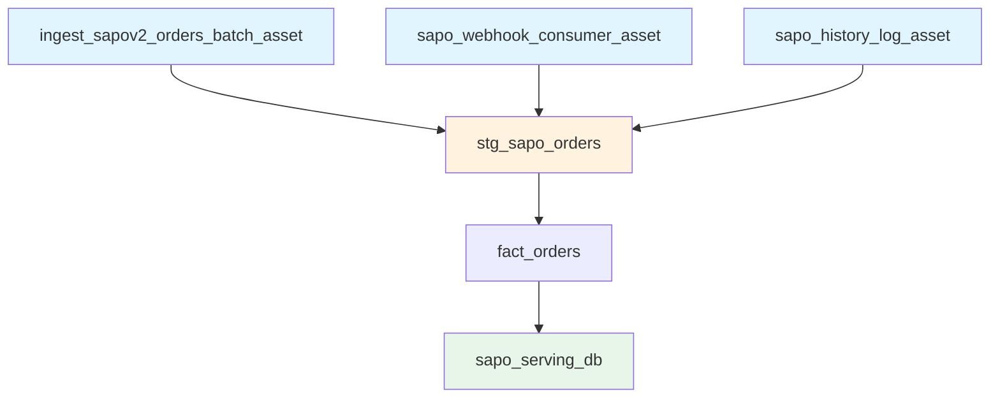

# Asset Documentation

> Dagster asset definitions and groups

## Asset Overview

Assets represent data artifacts in the pipeline. Each asset has:

- **Name**: Unique identifier
- **Group**: Logical grouping
- **Dependencies**: Upstream assets
- **Materialization**: How to produce the asset

## Asset Groups

### sapo_ingestion

Ingestion assets that extract data from Sapo or Google Sheets.

| Asset                         | Description                           | Schedule |
| ----------------------------- | ------------------------------------- | -------- |
| `ingest_sapov2_orders_batch_asset`     | Daily batch sync for Orders           | Nightly  |
| `sapo_customers_batch_asset`  | Daily batch sync for Customers        | Nightly  |
| `sapo_accounts_batch_asset`   | Daily batch sync for Accounts (Staff) | Nightly  |
| `sapo_history_log_asset`      | Incremental poll of History Logs      | 10 min   |
| `sapo_webhook_consumer_asset` | High-frequency webhook polling        | 1 min    |

### sheets_ingestion

Ingestion assets from Google Sheets.

| Asset                          | Description                   | Schedule       |
| ------------------------------ | ----------------------------- | -------------- |
| `sheets_targets_asset`         | Google Sheet: Sales Targets   | Manual/Nightly |
| `sheets_marketing_spend_asset` | Google Sheet: Marketing Spend | Manual/Nightly |

### dbt_assets

Transformation assets managed by dbt. All dbt models are auto-loaded.

| Asset                   | Description            | Key Dependencies (Strict)                   |
| ----------------------- | ---------------------- | ------------------------------------------- |
| `stg_sapo_orders`       | Deduplicated orders    | `history_log`, `webhook`, `orders_batch`    |
| `stg_sapo_customers`    | Deduplicated customers | `history_log`, `webhook`, `customers_batch` |
| `stg_sapo_accounts`     | Staff accounts         | `history_log`, `webhook`, `accounts_batch`  |
| `stg_sapo_fulfillments` | Fulfillment details    | `history_log`, `webhook`                    |
| `fact_orders`           | Order fact table       | `stg_sapo_orders`                           |

### serving_layer

Serving layer assets for BI.

| Asset             | Description                    | Dependencies  |
| ----------------- | ------------------------------ | ------------- |
| `sapo_serving_db` | Generates DuckDB OLAP database | All dbt Marts |

---

## Asset Definitions

### Ingestion Assets

#### ingest_sapov2_orders_batch_asset

Daily batch sync that captures `modified_on` updates for Orders.

- **Group**: `sapo_ingestion`
- **Schedule**: Nightly (04:00 AM)

#### sapo_webhook_consumer_asset

Polls Cloudflare D1 for real-time webhook events.

- **Group**: `sapo_ingestion`
- **Schedule**: Realtime (Every minute)

#### sapo_history_log_asset

Polls Sapo History Log API to fill gaps from missed webhooks.

- **Group**: `sapo_ingestion`
- **Schedule**: Incremental (Every 10 minutes)

#### sheets_targets_asset

Syncs Sales Targets from Google Sheets.

- **Group**: `sheets_ingestion`
- **Schedule**: Manual / Nightly

#### sheets_marketing_spend_asset

Syncs Marketing Spend data from Google Sheets.

- **Group**: `sheets_ingestion`
- **Schedule**: Manual / Nightly

---

### Transformation Assets (dbt)

Loaded dynamically from the dbt project.

- **Translations**:
  - `source('sapo_raw', 'order')` -> `ingest_sapov2_orders_batch_asset`
  - **Explicit Injection**: Staging models also depend on `history_log` and `webhook` to ensure data consistency.

---

### Serving Assets

#### sapo_serving_db

Orchestrates the creation of the user-facing DuckDB database (`olap.duckdb`).

- **Mechanism**: Runs `scripts/provisioning/generate_serving_db.py`
- **Trigger**: Runs after relevant dbt models complete.

---

## Asset Dependencies Graph



---

## Materializing Assets

### Via UI

1. Navigate to **Assets**.
2. Filter by group (e.g., `sapo_ingestion`).
3. Click **Materialize**.

### Via CLI

```bash
# Materialize specific asset
dagster asset materialize -a ingest_sapov2_orders_batch_asset
```
