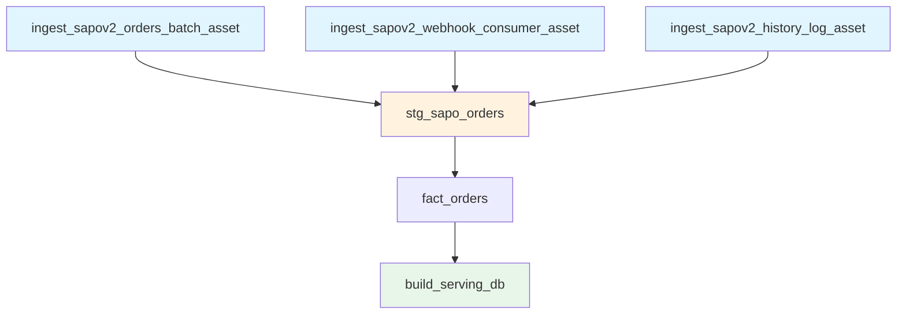

# Asset Documentation

> Dagster asset definitions and groups

## Asset Overview

Assets represent data artifacts in the pipeline. Each asset has:

- **Name**: Unique identifier
- **Group**: Logical grouping
- **Dependencies**: Upstream assets
- **Materialization**: How to produce the asset

## Asset Groups

### sapo_ingestion

Ingestion assets that extract data from Sapo or Google Sheets.

| Asset                         | Description                           | Schedule |
| ----------------------------- | ------------------------------------- | -------- |
| `ingest_sapov2_orders_batch_asset`     | Daily batch sync for Orders           | Nightly  |
| `ingest_sapov2_customers_batch_asset`  | Daily batch sync for Customers        | Nightly  |
| `ingest_sapov2_accounts_batch_asset`   | Daily batch sync for Accounts (Staff) | Nightly  |
| `ingest_sapov2_history_log_asset`      | Incremental poll of History Logs      | 10 min   |
| `ingest_sapov2_webhook_consumer_asset` | High-frequency webhook polling        | 1 min    |

### sheets_ingestion

Ingestion assets from Google Sheets.

| Asset                               | Description                                                | Schedule          |
| ----------------------------------- | ---------------------------------------------------------- | ----------------- |
| `sheets_targets_asset`              | Google Sheet: Sales Targets                                | Manual/Nightly    |
| `sheets_marketing_spend_asset`      | Google Sheet: Marketing Spend                              | Manual/Nightly    |
| `sheets_team_config_asset`          | Google Sheet: Team Configuration (teams + members)         | Manual/Nightly    |
| `sheets_us_shipment_prices_asset`   | Google Sheet: US Export Prices (SKU-level)                 | Daily             |
| `sheets_overhead_classification_asset` | Google Sheet: MISA Overhead Account Classification        | Daily             |
| `budget_sheet_sync_asset`           | Google Sheet: Budget Matrix (BUDGET_ITEMS + ALLOCATION_POLICY) → dbt seeds | Daily (02:30 ICT) |
| `budget_suggestion_writeback_asset` | Write-back of suggested budget values (Gợi Ý column)      | Monthly (08:00 ICT, day 1) |

### dbt_assets

Transformation assets managed by dbt. All dbt models are auto-loaded.

| Asset                   | Description            | Key Dependencies (Strict)                   |
| ----------------------- | ---------------------- | ------------------------------------------- |
| `stg_sapo_orders`       | Deduplicated orders    | `history_log`, `webhook`, `orders_batch`    |
| `stg_sapo_customers`    | Deduplicated customers | `history_log`, `webhook`, `customers_batch` |
| `stg_sapo_accounts`     | Staff accounts         | `history_log`, `webhook`, `accounts_batch`  |
| `stg_sapo_fulfillments` | Fulfillment details    | `history_log`, `webhook`                    |
| `fact_orders`           | Order fact table       | `stg_sapo_orders`                           |

### serving_layer

Serving layer assets for BI.

| Asset             | Description                    | Dependencies  |
| ----------------- | ------------------------------ | ------------- |
| `build_serving_db` | Generates DuckDB OLAP database | All dbt Marts |

---

## Asset Definitions

### Ingestion Assets

#### ingest_sapov2_orders_batch_asset

Daily batch sync that captures `modified_on` updates for Orders.

- **Group**: `sapo_ingestion`
- **Schedule**: Nightly (04:00 AM)

#### ingest_sapov2_webhook_consumer_asset

Polls Cloudflare D1 for real-time webhook events.

- **Group**: `sapo_ingestion`
- **Schedule**: Realtime (Every minute)

#### ingest_sapov2_history_log_asset

Polls Sapo History Log API to fill gaps from missed webhooks.

- **Group**: `sapo_ingestion`
- **Schedule**: Incremental (Every 10 minutes)

#### sheets_targets_asset

Syncs Sales Targets from Google Sheets.

- **Group**: `sheets_ingestion`
- **Schedule**: Manual / Nightly

#### sheets_marketing_spend_asset

Syncs Marketing Spend data from Google Sheets.

- **Group**: `sheets_ingestion`
- **Schedule**: Manual / Nightly

#### sheets_team_config_asset

Syncs Team Configuration from Google Sheets (2 tabs: teams definitions and team_members SCD2 membership).

- **Group**: `sheets_ingestion`
- **Schedule**: Manual / Nightly

#### sheets_us_shipment_prices_asset

Ingests SKU-level US export prices with effective_from date versioning. Used to enrich US CrossBorder orders whose Sapo net_revenue is 0.

- **Group**: `sheets_ingestion`
- **Schedule**: Daily

#### sheets_overhead_classification_asset

Syncs MISA overhead sub-account classification rules (treatment, pool_id, base_metric) that control allocation in the P&L. Overwrites a full snapshot parquet on each run — the sheet is the live master.

- **Group**: `sheets_ingestion`
- **Schedule**: Daily (nightly)

#### budget_sheet_sync_asset

Daily sync of the Budget Sheet (BUDGET_ITEMS + ALLOCATION_POLICY tabs). Unlike other sheets_* assets, writes directly to dbt seed CSVs (transformation/seeds/seed_cashflow_budget.csv, seed_cash_allocation_policy.csv) instead of the gsheet_raw data lake. Scheduled at 02:30 ICT, 30 minutes before the nightly dbt build so fresh seeds are in place. Validation is strict and fails loud: any bad sheet structure, missing recurring line ref, or ALLOCATION_POLICY gap/overlap aborts the entire sync.

- **Group**: `sheets_ingestion`
- **Schedule**: Daily (02:30 ICT)

#### budget_suggestion_writeback_asset

Monthly write-back of the 'Gợi Ý' (suggestion) column into BUDGET_ITEMS. Computes per-item suggestion for NEXT month only — Budget column is never touched. Suggestions: recurring = rolling 3-month avg actual, reserve = required_monthly_adj from reserve status (if has deadline), one_off = 0 (except item's own target_month).

**OPERATIONAL CAVEAT**: Requires `GOOGLE_SERVICE_ACCOUNT_BUDGET_WRITE_PATH` env var pointing at a Google service-account JSON key with EDITOR access on the budget sheet. This is a higher privilege than the read-only budget_sheet_sync_asset (public "Anyone with link" read access is not enough). No such credential exists in this repo yet. Asset fails loud with RuntimeError at RUNTIME only (not at code-load time), so missing credentials cannot break the asset graph. See gsheet_budget_sync.py module docstring for manual GCP setup steps.

- **Group**: `sheets_ingestion`
- **Schedule**: Monthly (1st of month, 08:00 ICT) — after ingest_monthly_job (07:00 ICT) lands fresh MISA actuals

---

### Transformation Assets (dbt)

Loaded dynamically from the dbt project.

- **Translations**:
  - `source('sapo_raw', 'order')` -> `ingest_sapov2_orders_batch_asset`
  - **Explicit Injection**: Staging models also depend on `history_log` and `webhook` to ensure data consistency.

---

### Serving Assets

#### build_serving_db

Orchestrates the creation of the user-facing DuckDB database (`olap.duckdb`).

- **Mechanism**: Runs `scripts/provisioning/generate_serving_db.py`
- **Trigger**: Runs after relevant dbt models complete.

---

## Asset Dependencies Graph



---

## Materializing Assets

### Via UI

1. Navigate to **Assets**.
2. Filter by group (e.g., `sapo_ingestion`).
3. Click **Materialize**.

### Via CLI

```bash
# Materialize specific asset
dagster asset materialize -a ingest_sapov2_orders_batch_asset
```
