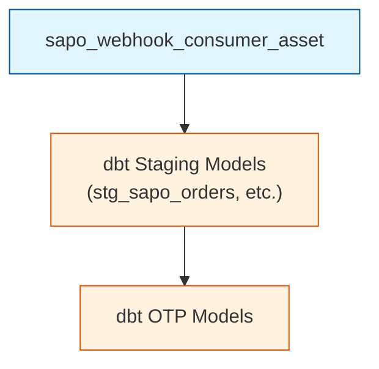
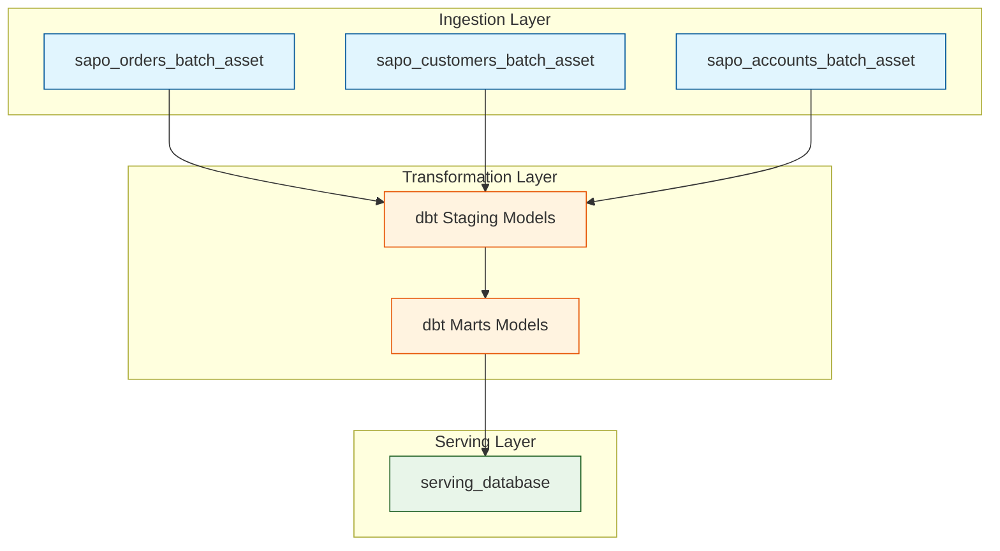

# Job Documentation

> Dagster job definitions and configurations

## Job Overview

Jobs are collections of assets that execute together. Each job has:

- **Name**: Unique identifier
- **Selection**: Which assets to include
- **Config**: Runtime configuration

## Active Jobs

| Job                               | Schedule        | Assets                        | Purpose                  |
| --------------------------------- | --------------- | ----------------------------- | ------------------------ |
| `ingest_sapo_realtime_job`       | _/1 _ \* \* \*  | Webhooks + dbt OTP            | Real-time updates        |
| `ingest_sapo_incremental_job`    | _/10 _ \* \* \* | History log + dbt OTP         | Gap filling              |
| `pipeline_batch_nightly_job`    | 0 4 \* \* \*    | All ingestion + dbt + serving | Full reconciliation      |
| `ingest_sheets_sync_job`         | Manual          | Targets + Marketing Spend     | Google Sheets (Raw Only) |

---

## Job Definitions

### ingest_sapo_realtime_job

**Purpose:** Process webhook events and update operational tables.

```python
ingest_sapo_realtime_job = define_asset_job(
    name="ingest_sapo_realtime_job",
    selection=[
        "sapo_webhook_consumer",
        *dbt_assets_tagged("otp")
    ],
    description="Process real-time webhook events"
)
```

**Schedule:** Every 1 minute

**Assets Included:**

- `sapo_webhook_consumer`
- `stg_sapo_orders`
- `stg_sapo_customers`

**Execution Flow:**



---

### ingest_sapo_incremental_job

**Purpose:** Gap filling via history log and incremental dbt updates.

```python
ingest_sapo_incremental_job = define_asset_job(
    name="ingest_sapo_incremental_job",
    selection=[
        "sapo_history_log",
        *dbt_assets_tagged("otp")
    ],
    description="Incremental sync via history log"
)
```

**Schedule:** Every 10 minutes

**Assets Included:**

- `sapo_history_log`
- `stg_sapo_*`

---

### pipeline_batch_nightly_job

**Purpose:** Full daily reconciliation and mart refresh.

```python
pipeline_batch_nightly_job = define_asset_job(
    name="pipeline_batch_nightly_job",
    selection=[
        "sapo_orders_batch",
        "sapo_customers_batch",
        "sapo_accounts_batch",
        *dbt_assets_tagged("olap"),
        "serving_database"
    ],
    description="Nightly full reconciliation"
)
```

**Schedule:** 04:00 AM daily (Asia/Ho_Chi_Minh)

**Assets Included:**

- All batch ingestion assets
- All dbt models (staging + marts)
- Serving database generation

**Execution Flow:**



---

### ingest_sheets_sync_job

**Purpose:** Manual sync of Targets and Marketing Spend from Google Sheets (Raw Ingestion Only).

```python
ingest_sheets_sync_job = define_asset_job(
    name="ingest_sheets_sync_job",
    selection=[
        "sheets_targets_asset",
        "sheets_marketing_spend_asset"
    ],
    description="Sync Google Sheets (Raw Only)"
)
```

**Schedule:** Manual trigger only

---

## Job Configuration

### Runtime Config

```python
@job(config={
    "ops": {
        "sapo_orders_batch": {
            "config": {
                "backfill_days": 7
            }
        }
    }
})
def custom_backfill_job(): ...
```

### Tags

```python
pipeline_batch_nightly_job = define_asset_job(
    name="pipeline_batch_nightly_job",
    selection=[...],
    tags={
        "team": "data-eng",
        "priority": "high",
        "dagster/max_retries": 2
    }
)
```

### Executor

```python
from dagster import multiprocess_executor

pipeline_batch_nightly_job = define_asset_job(
    name="pipeline_batch_nightly_job",
    selection=[...],
    executor_def=multiprocess_executor.configured({
        "max_concurrent": 4
    })
)
```

---

## Running Jobs

### Via UI

1. Navigate to Jobs
2. Select job
3. Click "Launch Run"
4. Optionally configure parameters
5. Click "Launch"

### Via CLI

```bash
# Run with defaults
dagster job execute -j pipeline_batch_nightly_job

# Run with config
dagster job execute -j pipeline_batch_nightly_job \
  --config-json '{"ops": {"sapo_orders_batch": {"config": {"backfill_days": 30}}}}'

# Run in background
dagster job launch -j pipeline_batch_nightly_job
```

### Via Code

```python
from dagster import execute_job

result = execute_job(
    pipeline_batch_nightly_job,
    run_config={...}
)
```

---

## Job Dependencies

Jobs can depend on other jobs completing:

```python
@sensor(job=pipeline_batch_nightly_job)
def after_ingestion_sensor(context):
    # Check if ingestion completed
    if ingestion_complete():
        yield RunRequest()
```

---

## Monitoring Jobs

### Run Status

```bash
# List recent runs
dagster run list

# View specific run
dagster run view <run_id>

# Failed runs only
dagster run list --status FAILURE
```

### UI Monitoring

- **Runs page**: See all executions
- **Timeline**: Gantt chart of steps
- **Logs**: Detailed execution logs

---

## Related

- [Assets](./ASSETS.md)
- [Schedules](./SCHEDULES.md)
- [Resources](./RESOURCES.md)
