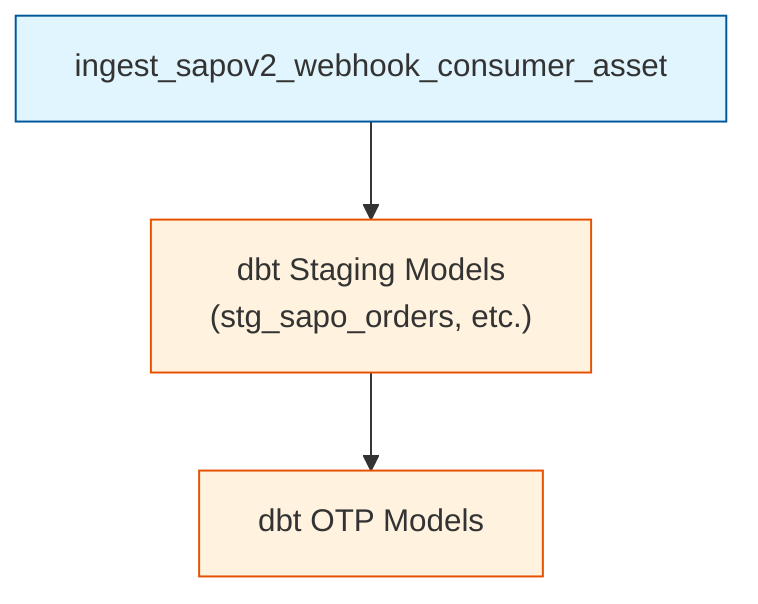
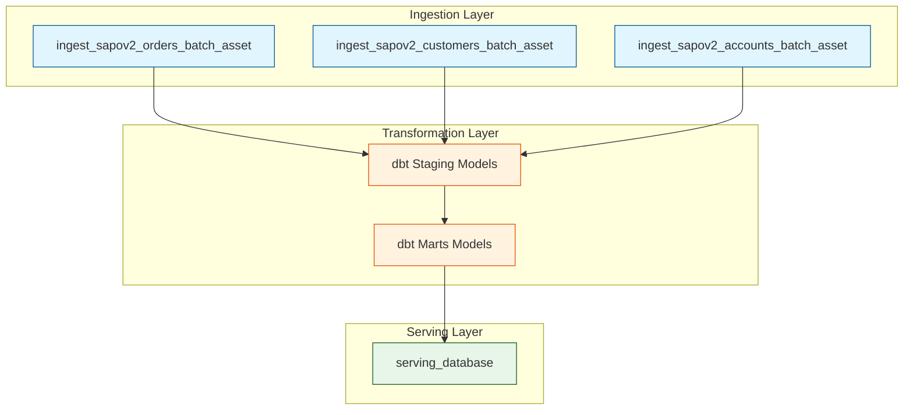

# Job Documentation

> Dagster job definitions and configurations

## Job Overview

Jobs are collections of assets that execute together. Each job has:

- **Name**: Unique identifier
- **Selection**: Which assets to include
- **Config**: Runtime configuration

## Active Jobs

| Job                                    | Schedule              | Assets                                    | Purpose                                    |
| -------------------------------------- | -------------------- | ----------------------------------------- | ------------------------------------------ |
| `pipeline_sapov2_realtime_job`         | */3 * * * *          | Webhooks + dbt OTP                        | Real-time updates                          |
| `pipeline_sapov2_incremental_job`      | */10 0-2,4-23 * * *  | History log + dbt OTP                     | Gap filling                                |
| `pipeline_batch_nightly_job`           | 0 3 * * *            | All ingestion + dbt + serving             | Full reconciliation                        |
| `ingest_sheets_sync_job`               | Manual               | Targets + Marketing Spend + Team Config + US Prices + Overhead Class | Google Sheets (Raw Only) |
| `budget_sheet_sync_job`                | 30 2 * * *           | budget_sheet_sync_asset                   | Budget Matrix → dbt seeds                  |
| `budget_suggestion_writeback_job`      | 0 8 1 * *            | budget_suggestion_writeback_asset         | Write-back budget suggestions              |

---

## Job Definitions

### pipeline_sapov2_realtime_job

**Purpose:** Process webhook events and update operational tables.

```python
pipeline_sapov2_realtime_job = define_asset_job(
    name="pipeline_sapov2_realtime_job",
    selection=[
        "sapo_webhook_consumer",
        *dbt_assets_tagged("otp")
    ],
    description="Process real-time webhook events"
)
```

**Schedule:** Every 1 minute

**Assets Included:**

- `sapo_webhook_consumer`
- `stg_sapo_orders`
- `stg_sapo_customers`

**Execution Flow:**



---

### pipeline_sapov2_incremental_job

**Purpose:** Gap filling via history log and incremental dbt updates.

```python
pipeline_sapov2_incremental_job = define_asset_job(
    name="pipeline_sapov2_incremental_job",
    selection=[
        "sapo_history_log",
        *dbt_assets_tagged("otp")
    ],
    description="Incremental sync via history log"
)
```

**Schedule:** Every 10 minutes

**Assets Included:**

- `sapo_history_log`
- `stg_sapo_*`

---

### pipeline_batch_nightly_job

**Purpose:** Full daily reconciliation and mart refresh.

```python
pipeline_batch_nightly_job = define_asset_job(
    name="pipeline_batch_nightly_job",
    selection=[
        "sapo_orders_batch",
        "sapo_customers_batch",
        "sapo_accounts_batch",
        *dbt_assets_tagged("olap"),
        "serving_database"
    ],
    description="Nightly full reconciliation"
)
```

**Schedule:** 04:00 AM daily (Asia/Ho_Chi_Minh)

**Assets Included:**

- All batch ingestion assets
- All dbt models (staging + marts)
- Serving database generation

**Execution Flow:**



---

### ingest_sheets_sync_job

**Purpose:** Sync of Targets, Marketing Spend, Team Config, US Shipment Prices, and Overhead Classification from Google Sheets. Includes downstream dbt models that depend on these sources, plus serving_db and rill refresh.

```python
ingest_sheets_sync_job = define_asset_job(
    name="ingest_sheets_sync_job",
    selection=(
        AssetSelection.assets(sheets_targets_asset)
        | AssetSelection.assets(sheets_marketing_spend_asset)
        | AssetSelection.assets(sheets_team_config_asset)
        | AssetSelection.assets(sheets_us_shipment_prices_asset)
        | AssetSelection.assets(sheets_overhead_classification_asset)
    ).downstream()
    | AssetSelection.assets(serving.build_serving_db)
    | AssetSelection.assets(rill.build_rill_publish)
)
```

**Schedule:** Manual trigger only (or sensor-triggered on sheet edit)

---

### budget_sheet_sync_job

**Purpose:** Daily sync of the Budget Sheet (BUDGET_ITEMS + ALLOCATION_POLICY tabs) into dbt seed CSVs. Scheduled 30 minutes before nightly dbt build so seeds are fresh at build time. Writes directly to transformation/seeds/ (not the gsheet_raw data lake). Validation is strict: fails loud on any sheet structure issues, missing recurring refs, or ALLOCATION_POLICY gaps/overlaps.

```python
budget_sheet_sync_job = define_asset_job(
    name="budget_sheet_sync_job",
    selection=AssetSelection.assets(
        sheets_assets.budget_sheet_sync_asset,
    ),
)
```

**Schedule:** Daily at 02:30 ICT (30 min before nightly dbt build at 03:00 ICT)

---

### budget_suggestion_writeback_job

**Purpose:** Monthly write-back of suggested budget values into the 'Gợi Ý' column of the BUDGET_ITEMS tab. Computes suggestions for next month: recurring items get rolling 3-month average, reserve items get required_monthly_adj, one-off items get 0 (except during their target month). The Budget column is never touched — enforced by assertions.

**OPERATIONAL CAVEAT:** Requires `GOOGLE_SERVICE_ACCOUNT_BUDGET_WRITE_PATH` env var (Google service-account JSON key with EDITOR access on the sheet). This is higher privilege than the read-only budget_sheet_sync_asset. No such credential exists in this repo yet. Asset fails loud at RUNTIME only if missing (not at code-load). See gsheet_budget_sync.py module docstring for manual GCP setup steps.

```python
budget_suggestion_writeback_job = define_asset_job(
    name="budget_suggestion_writeback_job",
    selection=AssetSelection.assets(
        sheets_assets.budget_suggestion_writeback_asset,
    ),
)
```

**Schedule:** Monthly on the 1st of month at 08:00 ICT (after ingest_monthly_job at 07:00 lands fresh MISA actuals)

---

## Job Configuration

### Runtime Config

```python
@job(config={
    "ops": {
        "sapo_orders_batch": {
            "config": {
                "backfill_days": 7
            }
        }
    }
})
def custom_backfill_job(): ...
```

### Tags

```python
pipeline_batch_nightly_job = define_asset_job(
    name="pipeline_batch_nightly_job",
    selection=[...],
    tags={
        "team": "data-eng",
        "priority": "high",
        "dagster/max_retries": 2
    }
)
```

### Executor

```python
from dagster import multiprocess_executor

pipeline_batch_nightly_job = define_asset_job(
    name="pipeline_batch_nightly_job",
    selection=[...],
    executor_def=multiprocess_executor.configured({
        "max_concurrent": 4
    })
)
```

---

## Running Jobs

### Via UI

1. Navigate to Jobs
2. Select job
3. Click "Launch Run"
4. Optionally configure parameters
5. Click "Launch"

### Via CLI

```bash
# Run with defaults
dagster job execute -j pipeline_batch_nightly_job

# Run with config
dagster job execute -j pipeline_batch_nightly_job \
  --config-json '{"ops": {"sapo_orders_batch": {"config": {"backfill_days": 30}}}}'

# Run in background
dagster job launch -j pipeline_batch_nightly_job
```

### Via Code

```python
from dagster import execute_job

result = execute_job(
    pipeline_batch_nightly_job,
    run_config={...}
)
```

---

## Job Dependencies

Jobs can depend on other jobs completing:

```python
@sensor(job=pipeline_batch_nightly_job)
def after_ingestion_sensor(context):
    # Check if ingestion completed
    if ingestion_complete():
        yield RunRequest()
```

---

## Monitoring Jobs

### Run Status

```bash
# List recent runs
dagster run list

# View specific run
dagster run view <run_id>

# Failed runs only
dagster run list --status FAILURE
```

### UI Monitoring

- **Runs page**: See all executions
- **Timeline**: Gantt chart of steps
- **Logs**: Detailed execution logs

---

## Related

- [Assets](./ASSETS.md)
- [Schedules](./SCHEDULES.md)
- [Resources](./RESOURCES.md)
