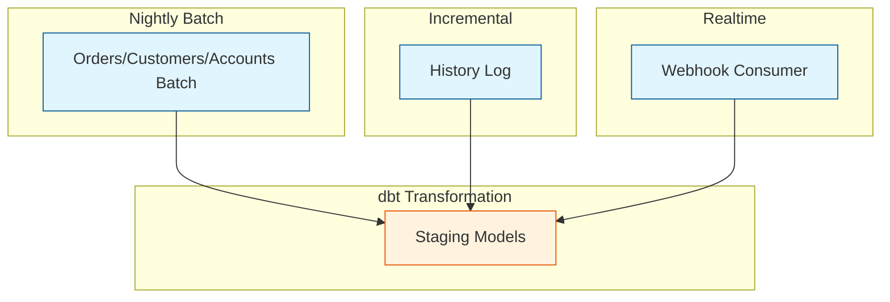

# Schedule Documentation

> Dagster schedule definitions and timezone configuration

## Schedule Overview

| Schedule                         | Cron           | Timezone         | Job                          |
| -------------------------------- | -------------- | ---------------- | ---------------------------- |
| `pipeline_sapov2_realtime_schedule`  | `*/1 * * * *`  | Asia/Ho_Chi_Minh | pipeline_sapov2_realtime_job     |
| `pipeline_sapov2_incremental_schedule` | `*/10 * * * *` | Asia/Ho_Chi_Minh | pipeline_sapov2_incremental_job  |
| `pipeline_batch_nightly_schedule` | `0 4 * * *`    | Asia/Ho_Chi_Minh | pipeline_batch_nightly_job  |

---

## Schedule Definitions

### pipeline_sapov2_realtime_schedule

**Purpose:** Process webhook events every minute.

```python
from dagster import ScheduleDefinition

pipeline_sapov2_realtime_schedule = ScheduleDefinition(
    job=pipeline_sapov2_realtime_job,
    cron_schedule="*/1 * * * *",
    execution_timezone="Asia/Ho_Chi_Minh",
    default_status=DefaultScheduleStatus.RUNNING
)
```

**Timing:** Every minute, 24/7

**Expected Duration:** < 30 seconds

---

### pipeline_sapov2_incremental_schedule

**Purpose:** Gap filling via history log every 10 minutes.

```python
pipeline_sapov2_incremental_schedule = ScheduleDefinition(
    job=pipeline_sapov2_incremental_job,
    cron_schedule="*/10 * * * *",
    execution_timezone="Asia/Ho_Chi_Minh",
    default_status=DefaultScheduleStatus.RUNNING
)
```

**Timing:** Every 10 minutes (00, 10, 20, 30, 40, 50)

**Expected Duration:** < 5 minutes

---

### pipeline_batch_nightly_schedule

**Purpose:** Full reconciliation and mart refresh.

```python
pipeline_batch_nightly_schedule = ScheduleDefinition(
    job=pipeline_batch_nightly_job,
    cron_schedule="0 4 * * *",
    execution_timezone="Asia/Ho_Chi_Minh",
    default_status=DefaultScheduleStatus.RUNNING
)
```

**Timing:** 04:00 AM daily (Vietnam time)

**Expected Duration:** 10-30 minutes

**Why 04:00 AM:**

- After business hours (store closes ~22:00)
- Before morning reporting (starts ~07:00)
- Low system load period

---

## Cron Syntax Reference

```
┌───────────── minute (0 - 59)
│ ┌───────────── hour (0 - 23)
│ │ ┌───────────── day of month (1 - 31)
│ │ │ ┌───────────── month (1 - 12)
│ │ │ │ ┌───────────── day of week (0 - 6) (Sunday = 0)
│ │ │ │ │
* * * * *
```

**Common Patterns:**

| Pattern        | Description               |
| -------------- | ------------------------- |
| `*/1 * * * *`  | Every minute              |
| `*/10 * * * *` | Every 10 minutes          |
| `0 * * * *`    | Every hour                |
| `0 4 * * *`    | Daily at 04:00            |
| `0 4 * * 0`    | Weekly on Sunday at 04:00 |
| `0 4 1 * *`    | Monthly on 1st at 04:00   |

---

## Timezone Configuration

### Why Vietnam Timezone?

- Business operates in Vietnam
- Reports needed by Vietnam morning
- Aligns with Sapo API behavior

### Setting Timezone

```python
ScheduleDefinition(
    job=my_job,
    cron_schedule="0 4 * * *",
    execution_timezone="Asia/Ho_Chi_Minh"  # UTC+7
)
```

### Timezone Considerations

| UTC Time | Vietnam Time   | Event         |
| -------- | -------------- | ------------- |
| 21:00    | 04:00 (+1 day) | Nightly job   |
| 00:00    | 07:00          | Morning       |
| 15:00    | 22:00          | Store closing |

---

## Managing Schedules

### Start/Stop

```bash
# Start schedule
dagster schedule start pipeline_batch_nightly_schedule

# Stop schedule
dagster schedule stop pipeline_batch_nightly_schedule

# List all schedules
dagster schedule list

# Wipe schedule state (careful!)
dagster schedule wipe
```

### Check Status

```bash
# View schedule status
dagster schedule list

# Output:
# Schedule Name                       State     Cron Schedule
# pipeline_sapov2_realtime_schedule       RUNNING   */1 * * * *
# pipeline_sapov2_incremental_schedule    RUNNING   */10 * * * *
# pipeline_batch_nightly_schedule    RUNNING   0 4 * * *
```

### Force Run

```bash
# Trigger schedule immediately
dagster schedule tick pipeline_batch_nightly_schedule
```

---

## Project Schedule Architecture

Our schedules are designed to work together without resource contention, using a combination of **Time Offsets** and **Asset Dependencies**.

### 1. The "Start-Time" Race Condition Fix

To prevent the _Realtime_ (every minute) and _Incremental_ (every 10 minutes) jobs from starting at the exact same second and fighting for resources:

- **Realtime Job**: Runs at minutes `1-9`, `11-19`, etc. (Skips minute `0`, `10`, `20`...).
- **Incremental Job**: Runs at minutes `0`, `10`, `20`, etc.

This physical separation ensures that at the top of the 10-minute mark, _only_ the Incremental job starts.

### 2. Universal Asset Dependencies

Regardless of which schedule triggers the run, `dbt` models enforce strict dependencies to ensure data consistency. Staging models will **wait** for the relevant ingestion assets to complete before starting, even if those assets are part of the same job.



---

## Schedule Dependencies

### Sensor-Based Triggering

Instead of fixed schedules, trigger based on events:

```python
from dagster import sensor, RunRequest

@sensor(job=pipeline_sapov2_incremental_job, minimum_interval_seconds=60)
def new_data_sensor(context):
    if check_for_new_webhooks():
        yield RunRequest(run_key=f"webhook_{timestamp}")
```

### Chained Schedules

Run job B after job A completes:

```python
@sensor(job=job_b)
def after_job_a_sensor(context):
    runs = context.instance.get_runs(
        filters=RunsFilter(job_name="job_a", statuses=[DagsterRunStatus.SUCCESS])
    )
    if new_successful_runs(runs):
        yield RunRequest()
```

---

## Monitoring Schedules

### Dagster UI

1. Navigate to **Schedules** page
2. View:
   - Next tick time
   - Recent runs
   - Tick history

### Tick History

Each schedule "tick" creates a run (or skips):

```python
@schedule(cron_schedule="0 4 * * *", job=my_job)
def my_schedule(context):
    if should_skip_today():
        return SkipReason("Holiday - skipping")
    return RunRequest()
```

---

## Troubleshooting

### Schedule Not Running

1. Check daemon is running:

   ```bash
   dagster-daemon status
   ```

2. Check schedule is started:

   ```bash
   dagster schedule list
   ```

3. Check logs:
   ```bash
   tail -f .dagster_home/logs/dagster-daemon.log
   ```

### Missed Runs

If server was down, missed runs are NOT automatically backfilled. To catch up:

```bash
# Manual run
dagster job execute -j pipeline_batch_nightly_job

# Or use sensors for catch-up logic
```

### Overlapping Runs

If previous run is still running:

```python
@schedule(cron_schedule="*/10 * * * *", job=my_job)
def my_schedule(context):
    # Check for running instances
    running = context.instance.get_runs(
        filters=RunsFilter(
            job_name="my_job",
            statuses=[DagsterRunStatus.STARTED]
        )
    )
    if running:
        return SkipReason("Previous run still in progress")
    return RunRequest()
```

---

## Related

- [Assets](./ASSETS.md)
- [Jobs](./JOBS.md)
- [Resources](./RESOURCES.md)
