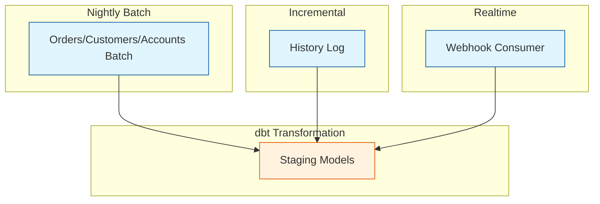

# Schedule Documentation

> Dagster schedule definitions and timezone configuration

## Schedule Overview

| Schedule                               | Cron                  | Timezone         | Job                                 |
| -------------------------------- | -------------------- | ---------------- | -------------------------------------- |
| `pipeline_sapo_v2_realtime_schedule`   | `*/3 * * * *`        | Asia/Ho_Chi_Minh | pipeline_sapo_v2_realtime_job      |
| `pipeline_sapo_v2_incremental_schedule` | `*/10 0-2,4-23 * * *` | Asia/Ho_Chi_Minh | pipeline_sapo_v2_incremental_job   |
| `pipeline_sapo_v2_hourly_schedule`     | `25 0-2,4-23 * * *`  | Asia/Ho_Chi_Minh | pipeline_sapo_v2_hourly_job        |
| `pipeline_batch_nightly_schedule`      | `0 3 * * *`          | Asia/Ho_Chi_Minh | pipeline_batch_nightly_job         |
| `ingest_weekly_schedule`               | `0 7 * * 1`          | Asia/Ho_Chi_Minh | ingest_weekly_job                  |
| `ingest_monthly_schedule`              | `0 7 1 * *`          | Asia/Ho_Chi_Minh | ingest_monthly_job                 |
| `ingest_monthly_repull_schedule`       | `0 7 10 * *`         | Asia/Ho_Chi_Minh | ingest_monthly_job (re-pull)       |
| `budget_sheet_sync_schedule`           | `30 2 * * *`         | Asia/Ho_Chi_Minh | budget_sheet_sync_job              |
| `budget_suggestion_writeback_schedule` | `0 8 1 * *`          | Asia/Ho_Chi_Minh | budget_suggestion_writeback_job    |
| `maintain_purge_runs_schedule`         | `0 1 * * *`          | Asia/Ho_Chi_Minh | maintain_purge_runs_job            |
| `maintain_backup_fallback_schedule`    | `0 6 * * *`          | Asia/Ho_Chi_Minh | maintain_backup_platform_job       |

---

## Schedule Definitions

### pipeline_sapo_v2_realtime_schedule

**Purpose:** Process webhook events every 3 minutes.

```python
from dagster import schedule

@schedule(job=pipeline_sapo_v2_realtime_job, cron_schedule="*/3 * * * *",
          execution_timezone="Asia/Ho_Chi_Minh")
def pipeline_sapo_v2_realtime_schedule(context):
    ...
```

**Timing:** Every 3 minutes, 24/7

**Note:** Changed from `*/1` to `*/3` to allow dbt OTP to complete within one schedule cycle.

**Expected Duration:** < 30 seconds

---

### pipeline_sapov2_incremental_schedule

**Purpose:** Gap filling via history log every 10 minutes.

```python
pipeline_sapov2_incremental_schedule = ScheduleDefinition(
    job=pipeline_sapov2_incremental_job,
    cron_schedule="*/10 * * * *",
    execution_timezone="Asia/Ho_Chi_Minh",
    default_status=DefaultScheduleStatus.RUNNING
)
```

**Timing:** Every 10 minutes (00, 10, 20, 30, 40, 50)

**Expected Duration:** < 5 minutes

---

### pipeline_batch_nightly_schedule

**Purpose:** Full reconciliation and mart refresh.

```python
@schedule(job=pipeline_batch_nightly_job, cron_schedule="0 3 * * *",
          execution_timezone="Asia/Ho_Chi_Minh")
def pipeline_batch_nightly_schedule(context):
    ...
```

**Timing:** 03:00 AM daily (Vietnam time)

**Expected Duration:** 30-60 minutes

**Why 03:00 AM:**

- After business hours (store closes ~22:00)
- Before morning reporting (starts ~07:00)
- Low system load period

---

### ingest_weekly_schedule

**Purpose:** Weekly ingestion of MISA sales ledger.

```python
@schedule(job=ingest_weekly_job, cron_schedule="0 7 * * 1",
          execution_timezone="Asia/Ho_Chi_Minh")
def ingest_weekly_schedule(context):
    ...
```

**Timing:** Every Monday at 07:00 AM (Vietnam time)

**Assets:** MISA sales ledger download (browser automation)

---

### ingest_monthly_schedule

**Purpose:** Monthly ingestion of MISA account ledger (first-of-month pull).

```python
@schedule(job=ingest_monthly_job, cron_schedule="0 7 1 * *",
          execution_timezone="Asia/Ho_Chi_Minh")
def ingest_monthly_schedule(context):
    ...
```

**Timing:** 1st of month at 07:00 AM (Vietnam time)

**Assets:** MISA account ledger download (browser automation)

**Note:** This is the initial pull. MISA's books typically don't finalize until day 5-10 of the following month, so a re-pull schedule (below) catches late bookkeeping entries.

---

### ingest_monthly_repull_schedule

**Purpose:** Re-pull MISA account ledger after books close (day 10 of month).

```python
@schedule(job=ingest_monthly_job, cron_schedule="0 7 10 * *",
          execution_timezone="Asia/Ho_Chi_Minh")
def ingest_monthly_repull_schedule(context):
    ...
```

**Timing:** 10th of month at 07:00 AM (Vietnam time)

**Assets:** MISA account ledger download (re-pull)

**Note:** Reuses the existing `ingest_monthly_job`. The downloader defaults to "last month" and the ingest mechanism fully replaces (UPSERT by year/month) the target month's partition on each run, so re-running on day 10 is safe/idempotent — no double-counting, just fresher data once books are finalized.

---

### budget_sheet_sync_schedule

**Purpose:** Daily sync of the Budget Sheet into dbt seed CSVs.

```python
@schedule(job=budget_sheet_sync_job, cron_schedule="30 2 * * *",
          execution_timezone="Asia/Ho_Chi_Minh")
def budget_sheet_sync_schedule(context):
    ...
```

**Timing:** Daily at 02:30 AM (Vietnam time)

**Assets:** `budget_sheet_sync_asset`

**Why 02:30 AM:** 30 minutes before the nightly dbt build (03:00 ICT) so fresh budget seeds (BUDGET_ITEMS + ALLOCATION_POLICY) are in place before `dbt build` runs.

**Note:** Unlike other sheets_* assets, this writes directly to dbt seed CSVs (transformation/seeds/seed_cashflow_budget.csv, seed_cash_allocation_policy.csv) instead of the gsheet_raw data lake. Validation is strict: the entire sync aborts (no seed files touched) if any sheet structure issues, missing recurring line refs, or ALLOCATION_POLICY gaps/overlaps are detected.

---

### budget_suggestion_writeback_schedule

**Purpose:** Monthly write-back of suggested budget values into the BUDGET_ITEMS sheet.

```python
@schedule(job=budget_suggestion_writeback_job, cron_schedule="0 8 1 * *",
          execution_timezone="Asia/Ho_Chi_Minh")
def budget_suggestion_writeback_schedule(context):
    ...
```

**Timing:** 1st of month at 08:00 AM (Vietnam time)

**Assets:** `budget_suggestion_writeback_asset`

**Why 08:00 on the 1st:** Runs after `ingest_monthly_job` (07:00 ICT on the 1st), so the suggestions (rolling 3-month avg for recurring items, required_monthly_adj for reserves) reflect the latest month's real MISA account-ledger actuals.

**OPERATIONAL CAVEAT:** Requires `GOOGLE_SERVICE_ACCOUNT_BUDGET_WRITE_PATH` env var pointing at a Google service-account JSON key with EDITOR access on the budget sheet. This is higher privilege than the read-only `budget_sheet_sync_asset` (public "Anyone with link" is insufficient). No such credential exists in this repo yet. The asset fails loud with RuntimeError at RUNTIME only (not at code-load time), so missing credentials cannot break the asset graph. See gsheet_budget_sync.py module docstring for the exact manual GCP setup steps.

---

## Cron Syntax Reference

```
┌───────────── minute (0 - 59)
│ ┌───────────── hour (0 - 23)
│ │ ┌───────────── day of month (1 - 31)
│ │ │ ┌───────────── month (1 - 12)
│ │ │ │ ┌───────────── day of week (0 - 6) (Sunday = 0)
│ │ │ │ │
* * * * *
```

**Common Patterns:**

| Pattern        | Description               |
| -------------- | ------------------------- |
| `*/1 * * * *`  | Every minute              |
| `*/10 * * * *` | Every 10 minutes          |
| `0 * * * *`    | Every hour                |
| `0 4 * * *`    | Daily at 04:00            |
| `0 4 * * 0`    | Weekly on Sunday at 04:00 |
| `0 4 1 * *`    | Monthly on 1st at 04:00   |

---

## Timezone Configuration

### Why Vietnam Timezone?

- Business operates in Vietnam
- Reports needed by Vietnam morning
- Aligns with Sapo API behavior

### Setting Timezone

```python
ScheduleDefinition(
    job=my_job,
    cron_schedule="0 4 * * *",
    execution_timezone="Asia/Ho_Chi_Minh"  # UTC+7
)
```

### Timezone Considerations

| UTC Time | Vietnam Time   | Event         |
| -------- | -------------- | ------------- |
| 21:00    | 04:00 (+1 day) | Nightly job   |
| 00:00    | 07:00          | Morning       |
| 15:00    | 22:00          | Store closing |

---

## Managing Schedules

### Start/Stop

```bash
# Start schedule
dagster schedule start pipeline_batch_nightly_schedule

# Stop schedule
dagster schedule stop pipeline_batch_nightly_schedule

# List all schedules
dagster schedule list

# Wipe schedule state (careful!)
dagster schedule wipe
```

### Check Status

```bash
# View schedule status
dagster schedule list

# Output:
# Schedule Name                       State     Cron Schedule
# pipeline_sapov2_realtime_schedule       RUNNING   */1 * * * *
# pipeline_sapov2_incremental_schedule    RUNNING   */10 * * * *
# pipeline_batch_nightly_schedule    RUNNING   0 4 * * *
```

### Force Run

```bash
# Trigger schedule immediately
dagster schedule tick pipeline_batch_nightly_schedule
```

---

## Project Schedule Architecture

Our schedules are designed to work together without resource contention, using a combination of **Time Offsets** and **Asset Dependencies**.

### 1. The "Start-Time" Race Condition Fix

To prevent the _Realtime_ (every minute) and _Incremental_ (every 10 minutes) jobs from starting at the exact same second and fighting for resources:

- **Realtime Job**: Runs at minutes `1-9`, `11-19`, etc. (Skips minute `0`, `10`, `20`...).
- **Incremental Job**: Runs at minutes `0`, `10`, `20`, etc.

This physical separation ensures that at the top of the 10-minute mark, _only_ the Incremental job starts.

### 2. Universal Asset Dependencies

Regardless of which schedule triggers the run, `dbt` models enforce strict dependencies to ensure data consistency. Staging models will **wait** for the relevant ingestion assets to complete before starting, even if those assets are part of the same job.



---

## Schedule Dependencies

### Sensor-Based Triggering

Instead of fixed schedules, trigger based on events:

```python
from dagster import sensor, RunRequest

@sensor(job=pipeline_sapov2_incremental_job, minimum_interval_seconds=60)
def new_data_sensor(context):
    if check_for_new_webhooks():
        yield RunRequest(run_key=f"webhook_{timestamp}")
```

### Chained Schedules

Run job B after job A completes:

```python
@sensor(job=job_b)
def after_job_a_sensor(context):
    runs = context.instance.get_runs(
        filters=RunsFilter(job_name="job_a", statuses=[DagsterRunStatus.SUCCESS])
    )
    if new_successful_runs(runs):
        yield RunRequest()
```

---

## Monitoring Schedules

### Dagster UI

1. Navigate to **Schedules** page
2. View:
   - Next tick time
   - Recent runs
   - Tick history

### Tick History

Each schedule "tick" creates a run (or skips):

```python
@schedule(cron_schedule="0 4 * * *", job=my_job)
def my_schedule(context):
    if should_skip_today():
        return SkipReason("Holiday - skipping")
    return RunRequest()
```

---

## Troubleshooting

### Schedule Not Running

1. Check daemon is running:

   ```bash
   dagster-daemon status
   ```

2. Check schedule is started:

   ```bash
   dagster schedule list
   ```

3. Check logs:
   ```bash
   tail -f .dagster_home/logs/dagster-daemon.log
   ```

### Missed Runs

If server was down, missed runs are NOT automatically backfilled. To catch up:

```bash
# Manual run
dagster job execute -j pipeline_batch_nightly_job

# Or use sensors for catch-up logic
```

### Overlapping Runs

If previous run is still running:

```python
@schedule(cron_schedule="*/10 * * * *", job=my_job)
def my_schedule(context):
    # Check for running instances
    running = context.instance.get_runs(
        filters=RunsFilter(
            job_name="my_job",
            statuses=[DagsterRunStatus.STARTED]
        )
    )
    if running:
        return SkipReason("Previous run still in progress")
    return RunRequest()
```

---

## Related

- [Assets](./ASSETS.md)
- [Jobs](./JOBS.md)
- [Resources](./RESOURCES.md)
