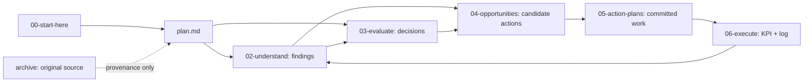

# Start Here — Retail Reactivation

> Đây là cửa vào ngắn nhất để hiểu bộ tài liệu. Nếu cần chi tiết luồng 6 stage, đọc tiếp [`plan.md`](./plan.md). Nếu cần provenance lịch sử, xem [`archive/`](./archive/2026-06-04-original-sales-slowdown-playbook.md) sau cùng.

## TL;DR

**Câu hỏi gốc:** bán ế thì khai thác data nào để gợi ý hành động cho Marketing / CSKH / Sales?

**Kết luận hiện tại:** "ế" không phải một vấn đề đơn. B2B không sụp thật; tín hiệu sụp phần lớn là artifact đo completed-only + COD lag. Vấn đề thật đang tách thành 3 nhánh:

| Nhánh | Kết luận hiện tại | Đọc ở đâu |
|---|---|---|
| B2B / doanh thu lõi | B2B 2026 vẫn có cầu; số "sụp" cũ là artifact đo lường | [`02-understand/b2b-collapse-root-cause.md`](./02-understand/b2b-collapse-root-cause.md) |
| Cashflow / công nợ | Có tín hiệu AR/COD lớn nhưng bị chặn bởi `fact_payments` rỗng; cần hỏi chủ/kế toán | [`02-understand/cashflow-collection-ar.md`](./02-understand/cashflow-collection-ar.md) |
| B2C retention | Đây là bệnh mạn tính thật: 71.8% khách lẻ mua một lần, M1 repeat thấp | [`02-understand/retention-leak.md`](./02-understand/retention-leak.md) |

**Focus đã chốt:** ưu tiên bán lẻ/B2C. Đòn bẩy số 1 là VOC khách lẻ vì data nói "cái gì", không nói "tại sao".

## Đọc Theo Nhu Cầu

| Nếu bạn muốn... | Đọc file này trước |
|---|---|
| Hiểu bức tranh tổng và path 6 stage | [`plan.md`](./plan.md) |
| Biết hiện tại đang tin điều gì | [`02-understand/README.md`](./02-understand/README.md) |
| Biết quyết định nào đã chốt / còn mở | [`03-evaluate/decision-log.md`](./03-evaluate/decision-log.md) và [`03-evaluate/open-decisions.md`](./03-evaluate/open-decisions.md) |
| Chọn việc nên làm tiếp | [`04-opportunities/README.md`](./04-opportunities/README.md) rồi [`03-evaluate/evaluation-framework.md`](./03-evaluate/evaluation-framework.md) |
| Chạy kế hoạch đã cam kết | [`05-action-plans/README.md`](./05-action-plans/README.md) |
| Đo kết quả và học ngược lại | [`06-execute/kpi.md`](./06-execute/kpi.md) và [`06-execute/execution-log.md`](./06-execute/execution-log.md) |
| Xem nguồn lịch sử ban đầu | [`archive/2026-06-04-original-sales-slowdown-playbook.md`](./archive/2026-06-04-original-sales-slowdown-playbook.md) |

## Bản Đồ Quan Hệ

## Trạng Thái Cần Nhớ

| Việc | Trạng thái |
|---|---|
| Focus B2C/retail | Đã chốt |
| B2B collapse | Resolved: không sụp thật theo dữ liệu đặt đơn |
| Cashflow/AR | Open/blocked: cần xác nhận chủ/kế toán + fix payment data |
| VOC khách lẻ | Open, ưu tiên cao nhất |
| Product-performance pipeline lớn | Không cần ngay; data đủ cho insight bán hàng, chỉ giữ Tier 1 fixes |
| Archive playbook | Chỉ dùng provenance, không phải source of truth hiện hành |

## Quy Ước Đọc

- Đừng đọc `archive/` trước; nó là bản nguồn lịch sử và có nhiều phần đã được hiệu chỉnh.
- Khi một file `02-understand` đã `resolved`, dùng kết luận mới nhất trong file đó thay vì số cũ trong archive.
- Opportunity ở `04` chưa phải cam kết. Chỉ `05-action-plans` mới là kế hoạch đã chọn để chạy.
- Kết quả thực thi ở `06` phải quay ngược thành finding mới trong `02`.
