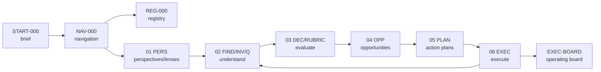

# START-000 — Start Here: Retail Reactivation

Đây là cửa vào ngắn nhất. Đọc file này trước để nắm tình hình hiện tại, sau đó dùng [NAVIGATION.md](./NAVIGATION.md) để đi xuyên toàn bộ hệ thống và [REGISTRY.md](./REGISTRY.md) để tra item theo lineage.

## TL;DR

**Câu hỏi gốc:** bán ế thì khai thác data nào để gợi ý hành động cho Marketing / CSKH / Sales?

**Kết luận hiện tại:** "ế" không phải một vấn đề đơn. B2B không sụp thật; tín hiệu sụp phần lớn là artifact đo completed-only + COD lag. Vấn đề thật đang tách thành 3 nhánh:

| Nhánh | Kết luận hiện tại | Đọc ở đâu |
|---|---|---|
| B2B / doanh thu lõi | B2B 2026 vẫn có cầu; số "sụp" cũ là artifact đo lường | [FIND-004](./02-understand/FIND-004-b2b-collapse-root-cause.md) |
| Cashflow / công nợ | Có tín hiệu AR/COD lớn nhưng bị chặn bởi `fact_payments` rỗng; cần hỏi chủ/kế toán | [INV-001](./02-understand/INV-001-cashflow-collection-ar.md) |
| B2C retention | Bệnh mạn tính thật: 71.8% khách lẻ mua một lần, M1 repeat thấp | [FIND-002](./02-understand/FIND-002-retention-leak.md) |

**Focus đã chốt:** ưu tiên bán lẻ/B2C. Đòn bẩy số 1 là VOC khách lẻ vì data nói "cái gì", không nói "tại sao".

## Đọc Theo Nhu Cầu

| Nếu bạn muốn... | Mở file |
|---|---|
| Đi toàn bộ hệ thống không lạc | [NAVIGATION.md](./NAVIGATION.md) |
| Tra item theo ID, lineage, stage | [REGISTRY.md](./REGISTRY.md) |
| Hiểu hiện tại đang tin điều gì | [FIND-000-current-diagnosis](./02-understand/FIND-000-current-diagnosis.md) |
| Biết từng stage chứa gì | [01](./01-perspectives/README.md) · [02](./02-understand/README.md) · [03](./03-evaluate/README.md) · [04](./04-opportunities/README.md) · [05](./05-action-plans/README.md) · [06](./06-execute/README.md) |
| Biết quyết định nào đã chốt / còn mở | [DEC-001-decision-register](./03-evaluate/DEC-001-decision-register.md) |
| Chọn việc nên làm tiếp | [03 priority board](./03-evaluate/README.md#priority-board) rồi [04 opportunities](./04-opportunities/README.md) |
| Chạy kế hoạch đã cam kết | [05 action plans](./05-action-plans/README.md) |
| Đo kết quả và học ngược lại | [06 execute board](./06-execute/README.md) |
| Quản lý danh mục vận hành | [EXEC-BOARD operating board](./06-execute/operating-board.md) |
| Xem nguồn lịch sử ban đầu | [archive](./archive/2026-06-04-original-sales-slowdown-playbook.md) |

## Bản Đồ Quan Hệ

## Trạng Thái Cần Nhớ

| Việc | Trạng thái |
|---|---|
| Focus B2C/retail | Đã chốt |
| B2B collapse | Resolved: không sụp thật theo dữ liệu đặt đơn |
| Cashflow/AR | Blocked: cần xác nhận chủ/kế toán + fix payment data |
| VOC khách lẻ | Open, ưu tiên cao nhất |
| Product-performance pipeline lớn | Không cần ngay; data đủ cho insight bán hàng, chỉ giữ Tier 1 fixes |
| Archive playbook | Chỉ dùng provenance, không phải source of truth hiện hành |

## Lưu Ý Xuyên Suốt

- **PII:** worklist export (tên/SĐT) chỉ lưu ngoài git.
- **DuckDB/Windows:** `fact_orders` là view không resolve trên Windows; query trực tiếp parquet `app_data/data_lake/export/marts/rolling/`.
- **Đo đúng:** tách kênh lõi vs marketplace, completed-only, waterfall point-in-time; không dùng `mart_customer_status_snapshot_monthly` cho trend. Xem [measurement rules](./06-execute/README.md#measurement-rules).

## Quy Ước Đọc

- Đừng đọc `archive/` trước; nó là nguồn lịch sử và có nhiều phần đã được hiệu chỉnh.
- Khi một file `02-understand` đã `resolved`, dùng kết luận mới nhất trong file đó thay vì số cũ trong archive.
- Opportunity ở `04` chưa phải cam kết. Chỉ `05-action-plans` mới là kế hoạch đã chọn để chạy.
- Kết quả thực thi ở `06` phải quay ngược thành finding mới trong `02`.
