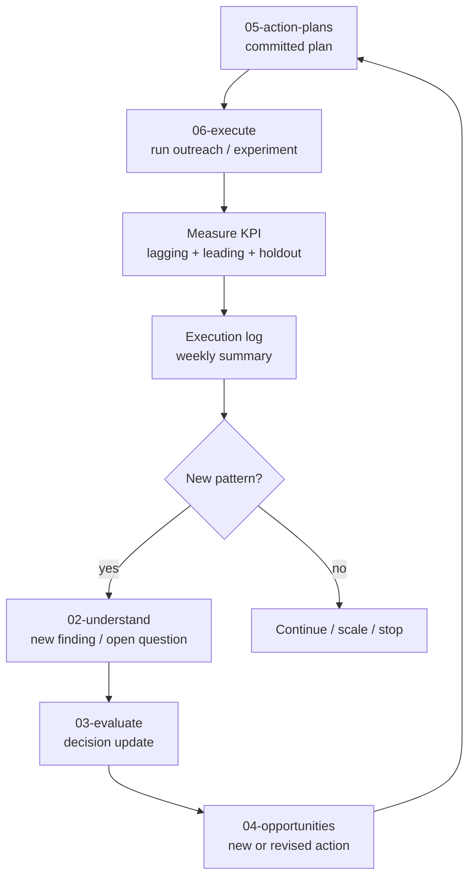

# EXEC-001 - Execution Scoreboard

**Registry:** [EXEC-001](../REGISTRY.md#exec-001)

> **Luồng:** ← [05-action-plans](../05-action-plans/) · → (LOOP) [02-understand](../02-understand/) khi kết quả sinh finding mới.

Stage này chạy các action plan đã cam kết, đo kết quả theo KPI bắc cầu, kiểm tra dashboard sẵn có, và đóng vòng học: mỗi tuần thực thi phải tạo ra dữ liệu đủ để biết plan nên tiếp tục, đổi message, đổi cohort, hay quay lại hiểu vấn đề.

## TL;DR

`05-action-plans -> 06-execute -> KPI/log/dashboard check -> 02-understand -> 03-evaluate -> 04-opportunities -> 05-action-plans`

- `06-execute/README.md` là surface đọc chính cho toàn bộ stage 06.
- KPI lagging trả lời “đã hết ế chưa?”; KPI leading trả lời “product journey có đang hoạt động không?”.
- Execution log ghi theo tuần, không ghi từng tương tác rời rạc trong tài liệu này.
- Dashboard inventory cho biết dashboard Metabase nào dùng được ngay, cái nào partial, cái nào blocked.
- Kết quả thực thi có pattern mới phải quay về `02-understand` thành finding mới.

## Current Execution State

| Mảng | Trạng thái hiện tại | Ghi chú |
|---|---|---|
| Retail/B2C reactivation | Ready to execute | Focus đã chốt ở stage 03; chạy theo action flows ở stage 05 |
| KPI measurement | Tracking framework ready | Chưa có số execution thật trong log tuần |
| Dashboard readiness | Mostly ready | Một số dashboard match; AR và US gift recipient còn gap |
| Cashflow/AR | Blocked | `fact_payments` rỗng; dashboard hiện có không đo công nợ/COD collection |
| Learning loop | Required | Mọi pattern mới từ execution phải quay về `02-understand` |

## Execution Loop

**Thực thi không phải điểm cuối. Nó là điểm khởi đầu của vòng học tiếp theo.**

## KPI Scoreboard

### Lagging KPI — “Hết ế”

| KPI | Hiện tại | Mục tiêu | Thời hạn |
|---|---|---|---|
| One-time rate | **72%** | < 60% | 2 quý |
| M1 repeat rate | **3–17%** | ≥ 25% | 2 quý |
| Returning buyers/tháng | ~30 | ≥ 60 | 2 quý |
| ACTIVE point-in-time cuối tháng | ~98 | tăng đều | theo dõi liên tục |
| Reactivation rate win-back | — | ≥ 15%/30 ngày | per campaign |
| US gift → nội địa conversion | 0 (test chưa có) | ≥ 10% → mở rộng | sau P4 test |

### Leading KPI — Product-Journey Health

| KPI | Ý nghĩa | Đo thế nào |
|---|---|---|
| Day-7 engagement rate | % khách mới phản hồi Touch 1 hoặc Touch 2 | Ghi vào Sheet tracking |
| “Thấy hiệu quả” rate | % WIN_BACK/SECOND_ORDER call trả lời “có thấy hiệu quả” | Cột trong Sheet outcome |
| Dùng đúng cách Y/N | % khách được tư vấn lại sau khi nói “không thấy gì” | Cột trong Sheet |

> Nếu Day-7 engagement thấp, product journey chưa hoạt động; call-list về sau sẽ không đủ.

## Measurement Rules

Luôn tách **kênh lõi vs marketplace**; dùng **completed-only**; dùng **waterfall point-in-time**. Không dùng `mart_customer_status_snapshot_monthly` để đọc xu hướng.

### Holdout 10–20%

Nguồn chi tiết: [../05-action-plans/PLAN-002-action-flows.md](../05-action-plans/PLAN-002-action-flows.md) — §5.5 *Đo lường (bắt buộc có nhóm chứng)*.

- Mỗi luồng hành động 1–5 giữ lại **10–20% không tác động** làm nhóm chứng.
- So sánh tỷ lệ mua lại giữa nhóm được tiếp cận và nhóm chứng để đo **incremental lift**.
- Tránh nhận công cho đơn tự đến (organic reorder); không có holdout thì overcount conversion.
- Khi pool nhỏ, ví dụ Luồng 1 chỉ có 6 khách, holdout 1 người là đủ; ghi rõ trong execution log.

## Execution Log

> **Vòng lặp học:** kết quả thực thi = finding mới → cập nhật ngược về [02-understand](../02-understand/README.md). Đây là điểm đóng vòng của path.

| Tuần | Hành động chạy | Luồng/Plan | Kết quả (đặt lại Y/N · lý do bỏ · thấy hiệu quả?) | KPI cập nhật |
|---|---|---|---|---|
| *VD: 2026-W24* | *Zalo 31 REORDER_NUDGE + 16 SECOND_ORDER nóng* | *Luồng 3 + 4* | *Y: 8 · N: 23 (lý do bỏ: 12 không phản hồi, 7 “đang dùng kênh khác”, 4 “chưa hết”) · thấy hiệu quả: 11/24 có phản hồi* | *M1 repeat: 18% · Day-7 engagement: 46%* |

### Cách Ghi Log

- Mỗi tuần ghi **1 dòng tổng hợp** sau review T7 theo lịch 5.3.
- Cột **Kết quả** ghi đủ 3 chiều: đặt lại Y/N, lý do bỏ gom nhóm, “thấy hiệu quả” Y/N.
- Cột **KPI cập nhật** chỉ ghi KPI nào **thay đổi** so với tuần trước.
- Pattern mới như lý do bỏ lặp lại hoặc nhóm yield 0% phải được ghi note riêng và tạo finding trong [02-understand](../02-understand/README.md).

## Dashboard Inventory — Metabase Sẵn Có

> Base: `https://bi.lan.fwg.vn/dashboard/<id>`. **Đã verify SQL-level 2026-06-13** trong 3 report ở [`plans/reports/`](../../reports/) — `metabase-verify-*-260613-0627`.
> Cột **Khớp?** = mức dashboard phục vụ đúng mục đích plan. Nhiều mục đã có; vài mục có gap thật cần xử lý.

| Mục đích theo plan | Dashboard | Khớp? — gap |
|---|---|---|
| **Action queue / reorder** | [103](https://bi.lan.fwg.vn/dashboard/103) | ✅ MATCH · ✅ **B1 done 2026-06-13**: card 2175 đã thêm 3 cột SKU-affinity (SP cuối/hay mua/#2) |
| Hồ sơ / phân khúc khách | [106](https://bi.lan.fwg.vn/dashboard/106) · [104](https://bi.lan.fwg.vn/dashboard/104) | ✅ MATCH |
| **B2C retention / cohort** (≈P3) | [111](https://bi.lan.fwg.vn/dashboard/111) · [112](https://bi.lan.fwg.vn/dashboard/112) · [105](https://bi.lan.fwg.vn/dashboard/105) | 111/112 ✅ point-in-time · ✅ **B2 done 2026-06-13**: 105 3 card scalar migrate khỏi snapshot (Churn/Active→waterfall, Repeat→fact_orders PIT) + dọn layout tab 1. ✅ value_group filter (dropdown) đã nối waterfall card sau khi thêm segment cols + Metabase sync. Còn: tab 2/3 chưa audit layout |
| **Cashflow / công nợ AR** | [78](https://bi.lan.fwg.vn/dashboard/78) · [34](https://bi.lan.fwg.vn/dashboard/34) · [74](https://bi.lan.fwg.vn/dashboard/74) | 🔴 **KHÔNG phục vụ AR**: 78 = recon đối soát, 34 = P&L accrual, 74 = cost ledger. Không cái nào đo công nợ/COD-collection. Chặn bởi `fact_payments` rỗng. Nhánh cashflow/AR vẫn **blocked** |
| **B2B doanh thu lõi** | [49](https://bi.lan.fwg.vn/dashboard/49) · [50](https://bi.lan.fwg.vn/dashboard/50) | ✅ MATCH (scope_b2b; 50 có outstanding payment) |
| **Kênh lõi vs marketplace** | [33](https://bi.lan.fwg.vn/dashboard/33) · [77](https://bi.lan.fwg.vn/dashboard/77) · [32](https://bi.lan.fwg.vn/dashboard/32) | ✅ **B3 done 2026-06-13 (cả 2 dùng Sapo)**: 77 + 33 đều có tab “Core vs Marketplace” từ `fact_order_economics` + `dim_channels` (Core 24.9B GM38% / MKT 6.0B GM46%). Đã **roll back hoàn toàn MISA-channel** (bỏ `int_misa.is_marketplace` + tab MISA) vì MISA 95% UNKNOWN. MISA chỉ dùng cho COGS/overhead, **không dùng cho kênh**. Caveat: tab Sapo của 33 chưa nối date-filter (`date_key` INTEGER) → all-time; period-filter dùng 77 |
| **Product performance** | [107](https://bi.lan.fwg.vn/dashboard/107) · [109](https://bi.lan.fwg.vn/dashboard/109) · [108](https://bi.lan.fwg.vn/dashboard/108) | ✅ MATCH (STAR/DOG, velocity, SKU margin) |
| OOS / tồn hero-SKU | [110](https://bi.lan.fwg.vn/dashboard/110) | ✅ MATCH (`is_oos` + `oos_risk` high-velocity low-stock) |
| **US gift recipients** | [51](https://bi.lan.fwg.vn/dashboard/51) | 🟠 PARTIAL: là **US-channel performance**, không segment theo người-nhận-quà. Cần view riêng nếu muốn target recipient |

## Dashboard Gaps To Carry Forward

| Gap | Stage cần xử lý | Ghi chú |
|---|---|---|
| AR/COD collection không có dashboard đúng | 02 hoặc data backlog | Bị chặn bởi `fact_payments` rỗng |
| Retention dashboard 105 tab 2/3 chưa audit layout | 06 | Không chặn execution retail tuần này |
| US gift recipient segment chưa có view riêng | 04/05 nếu chọn mở P4 | Dashboard 51 chỉ là US-channel performance |
| Dashboard 33 tab Sapo chưa nối date-filter | 06/data fix | Dùng 77 khi cần period-filter |

## Cách Cập Nhật Stage 06

1. Khi một plan bắt đầu chạy, thêm dòng mới vào [Execution Log](#execution-log).
2. Khi KPI đổi, cập nhật [KPI Scoreboard](#kpi-scoreboard) và ghi rõ nguồn đo.
3. Khi dashboard được sửa hoặc audit xong, cập nhật [Dashboard Inventory](#dashboard-inventory) và ngày verify.
4. Khi có pattern mới từ execution, tạo hoặc cập nhật finding ở `02-understand`, rồi link ngược về dòng log liên quan.
5. Nếu một gap dashboard/data chặn execution, giữ nó ở [Dashboard Gaps To Carry Forward](#dashboard-gaps) và link sang stage xử lý.

## Source Notes

- KPI và holdout lấy từ archive §8 + §5.5 và action flow stage 05.
- Dashboard inventory lấy từ kiểm tra Metabase SQL-level ngày 2026-06-13.
- Execution log hiện là template vận hành; chưa có kết quả campaign thật được ghi vào tài liệu.
