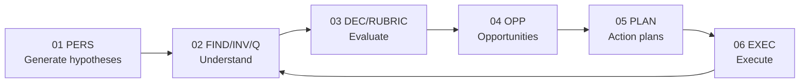

# NAV-000 — Navigation Map

File này là bản đồ đi xuyên hệ thống. Nó thay vai trò đọc/định hướng mà `plan.md` từng giữ ở root. `plan.md` đã được chuyển thành [06-execute/operating-board.md](./06-execute/operating-board.md) để quản lý vận hành.

## TL;DR

`START-000 -> NAV-000 -> REG-000 -> Stage README -> Canonical Item -> Next Stage`

- [00-start-here.md](./00-start-here.md) trả lời "hiện tại đang tin gì?"
- `NAVIGATION.md` trả lời "đi qua hệ thống như thế nào?"
- [REGISTRY.md](./REGISTRY.md) trả lời "item này từ đâu đến và đi đâu?"
- Stage README trả lời "folder này có gì?"
- File có prefix (`PERS-*`, `FIND-*`, `INV-*`, `DEC-*`, `OPP-*`, `PLAN-*`, `EXEC-*`) là canonical item.
- [06-execute/operating-board.md](./06-execute/operating-board.md) chỉ dùng khi đã hiểu hệ thống và muốn quản lý danh mục chạy việc.

## Đường Đọc Nhanh

| Thời gian | Đọc theo thứ tự |
|---|---|
| 10 phút | [START-000](./00-start-here.md) -> [FIND-000](./02-understand/FIND-000-current-diagnosis.md) -> [STAGE-03](./03-evaluate/README.md) |
| 30 phút | START -> NAV -> REGISTRY -> README của 01-06 |
| Full pass | START -> NAV -> 01 perspectives -> 02 findings/investigations -> 03 decisions -> 04 opportunities -> 05 plans -> 06 execute |
| Vận hành tuần | [STAGE-03 priority](./03-evaluate/README.md#priority-board) -> [STAGE-05 plans](./05-action-plans/README.md) -> [STAGE-06 execute](./06-execute/README.md) -> [operating board](./06-execute/operating-board.md) |

## Jump Table

| Bạn cần... | Mở |
|---|---|
| Bức tranh hiện tại | [FIND-000-current-diagnosis](./02-understand/FIND-000-current-diagnosis.md) |
| Vì sao B2B không sụp | [FIND-004-b2b-collapse-root-cause](./02-understand/FIND-004-b2b-collapse-root-cause.md) |
| Vì sao B2C mới là bệnh chính | [FIND-002-retention-leak](./02-understand/FIND-002-retention-leak.md) |
| Nghi phạm cashflow/AR | [INV-001-cashflow-collection-ar](./02-understand/INV-001-cashflow-collection-ar.md) |
| Câu hỏi còn mở | [Q-001-open-questions](./02-understand/Q-001-open-questions.md) |
| Quyết định đã chốt/còn mở | [DEC-001-decision-register](./03-evaluate/DEC-001-decision-register.md) |
| Chấm điểm cơ hội | [RUBRIC-001-evaluation-framework](./03-evaluate/RUBRIC-001-evaluation-framework.md) |
| Backlog cơ hội | [STAGE-04 opportunities](./04-opportunities/README.md) |
| Kế hoạch đã cam kết | [STAGE-05 action plans](./05-action-plans/README.md) |
| KPI, log, dashboard | [STAGE-06 execute](./06-execute/README.md) |
| Danh mục vận hành | [EXEC-BOARD](./06-execute/operating-board.md) |

## Code Prefix

| Prefix | Meaning | Stage |
|---|---|---|
| `PERS-###` | Perspective/lens container | 01 |
| `FIND-###` | Evidence-backed finding / diagnosis | 02 |
| `INV-###` | Investigation still being tested | 02 |
| `Q-###` | Open question | 02/03 |
| `COMP-###` | Companion file for a canonical item | any |
| `DEC-###` | Decision register/detail/audit item | 03 |
| `RUBRIC-###` | Evaluation framework | 03 |
| `OPP-###` | Candidate opportunity, not committed | 04 |
| `PLAN-###` | Committed action plan | 05 |
| `EXEC-###` | Execution log/KPI/dashboard item | 06 |
| `EXEC-BOARD` | Operating board for active management | 06 |

## Stage Map

## Move Forward / Move Back

| From | Forward when... | Backward when... |
|---|---|---|
| 01 -> 02 | Lens creates a testable unknown | Lens is too vague; rewrite perspective |
| 02 -> 03 | Finding has evidence and caveat | Evidence weak or contradiction unresolved |
| 03 -> 04 | Decision opens an action direction | Decision blocked by missing evidence |
| 04 -> 05 | Opportunity has owner, KPI, feasible next step | Opportunity still brainstorm or blocker unresolved |
| 05 -> 06 | Plan is committed and runnable | Owner/timeline/KPI missing |
| 06 -> 02 | Execution produces learning | Result is just activity without interpretable signal |

## Root Surfaces

| File | Role |
|---|---|
| [00-start-here.md](./00-start-here.md) | Human entrypoint: brief, current truth, warnings |
| [NAVIGATION.md](./NAVIGATION.md) | Human navigation: how to read, jump, move forward/back |
| [REGISTRY.md](./REGISTRY.md) | Cross-stage item index: lineage and canonical links |
| [AGENTS.md](./AGENTS.md) | Rules for LLM agents editing this plan |
| [06-execute/operating-board.md](./06-execute/operating-board.md) | Work management after the reader understands the system |

## Rule Of Thumb

Nếu bạn không biết mở gì tiếp theo, mở [REGISTRY.md](./REGISTRY.md), tìm item đang đọc, xem cột `Moves To`, rồi đi tới canonical link tiếp theo.
