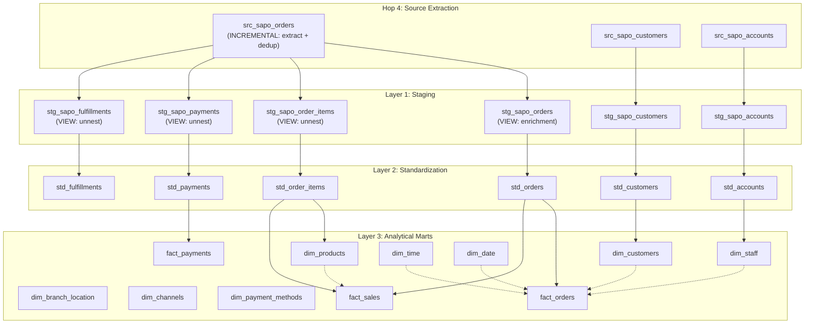

# Transformation Architecture & Data Lineage

This document provides a detailed overview of the Data Warehouse transformation layer, including dependency diagrams and entity definitions.

## 1. Data Lineage Diagram

The following Mermaid diagram illustrates the data flow from Raw Ingestion to Analytical Marts.



## 2. Layer & Entity Details

### Layer 1: Staging (Cleaning & Extraction)

_Path: `models/staging/sapo/`_

| Entity                   | Description                          | Key Transformations                                                                              |
| :----------------------- | :----------------------------------- | :----------------------------------------------------------------------------------------------- |
| **src_sapo_orders**      | Extraction + dedup (INCREMENTAL).    | Reads parquet, extracts 50+ JSON fields, tech dedup (entity_id) + biz dedup (order_id). Outputs flat columns + 3 nested JSON arrays as text. No payload. |
| **stg_sapo_orders**      | Enrichment (VIEW).                   | Reads from src_, adds enrichment joins (ref_order_sources, ref_payment_methods, ref_branch_locations). No dedup — already done in src_. |
| **stg_sapo_order_items** | Line items (VIEW, unnest).           | Unnests `order_line_items_json` from src_sapo_orders. Extracts `quantity`, `price`, `sku`.       |
| **stg_sapo_payments**    | Payments (VIEW, unnest).             | Unnests `payments_json` from src_sapo_orders.                                                    |
| **stg_sapo_fulfillments**| Fulfillments (VIEW, unnest).         | Unnests `fulfillments_json` from src_sapo_orders.                                                |
| **src_sapo_customers**   | Extraction + dedup (INCREMENTAL).    | Reads parquet, extracts JSON fields, tech dedup (entity_id) + biz dedup (sapo_customer_id). Outputs flat columns. No payload. |
| **stg_sapo_customers**   | Cleaning (VIEW).                     | Reads from src_, cleaning/formatting (consolidate dob/birthday). No JSON extraction.             |
| **src_sapo_accounts**    | Extraction + dedup (INCREMENTAL).    | Reads parquet, extracts JSON fields, tech dedup (entity_id) + biz dedup (account_id). Outputs flat columns. No payload. |
| **stg_sapo_accounts**    | Cleaning (VIEW).                     | Reads from src_, name coalescing (full_name/user_name/first+last). No JSON extraction.           |

### Layer 2: Standard (Business Logic)

_Path: `models/staging/standard/`_

| Entity              | Description                       | Key Logic                                                                                                                       |
| :------------------ | :-------------------------------- | :------------------------------------------------------------------------------------------------------------------------------ |
| **std_orders**      | The "Golden Record" for an Order. | **Hybrid Fulfillment Status**: Maps `financial_status` + `logistics_status` to business states (`COMPLETED`, `SHIPPED_COD`...). |
| **std_order_items** | Standardized Line Items.          | Calculates `total_line_amount` if missing. Standardizes `product_type`.                                                         |
| **std_customers**   | Unified Customer view.            | Deduplication of customers (if multiple sources exist in future).                                                               |
| **std_payments**    | Standardized Payments.            | Status mapping (paid→SUCCESS, pending→PENDING, voided→FAILED, refunded→REFUNDED). Timestamp normalization.                     |
| **std_fulfillments**| Standardized Fulfillments.        | Status mapping (DELIVERED, SHIPPING, PACKED, CANCELLED, FAILED, PENDING).                                                       |
| **std_accounts**    | Standardized Accounts (Staff).    | Normalize account/staff data from Sapo. Standard interface for dim_staff.                                                       |

### Layer 3: Marts / Dimensions

_Path: `models/marts/core/`_

| Dimension               | Type          | Source              | Logic                                                                                                           |
| :---------------------- | :------------ | :------------------ | :-------------------------------------------------------------------------------------------------------------- |
| **dim_products**        | **Virtual**   | `std_order_items`   | **Last Record Wins**: Uses `ROW_NUMBER()` to look back at history and pick the latest Product Name/Price by ID. |
| **dim_customers**       | Type 1        | `std_customers`     | Current view of customer details.                                                                               |
| **dim_staff**           | Type 1        | `std_accounts`      | List of salespeople/assignees.                                                                                  |
| **dim_time**            | **Generated** | SQL Loop            | Minute-level granularity (1,440 rows). Calculated flags: `is_peak_hour`, `is_business_hour`.                    |
| **dim_date**            | **Generated** | `dbt_utils`         | Day-level calendar from 2000-2030.                                                                              |
| **dim_branch_location** | Static        | `ref_locations`     | Loaded from Seeds (Physical stores/warehouses).                                                                 |
| **dim_channels**        | Static        | `ref_order_sources` | Logic mapping for Sales Channels (Online, POS, Facebook).                                                       |

### Layer 3: Marts / Facts

_Path: `models/marts/sales/`_

| Fact            | Grain      | Purpose                          | Key Metrics                                                  |
| :-------------- | :--------- | :------------------------------- | :----------------------------------------------------------- |
| **fact_orders** | Order      | High-level Sales performance.    | `gmv`, `total_discount`, `shipping_fee`, `time_to_complete`. |
| **fact_sales**  | Order Item | Product-level Sales performance. | `quantity_sold`, `gross_revenue`, `net_revenue`, `margin`.   |
| **fact_payments** | Payment  | Payment transactions.            | `amount`, `status`, `payment_method_key`. Source: `std_payments`. |

## 3. Dependency Rules

1.  **Marts never touch Staging**: Marts must select from `std_` models (Standard Layer) or other Marts. All entities (orders, customers, accounts/staff, payments) go through the full `src_ → stg_ → std_ → marts` pipeline.
2.  **Extraction in src_, enrichment in stg_, normalization in std_**: JSON extraction + dedup happens in `src_` (INCREMENTAL). Enrichment joins in `stg_` (VIEW). Business logic (status mapping) in `std_` (VIEW).
3.  **src_ is single source of truth**: All stg_ models (orders, order_items, payments, fulfillments) read from `src_sapo_orders`. No model reads raw parquet directly except src_.
4.  **Surrogate Keys**: All tables in Marts join via `md5` Surrogate Keys (`_key`), not integer IDs.

## 4. Key Logic Deep Dive

### Fulfillment Status Priority (in `std_orders`)

1.  **Cancelled** (`cancelled`)
2.  **Returns** (`restocked`)
3.  **Success** (`COMPLETED` = Paid + Packed + Received)
4.  **In Transit** (`SHIPPED` variants)
5.  **Processing** (`PAID` but not shipped)

### Virtual Product Definition

Since we do not sync Products directly, we define a Product as:

> "The appearance of a `product_id` + `variant_id` in the MOST RECENT Order Item line."

## 5. Incremental Strategy (Performance Optimization)

### Concept

Instead of re-processing the entire dataset every run (Full Refresh), we switch to an **Incremental Strategy** to process only changed data.

### 1. Partition Pruning (The "Big Filter")

- **Mechanism**: `dlt` partitions raw data by `year/month` derived from `modified_on`.
- **Effect**: When `dbt` runs an incremental model with `WHERE updated_at > :last_run`, DuckDB automatically skips reading folders from older years/months. This reduces I/O by 90-99%.

### 2. Merge Logic (Implemented as Delete+Insert)

- **Models**: `fact_orders`, `fact_sales`, `dim_customers`, `dim_products`, `dim_geography`.
- **Method**: Default `dbt-duckdb` incremental strategy (`delete+insert`).
- **Key**: `unique_key` (e.g., `order_id`).
- **Logic**:
  1.  Read only _new_ records from Source (based on `updated_at` or `extracted_at`).
  2.  Delete existing records in `sapo_warehouse.duckdb` that match the keys of new records.
  3.  Insert the new records.
  4.  _Note_: This achieves an "Upsert" effect efficiently without needing explicit `MERGE` SQL support.

## 6. Serving Layer Architecture

### Overview

The serving layer implements a **3-tier data flow** from warehouse to analytics:

1. **dbt Warehouse** (`sapo_warehouse.duckdb`) — Mart models execute with schema `main_marts`, export as Parquet files
2. **Rolling Snapshots** (`/app/data_lake/export/marts/rolling/{table}/`) — Timestamped files; older files GC'd after each run
3. **Serving Database** (`/app/data_lake/serving/olap.duckdb`) — Metabase connects read-only; views created by `bootstrap_serving_views.py`

### Rolling Self-Refresh Views

Mart models materialize as Parquet files with `location="{{ get_rolling_location() }}"` macro, which names files with ISO-8601 timestamps:
```
rolling/dim_customers/dim_customers_20260407140000.parquet  ← latest
rolling/dim_customers/dim_customers_20260407130000.parquet  ← older (GC'd)
```

Each dbt run creates a new file without overwriting. This enables **zero-downtime updates**: in-flight Metabase queries read old files while new queries immediately pick up the latest.

Views in `olap.duckdb` use `read_parquet(glob, filename=true)` + `max(filename)` to always resolve to the newest file:
```sql
CREATE OR REPLACE VIEW dim_customers AS
WITH latest AS (SELECT max(filename) FROM read_parquet('rolling/dim_customers/*.parquet', filename=true))
SELECT * EXCLUDE (filename)
FROM read_parquet('rolling/dim_customers/*.parquet', filename=true)
WHERE filename = (SELECT ... FROM latest)
```

No manual `CREATE OR REPLACE VIEW` needed when new parquets arrive.

### Schema Alignment: Dual-View Pattern for dbt-metabase Integration

**Current schema structure:**
- Warehouse: Mart models use `+schema: marts` in dbt_project.yml → dbt manifest calls them `main_marts.fact_orders`
- Serving: `bootstrap_serving_views.py` creates views as `CREATE OR REPLACE VIEW {table_name}` → Metabase sees `main.fact_orders`

This mismatch prevents `dbt-metabase` (v1.7.5) from auto-populating `depends_on` references, because the tool matches Metabase table names (`main.fact_orders`) against dbt manifest qualified names (`main_marts.fact_orders`).

**Planned enhancement:**
After creating `main.{table_name}` views (for backward compatibility), additionally create `main_marts.{table_name}` alias views. This allows:
- Metabase cards continue querying `main.fact_orders` (no SQL changes needed)
- dbt-metabase finds `main_marts.fact_orders` in both Metabase schema list AND dbt manifest
- `depends_on` auto-populates → enables full lineage: card → exposure → mart model → tests → sources

**Implementation:** Modify `bootstrap_serving_views.py` to run `_build_rolling_view_sql()` twice per table, once for `main` schema and once for `main_marts` schema, after creating the main view.

**Operational note:** When schema alias is added, re-run `bootstrap_serving_views.py` once to populate both views in all existing marts.
