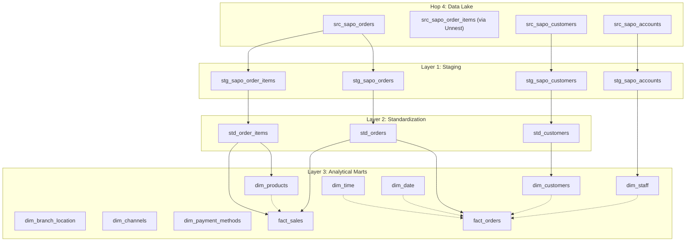

# Transformation Architecture & Data Lineage

This document provides a detailed overview of the Data Warehouse transformation layer, including dependency diagrams and entity definitions.

## 1. Data Lineage Diagram

The following Mermaid diagram illustrates the data flow from Raw Ingestion to Analytical Marts.

## 2. Layer & Entity Details

### Layer 1: Staging (Cleaning & Extraction)

_Path: `models/staging/sapo/`_

| Entity                   | Description            | Key Transformations                                                                              |
| :----------------------- | :--------------------- | :----------------------------------------------------------------------------------------------- |
| **stg_sapo_orders**      | Raw orders flattened.  | Extracts JSON fields (`billing`, `shipping`, `amounts`). Casts strings to `DECIMAL`/`TIMESTAMP`. |
| **stg_sapo_order_items** | Line items (exploded). | `UNNEST` from Order JSON. Extracts `quantity`, `price`, `sku`.                                   |
| **stg_sapo_customers**   | Raw customer profiles. | Extracts `name`, `email`, `phone` from Customer JSON.                                            |
| **stg_sapo_accounts**    | System users (Staff).  | Flattened list of employees/accounts for Staff Dimension.                                        |

### Layer 2: Standard (Business Logic)

_Path: `models/staging/standard/`_

| Entity              | Description                       | Key Logic                                                                                                                       |
| :------------------ | :-------------------------------- | :------------------------------------------------------------------------------------------------------------------------------ |
| **std_orders**      | The "Golden Record" for an Order. | **Hybrid Fulfillment Status**: Maps `financial_status` + `logistics_status` to business states (`COMPLETED`, `SHIPPED_COD`...). |
| **std_order_items** | Standardized Line Items.          | Calculates `total_line_amount` if missing. Standardizes `product_type`.                                                         |
| **std_customers**   | Unified Customer view.            | Deduplication of customers (if multiple sources exist in future).                                                               |

### Layer 3: Marts / Dimensions

_Path: `models/marts/core/`_

| Dimension               | Type          | Source              | Logic                                                                                                           |
| :---------------------- | :------------ | :------------------ | :-------------------------------------------------------------------------------------------------------------- |
| **dim_products**        | **Virtual**   | `std_order_items`   | **Last Record Wins**: Uses `ROW_NUMBER()` to look back at history and pick the latest Product Name/Price by ID. |
| **dim_customers**       | Type 1        | `std_customers`     | Current view of customer details.                                                                               |
| **dim_staff**           | Type 1        | `stg_sapo_accounts` | List of salespeople/assignees.                                                                                  |
| **dim_time**            | **Generated** | SQL Loop            | Minute-level granularity (1,440 rows). Calculated flags: `is_peak_hour`, `is_business_hour`.                    |
| **dim_date**            | **Generated** | `dbt_utils`         | Day-level calendar from 2000-2030.                                                                              |
| **dim_branch_location** | Static        | `ref_locations`     | Loaded from Seeds (Physical stores/warehouses).                                                                 |
| **dim_channels**        | Static        | `ref_order_sources` | Logic mapping for Sales Channels (Online, POS, Facebook).                                                       |

### Layer 3: Marts / Facts

_Path: `models/marts/sales/`_

| Fact            | Grain      | Purpose                          | Key Metrics                                                  |
| :-------------- | :--------- | :------------------------------- | :----------------------------------------------------------- |
| **fact_orders** | Order      | High-level Sales performance.    | `gmv`, `total_discount`, `shipping_fee`, `time_to_complete`. |
| **fact_sales**  | Order Item | Product-level Sales performance. | `quantity_sold`, `gross_revenue`, `net_revenue`, `margin`.   |

## 3. Dependency Rules

1.  **Marts never touch Staging**: Marts must select from `std_` models (Standard Layer) or other Marts.
2.  **Standardization First**: All casting, renaming, and complex JSON extraction happens in `stg_`. Business logic (status mapping) happens in `std_`.
3.  **Surrogate Keys**: All tables in Marts join via `md5` Surrogate Keys (`_key`), not integer IDs.

## 4. Key Logic Deep Dive

### Fulfillment Status Priority (in `std_orders`)

1.  **Cancelled** (`cancelled`)
2.  **Returns** (`restocked`)
3.  **Success** (`COMPLETED` = Paid + Packed + Received)
4.  **In Transit** (`SHIPPED` variants)
5.  **Processing** (`PAID` but not shipped)

### Virtual Product Definition

Since we do not sync Products directly, we define a Product as:

> "The appearance of a `product_id` + `variant_id` in the MOST RECENT Order Item line."

## 5. Incremental Strategy (Performance Optimization)

### Concept

Instead of re-processing the entire dataset every run (Full Refresh), we switch to an **Incremental Strategy** to process only changed data.

### 1. Partition Pruning (The "Big Filter")

- **Mechanism**: `dlt` partitions raw data by `year/month` derived from `modified_on`.
- **Effect**: When `dbt` runs an incremental model with `WHERE updated_at > :last_run`, DuckDB automatically skips reading folders from older years/months. This reduces I/O by 90-99%.

### 2. Merge Logic (Implemented as Delete+Insert)

- **Models**: `fact_orders`, `fact_sales`, `dim_customers`, `dim_products`, `dim_geography`.
- **Method**: Default `dbt-duckdb` incremental strategy (`delete+insert`).
- **Key**: `unique_key` (e.g., `order_id`).
- **Logic**:
  1.  Read only _new_ records from Source (based on `updated_at` or `extracted_at`).
  2.  Delete existing records in `sapo_warehouse.duckdb` that match the keys of new records.
  3.  Insert the new records.
  4.  _Note_: This achieves an "Upsert" effect efficiently without needing explicit `MERGE` SQL support.
