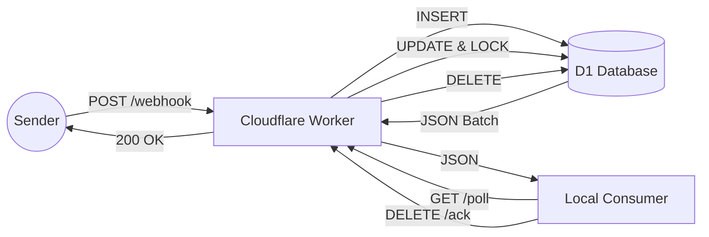

# Cloudflare Webhook Receiver

## Overview

A High-Performance, Low-Cost webhook ingestion system using **Cloudflare Workers** and **D1 (SQLite)**.
This project acts as a reliable buffer, receiving webhooks with low latency and allowing consumers to pull them in batches.

## Architecture



## Setup & Deployment

### Prerequisites

- Node.js & npm
- Wrangler CLI: `npm install -g wrangler`

### Configuration

1.  **Clone the repository.**
2.  **Login to Cloudflare:**
    ```bash
    wrangler login
    ```
3.  **Update `wrangler.toml`:**
    Ensure your `d1_databases` binding matches your Cloudflare D1 database ID.
    ```toml
    [[d1_databases]]
    binding = "DB"
    database_name = "webhook-db"
    database_id = "<your-d1-id>"
    ```

### Initialization

1.  **Create D1 Database** (if not exists):
    ```bash
    wrangler d1 create webhook-db
    ```
2.  **Apply Schema:**
    ```bash
    wrangler d1 execute webhook-db --file=./schema.sql
    ```

### Deployment

```bash
wrangler deploy
```

## API Usage

### 1. Ingest (Webhook Provider)

**POST** `/webhook/<source_system>/<entity_type>/<action>`

- **Headers:** `x-hub-signature-256` (HMAC)
- **Response:** `200 OK`

### 2. Poll (Consumer)

**GET** `/poll?limit=1000&source_system=stripe`

- Fetches pending messages and locks them.

### 3. Acknowledge (Consumer)

**POST** `/ack-batch`

- **Body:** `{ "ids": ["uuid-1", "uuid-2"] }`
- Deletes processed messages.

### 4. Release / NACK (Consumer)

**POST** `/release`

- **Body:** `{ "id": "uuid-1" }`
- Unlocks a message for immediate retry.
