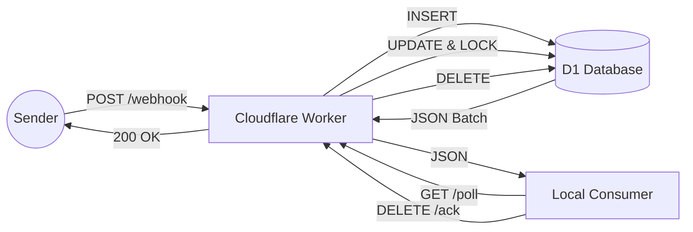

# Product Requirements Document (PRD): Cloudflare Webhook Receiver

## 1. Overview

This project, `cloudflare_webhook`, is a high-performance, cost-effective webhook ingestion system implemented using **Cloudflare Workers** and **Cloudflare D1 (SQLite)**. It serves as a reliable buffer layer between external webhook senders (e.g., Payment Gateways, ERPs) and internal data processing consumers (e.g., Data Lake ingestion pipelines via `dlt`).

It is designed to replace legacy implementations with a serverless, edge-based solution that prioritizes **low latency** ingestion and **reliable** message buffering.

## 2. Goals & Success Metrics

### 2.1. Primary Goals

1.  **Ingestion Speed:** Minimise response time to webhook senders to prevent timeouts or unnecessary retries.
2.  **Reliability:** Zero data loss. All received webhooks must be safely persisted until explicitly acknowledged by a consumer.
3.  **Cost Efficiency:** Leverage the Cloudflare Workers free/paid tier model to handle high volumes at a fraction of the cost of traditional RDS/VM setups.
4.  **Scalable Consumption:** Support high-throughput batch extraction by downstream consumers.

### 2.2. Success Metrics

- **Latency:** Ingestion endpoint responds with `200 OK` in < 100ms (P95).
- **Capacity:** Capable of buffering bursts of webhooks without dropping requests.
- **Consumer Efficiency:** Support batch fetching of 1000+ records per poll cycle.

## 3. Architecture & Flow

- **Ingest Worker:** Receives POST request -> Writes to D1 -> Returns 200 OK.
- **D1 Database:** Stores webhooks permanently until deleted.
- **Pull Worker:** Endpoint for Local App to fetch pending webhooks with locking mechanism.

## 4. Functional Requirements

### 4.1. Webhook Ingestion

- **Endpoint:** `POST /webhook/<source_system>/<entity_type>/<action>`
- **Security:** Must verify HMAC signatures (e.g., `x-hub-signature-256`) to ensure authenticity.
- **Persistence:** Immediately write the raw JSON payload, source metadata, and timestamp to D1 storage upon receipt.
- **Response:** Return `200 OK` immediately after successful database write.

### 4.2. Data Consumption (Polling)

- **Queue Semantics:** Implement a "Pull" model where consumers request pending messages.
- **Ordering:** Strict FIFO (First-In-First-Out) processing based on ingestion timestamp (`enqueued_at`).
- **Locking Mechanism:**
  - When a consumer fetches messages, they must be "locked" (marked as `PROCESSING`) for a specific duration (e.g., 60 seconds).
  - This prevents other consumers (or parallel threads) from processing the same message simultaneously.
- **Filtering:** Support filtering by `source_system` to allow dedicated consumers for high-volume sources.
- **Batching:** Support configurable batch sizes (up to 1000 items) to optimize throughput for ETL tools like `dlt`.

### 4.3. Acknowledgement & Lifecycle

- **Positive ACK:** Consumers must explicitly confirm successful processing.
  - Support single-item ACK (`DELETE /ack`) and batch ACK (`POST /ack-batch`).
  - On ACK, the record is permanently deleted from the buffer.
- **Negative ACK / Release:** If processing fails, consumers can explicitly release messages (`POST /release`) to make them immediately available for retry.
- **Visibility Timeout:** If a consumer hangs or crashes without ACK/Release, the lock must automatically expire after the timeout, making the message available again.

## 5. Technical Specifications

### 5.1. Architecture

- **Compute:** Cloudflare Workers (Typescript).
- **Database:** Cloudflare D1 (SQLite) - Single-write leader, highly available.
- **Deployment:** Managed via `wrangler`.

### 5.2. Database Schema (D1)

The primary storage table `webhooks` uses the following schema:

| Field           | Type        | Description                                            |
| :-------------- | :---------- | :----------------------------------------------------- |
| `msg_id`        | `TEXT` (PK) | Unique UUIDv4 for the message.                         |
| `payload`       | `TEXT`      | Raw JSON payload from the sender.                      |
| `source_system` | `TEXT`      | Identifier for the sender (e.g., `stripe`, `shopify`). |
| `status`        | `TEXT`      | `NEW`, `PROCESSING`. Default is `NEW`.                 |
| `enqueued_at`   | `INTEGER`   | Unix timestamp (ms) of ingestion.                      |
| `locked_until`  | `INTEGER`   | Unix timestamp (ms) when the visibility lock expires.  |

**Indices:**

- `idx_status_locked`: `(status, locked_until)` - Optimized for generic polling.
- `idx_source_status_locked`: `(source_system, status, locked_until)` - Optimized for source-specific polling.

### 5.3. API Specifications

#### Ingest Webhook

- **METHOD:** `POST`
- **PATH:** `/webhook/:source_system/:entity_type/:action`
- **Headers:** `x-hub-signature-256` (or configured header) for HMAC.
- **Behavior:** Validates signature, generates UUID, inserts into D1.

#### Poll Messages

- **METHOD:** `GET`
- **PATH:** `/poll`
- **Query Params:**
  - `limit`: Number of records to fetch (default 10, max 1000).
  - `source_system`: (Optional) Filter by source.
- **Behavior:** Selects `NEW` or expired `PROCESSING` records, updates them to `PROCESSING` with a new `locked_until` timestamp, and returns them.

#### Batch Acknowledge

- **METHOD:** `POST`
- **PATH:** `/ack-batch`
- **Body:** `{ "ids": ["uuid-1", "uuid-2", ...] }`
- **Behavior:** Deletes the specified records from the database.

#### Single Acknowledge (Legacy/Simple)

- **METHOD:** `DELETE`
- **PATH:** `/ack`
- **Query Params:** `id`
- **Behavior:** Deletes the single specified message.

#### Release (NACK)

- **METHOD:** `POST`
- **PATH:** `/release`
- **Body:** `{ "id": "uuid-1" }`
- **Behavior:** Resets status to `NEW` and `locked_until` to `NULL`.

## 6. Integration Guidelines

### 6.1. For `dlt` (Data Load Tool)

The consumer pipeline should follow this pattern:

1.  **Poll:** Call `GET /poll?limit=1000` (optionally with `source_system`).
2.  **Extract:** Save the JSON batch to a local file (e.g., Parquet/JSONL).
3.  **Atomic Commit:**
    - If file save is **successful**: Call `POST /ack-batch` with all IDs.
    - If file save **fails**: Do nothing. The locks will expire, and data will be retried later.
4.  **Loop:** Repeat until no more data is returned.

### 6.2. Error Handling

- **Malformed Data:** The receiver stores _raw_ data. Validation should happen at the transformation stage (Consumer), not the ingestion stage. "Bad" data should still be ACKed and moved to a "Dead Letter" path in the Data Lake to prevent infinite retry loops.

## 7. Setup & Deployment

> **Note:** For detailed installation, configuration, and deployment instructions, please refer to the [README.md](../README.md).
